# Mermaid recipes and failure modes

Skeletons to start from, and the layout failures that keep recurring. Read the failures section before debugging a diagram by trial and error. Most problems are one of these seven.

Every skeleton below uses real subjects from this repo. Copy the shape, then re-check the content against the code. See `repo-vocabulary.md` for where each subsystem lives.

---

## Recurring failures

### 1. `direction` inside a subgraph is ignored when edges cross the subgraph

The most common cause of an unreadable diagram. `direction TB` inside a subgraph is silently dropped as soon as an edge connects a node inside it to a node outside it. The whole graph collapses into one row.

```
flowchart LR
    subgraph A["frontend"]
        direction TB          %% ignored, CLIENT has an edge leaving the subgraph
        CLIENT["shared/api/client.ts"]
    end
    CLIENT --> API
```

**Fix:** drop the subgraph boxes and let the edges create the columns. Group by colour instead.

```
flowchart LR
    VERIFY["POST /auth/otp/verify"] --> G1
    G1{{"X-Client-Platform: native?"}} --> OUT["accessToken in the body"]

    classDef api     fill:#e8eefc,stroke:#4a6fa5,color:#000
    classDef outcome fill:#e6f4ea,stroke:#5a9e6f,color:#000
    class VERIFY api
    class OUT outcome
```

Keep subgraphs only when nothing crosses them, or when you accept the default direction.

### 2. Fan-in and fan-out spaghetti

`A & B & C & D --> TARGET` draws four crossing lines. If the nodes already sit in a subgraph, draw **one** edge from the subgraph:

```
PAGES -->|"every request"| CLIENT      %% not: LOGIN & SETTINGS & ADMIN --> CLIENT
```

Same claim, one line, no crossings.

### 3. `quadrantChart` label clipping and collisions

Labels render to the **right** of their point, so anything past `x` of about 0.8 is clipped at the frame. Quadrant titles sit near the top centre of each quadrant, so points at `y` between about 0.44 and 0.53 land on the lower titles.

Keep `x` at 0.8 or below, avoid `y` in 0.44 to 0.53, and space points at least 0.04 apart on `y` when they share an `x` band. Axis labels and point names are unquoted in the documented syntax, so avoid commas and colons inside names.

### 4. Unquoted punctuation breaks the parser

Parentheses, slashes and `#` inside a label need quotes: `A["useSession() (TanStack Query)"]`, not `A[useSession() (TanStack Query)]`. Quoting every label is the safe habit. `<br/>` works inside quoted labels for line breaks and `<b>` works for emphasis.

### 5. Dark mode makes styled nodes unreadable

A `classDef` that sets `fill` without `color` inherits the theme's text colour, which is dark in light mode and **light** in dark mode. A pale fill with no explicit `color` renders light on light and vanishes. That is exactly the case for the pale fills used throughout these recipes. Always pair them: `classDef x fill:#e8eefc,stroke:#4a6fa5,color:#000`.

### 6. `sequenceDiagram` notes are not flowchart labels

`Note over A,B:` takes plain text to end of line. No quoting, and `;` terminates the statement, so `Note over UI,API: cookie only;<br/>never localStorage` is a parse error. Keep notes short and unpunctuated. Use `<br/>` only inside quoted **flowchart** labels.

### 7. Deep `LR` graphs need horizontal scrolling

GitHub renders into a narrow column. More than about 5 ranks in `LR` forces the reader to scroll sideways. Prefer `TB` for deep graphs and keep `LR` for wide but shallow ones. Three ranks is ideal, which is the symptom, cause, outcome shape.

---

## Skeletons

Copy the shape, then re-check every label against the code.

### The login flow (the canonical one)

One login, two transports. This is the diagram most specs in this repo will want.

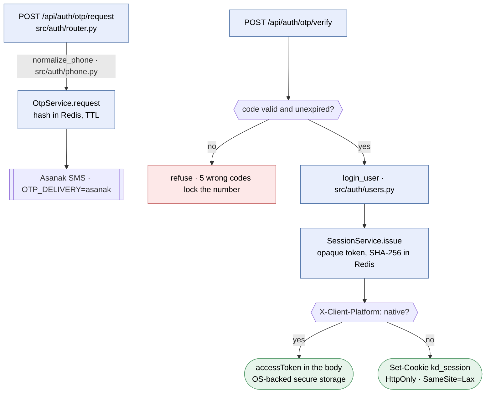

Caption to write under it: one token, two transports. The web branch never lets JavaScript see the token; the native branch puts the same token in OS-backed storage.

Note the deliberate exception to failure 2 above: two branches land on two separate terminal nodes rather than one shared one, because the whole point of the diagram is that the two outcomes differ.

### The four targets from one codebase

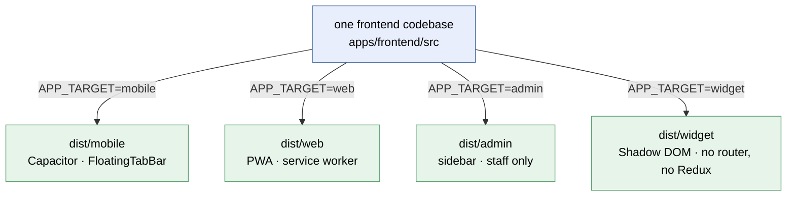

Draw this only when the point is the **build mechanism**. The target list itself reads better as the table in `AGENTS.md`.

### Decision and its contingencies (research doc, Recommendation section)

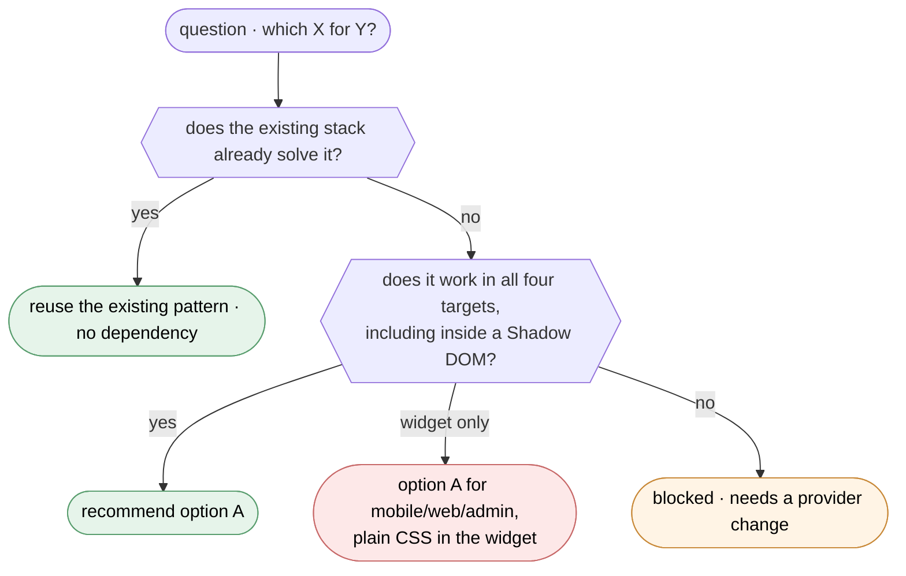

The three classes mean the same thing in every research doc here. See `repo-vocabulary.md`.

### Subsystem architecture (spec flow section, ARCHITECTURE.md)

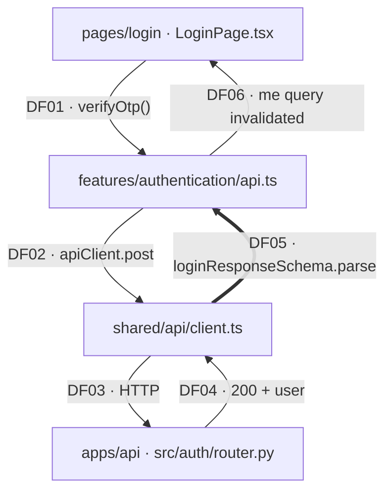

The thick edge is the rule the diagram exists to show: nothing reaches the UI without passing its Zod schema.

### Summary and detail pair (any diagram past about 15 nodes)

Summary IDs are prefixed `S` so they never collide with the detail diagram's.

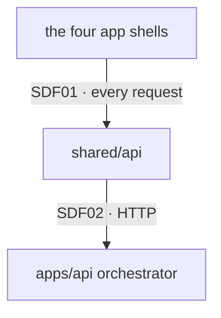

| Summary node | Collapses | Detail flows |
| ------------ | --------- | ------------ |
| `UI` | `src/app/{mobile,web,admin,widget}` | DF01 to DF03 |
| `BE` | `src/auth`, `src/assistant`, `livekit_gateway`, `media_probe` | DF04 to DF09 |

Never collapse a node on an authorization boundary, a node marked proposed, or either end of a `==>` edge.

### Ordering across participants (a protocol, a retry, a failover)

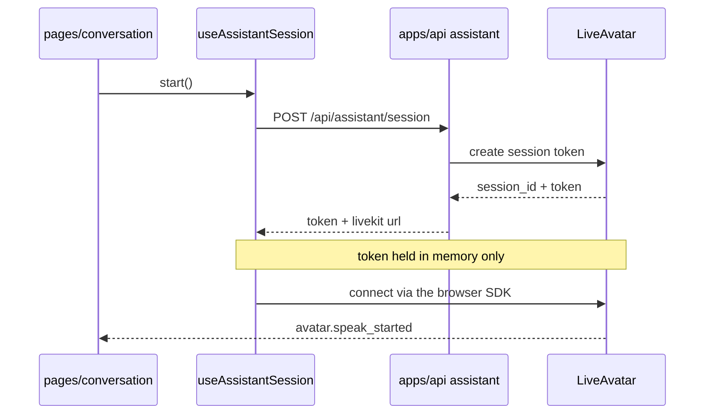

Keep notes short and unpunctuated (failure 6).

### Lifecycle (a status column)

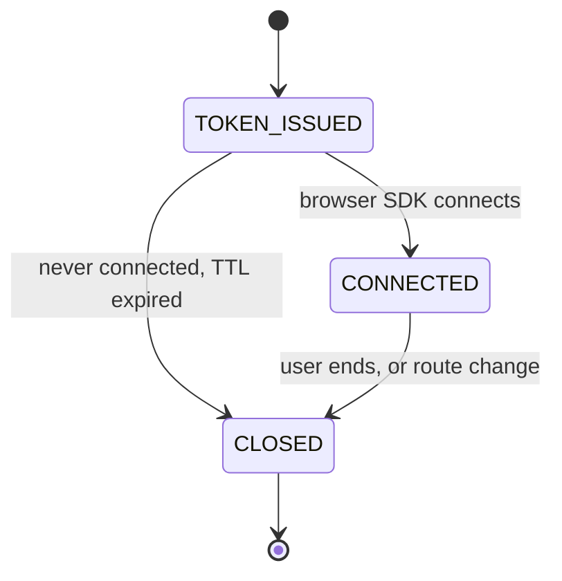

Use the status strings the code actually writes. Do not invent one.

### Schema change (a spec that adds or reshapes tables)

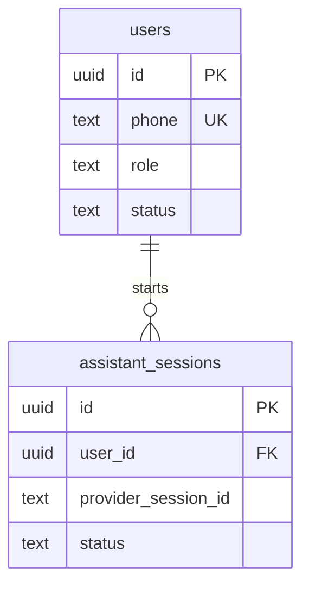

Show keys and relationships, not every column. Say in the caption which tables already exist and which the spec adds, and which migration number adds them.

### Ranking candidates (research doc, Options)

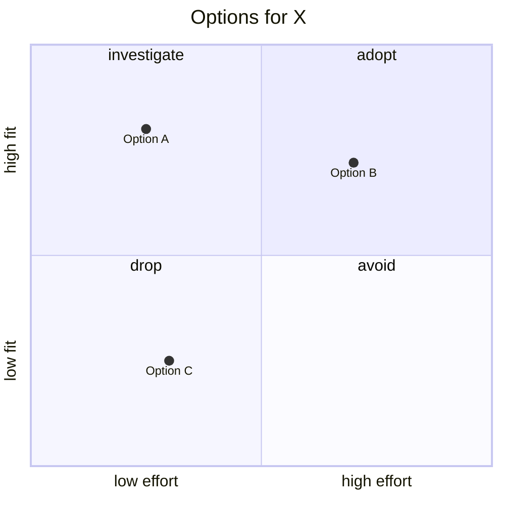

Keep `x` at 0.8 or below and avoid `y` between 0.44 and 0.53 (failure 3).

### Task dependency graph (a stack of PRs)

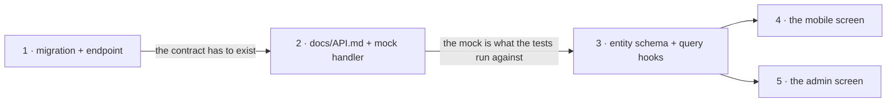

Label why each edge blocks. An unlabelled dependency edge is a guess. This shape maps one to one onto a `gh stack`; see the `scoped-pr` skill.

### Symptom, cause, outcome (a user-facing framing)

Three ranks, which is the shape `LR` renders best (failure 7).

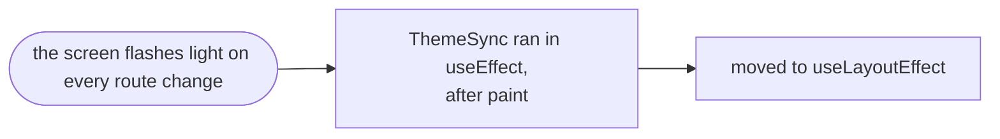
