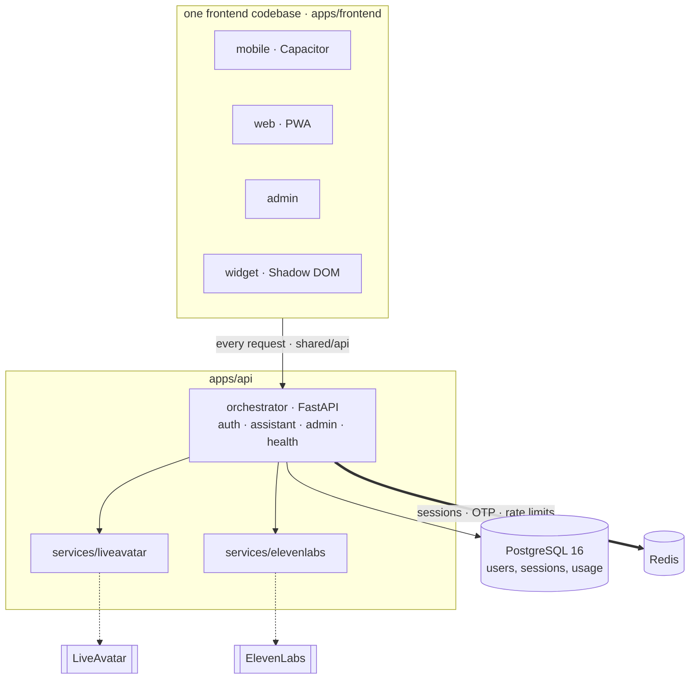

# Diagram vocabulary for this repo

Canonical names, shapes, and starting points. Use these so a diagram of the login flow and a diagram of the assistant session compose into one picture of the product instead of two artists' impressions of it.

Paths are starting points for **reading before drawing** (SKILL.md step 3), not a substitute for it. They drift. Verify before you cite.

**Two roots, and both have a `src/`.** A frontend path written as `src/...` is under `apps/frontend/`. A backend path written as `src/...` is under `apps/api/services/orchestrator/`. The tables below say which, and a diagram label should carry enough of the path to be unambiguous.

## Shapes

| Element                        | Shape                | Example                                                        |
| ------------------------------ | -------------------- | -------------------------------------------------------------- |
| Page, screen                   | rectangle            | `LOGIN["pages/login/LoginPage.tsx"]`                            |
| Hook, function, service        | rectangle            | `SESS["useAssistantSession()<br/>features/assistant"]`          |
| Endpoint                       | rectangle            | `VER["POST /api/auth/otp/verify<br/>src/auth/router.py"]`       |
| Datastore                      | cylinder `[( )]`     | `PG[("PostgreSQL 16")]`, `RD[("Redis · sessions, OTP, limits")]` |
| Decision, gate                 | hexagon `{{ }}`      | `G1{{"X-Client-Platform: native?"}}`                            |
| Target, phase, grouping node   | stadium `([ ])`      | `WIDGET(["widget · Shadow DOM"])`                               |
| External service or other doc  | subroutine `[[ ]]`   | `LA[["LiveAvatar"]]`, `EL[["ElevenLabs"]]`, `SMS[["Asanak"]]`   |
| Proposed, not built yet        | any shape plus dashed | `classDef proposed stroke-dasharray: 5 5,color:#000`           |
| Async or out-of-band edge      | dotted `-.->`        | an egress recording finishing, a background poll                |
| Load-bearing dependency        | thick `==>`          | the edge whose removal breaks the design                        |

## Decision states

A research doc's recommendation diagram encodes an outcome per node, so the encoding must mean the same thing in every doc. Copy these three `classDef` lines instead of picking fills per document.

```
classDef chosen   fill:#e6f4ea,stroke:#5a9e6f,color:#000
classDef fallback fill:#fde8e8,stroke:#c86a6a,color:#000
classDef forced   fill:#fff4e5,stroke:#c98a3a,color:#000
```

| Class      | Means |
| ---------- | ----- |
| `chosen`   | what ships if everything holds |
| `fallback` | where a failed gate lands, a worse outcome we have accepted |
| `forced`   | a branch an external constraint takes out of our hands (a provider refuses, a platform limit) |

`color:#000` is on every line for a reason. See failure 5 in `mermaid-recipes.md`. A pale fill without it disappears in GitHub's dark theme.

Still caption the diagram. A colour legend that only lives in this file is a legend the reader does not have.

## Naming rules

Get these right and diagrams stop contradicting the docs.

- **Target** is one of `mobile`, `web`, `admin`, `widget`. Use those four words exactly. Not "app", not "PWA build", not "embed".
- **Target is not platform.** `env.appTarget` answers "which build". `src/shared/platform` answers "is this inside Capacitor". A diagram that conflates them is drawing a bug.
- **Layer** names come from `ARCHITECTURE.md`: `app`, `pages`, `features`, `entities`, `shared`. Arrows run left to right in that order and never back. A diagram showing `shared` importing a feature is drawing a rule violation.
- **Entity** for a domain concept with a Zod schema, an `api.ts` and query hooks. **Feature** for a user-facing workflow. Not "module", not "component" for either.
- **The API client** is `src/shared/api`. There is exactly one. A diagram showing a page calling `fetch` is drawing a rule violation.
- **PostgreSQL 16** holds metadata and usage. **Redis** holds locks, sessions, one-time codes and rate-limit counters. A diagram that puts sessions in PostgreSQL is wrong.
- **Session** is the opaque login token (`kd_session` cookie on web, `Authorization: Bearer` on native). **Assistant session** is the per-conversation provider credential. They are different things with different lifetimes, and merging them into one box is the mistake this line exists to stop.
- **Service** for a directory under `apps/api/services/`: `orchestrator`, `liveavatar`, `elevenlabs`. **Router** for `src/<area>/router.py`.
- **User** and **admin** are the two roles. A **widget visitor** is anonymous and holds no session at all.
- **The backend owns authorization.** `RequireAuth` and `RequireRole` are UX only. If a diagram shows a frontend guard as the thing that protects data, label it clearly or redraw it.

## Subsystems: where to start reading

### The four targets

| Piece | Path |
| ----- | ---- |
| Shared bootstrap | `apps/frontend/src/app/`: `providers.tsx`, `store.ts`, `queryClient.ts`, `bootstrap.ts`, `mount.tsx` |
| Mobile shell | `src/app/mobile/`: `App.tsx`, `router.tsx`, `MobileLayout.tsx` |
| Web shell | `src/app/web/`: plus `PwaUpdatePrompt.tsx` |
| Admin shell | `src/app/admin/`: plus `AdminLayout.tsx` |
| Widget | `src/app/widget/`: `mount.tsx`, `WidgetLauncher.tsx`, `WidgetPanel.tsx`, `config.ts`. No router, no Redux (ADR 0010) |
| Build wiring | `apps/frontend/vite.config.ts`, driven by `APP_TARGET` |

The widget is the target most often drawn wrong. It has no router, no Redux, and it renders inside a Shadow DOM. Anything in a diagram that reaches it must work without those.

### Frontend layers

`ARCHITECTURE.md` carries the authoritative statement. A Mermaid version must agree with it.

```text
app → pages → features/entities → shared → platform/api/storage
```

| Layer | Path | Holds |
| ----- | ---- | ----- |
| app | `src/app/` | the four shells and the shared bootstrap |
| pages | `src/pages/` | route-level composition. `pages/admin/` is admin-only |
| features | `src/features/` | `assistant`, `authentication`, `settings`, `navigation`, `profile`, `recording`, `text-to-speech`, `avatar-session`, `diagnostics` |
| entities | `src/entities/` | `user`, `session`, `assistant-session`, `audio-asset`, `video-asset`, `dashboard` |
| shared | `src/shared/` | `api`, `ui`, `platform`, `storage`, `config`, `hooks`, `utils` |

### The API client

| Piece | Path |
| ----- | ---- |
| The single axios client | `src/shared/api/client.ts` |
| Interceptors | `src/shared/api/interceptors.ts` |
| Error normalization | `src/shared/api/errors.ts`: `ApiError`, `toApiError`, `isForbidden` |
| URLs and DTOs | `src/shared/api/urls.ts`, `dto.ts`, `types.ts` |
| Mock API | `src/data/mock/handlers.ts`, behind `VITE_API_MOCK` (ADR 0005) |

Two error shapes reach `toApiError`: the orchestrator's enveloped `{ "error": { code, message, retryable, details }, "correlation_id" }`, and the starter's flat `{ code, message, details? }`. FastAPI's `422` validation body is converted by the exception handler.

### Auth and sessions

| Piece | Path |
| ----- | ---- |
| Endpoints | `apps/api/services/orchestrator/src/auth/router.py` |
| Phone normalization | `src/auth/phone.py`: `normalize_phone`, `mask_phone` |
| One-time codes | `src/auth/otp.py`: `OtpService.request`, `.verify` |
| Sessions | `src/auth/sessions.py`: `SessionService`, `COOKIE_NAME = "kd_session"`, `set_session_cookie` |
| Guards | `src/auth/dependencies.py`: `resolve_optional_user`, `get_current_user`, `require_admin` |
| Admin routes | `src/auth/admin.py`: `dependencies=[Depends(require_admin)]` on the router |
| SMS | `src/auth/asanak.py`, used when `OTP_DELIVERY=asanak` |
| Frontend guards | `src/features/authentication/guards.tsx`: `RequireAuth`, `RequireProfile`, `RequireRole` |
| Token store | `src/shared/storage/tokenStore.ts` |

Three facts an auth diagram must not get wrong:

1. **One token, two transports.** The same opaque token is the web cookie and the native bearer. It carries no claims; Redis holds its SHA-256.
2. **A stale token is 401, not anonymous.** `resolve_optional_user` returns `None` only when there is no token at all. That distinction is what stops a stale cookie being mistaken for a widget visitor.
3. **The frontend guards are UX only.** `require_admin` on the backend router is the real gate.

### The assistant session

| Piece | Path |
| ----- | ---- |
| Endpoint and the two doors | `src/assistant/router.py`: `get_principal`, `origin_allowed` |
| Service | `src/assistant/service.py`: `AssistantSessionService` |
| Provider client | `apps/api/services/liveavatar/`: `client.py`, `connection.py`, `manager.py` |
| Frontend hook | `src/features/assistant/useAssistantSession.ts` |
| Test double | `apps/frontend/tests/utils/liveAvatarSdkMock.ts` and `tests/e2e/utils/fakeLiveAvatarSdk.ts` |

`get_principal` is two doors in one function: a signed-in user, or the embed key on an allowed `Origin`. Nothing else. The `Principal` carries `key` (who) and `rate_key` (what the hourly limit counts) separately, because the embed key is public and the limit has to count the visitor address.

The session token it returns is **per-conversation** and lives in memory only. A diagram that shows it stored anywhere is drawing a Critical security finding.

### Theme and language

| Piece | Path |
| ----- | ---- |
| Redux slice | `src/features/settings/settingsSlice.ts`: `theme`, `language`, `reduceTransparency`, `micPermissionAsked` |
| Theme application | `src/features/settings/ThemeSync.tsx` |
| Language application | `src/features/settings/LanguageSync.tsx` |
| Anti-FOUC | the inline script in `src/app/{mobile,web,admin}/index.html` |
| Tokens and utilities | `src/styles/globals.css` |
| Locales | `src/i18n/locales/{en,fa}/{common,admin}.json` |

Redux owns both. `ThemeSync` writes the `dark` class **and** `data-theme` **and** `color-scheme` **and** the `theme-color` meta. The widget never mounts `ThemeSync`; it gets its theme from HeroUI's `:root, :host` declarations inside the shadow root.

### Backend services

| Service | Path | Holds |
| ------- | ---- | ----- |
| `orchestrator` | `apps/api/services/orchestrator/` | the FastAPI app, schemas, migrations, LiveKit gateway, media probe |
| `liveavatar` | `apps/api/services/liveavatar/` | session client, event socket, LITE session manager |
| `elevenlabs` | `apps/api/services/elevenlabs/` | TTS client, PCM validation, content-addressed cache |

Imports are rooted at `apps/api`, so modules are `services.orchestrator.src.main` and friends. The frontend never imports any of this; it reaches it over HTTP.

Migrations live in `apps/api/services/orchestrator/migrations/`, applied in order on startup. They are **append-only**: there is no downgrade path. An `erDiagram` of a proposed table should say which migration number adds it.

## Platform skeleton

The backdrop most subsystem diagrams sit on. Take the layers you need and delete the rest.



Caption it. The thick edge is the one worth pointing at: nothing about a login lives in PostgreSQL, so revoking a session is deleting one Redis key.
