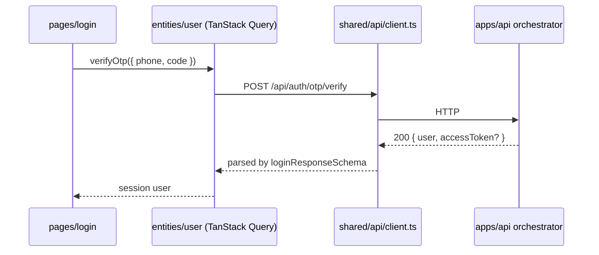

# Show me

Help the user understand the current topic visually. Skip the preamble and keep prose brief. Pick the smallest view that makes the key point clear.

**Scope:** the test is whether the visual lands in a git-tracked file.

If it does (`ARCHITECTURE.md`, anything under `docs/`, `docs/DECISIONS/`, `docs/features/`), it belongs to the `diagrams` skill. That one owns type choice, drawing from verified code, and the check-it-rendered step. Do not do that work here.

If it does not, it is this skill's work. Four surfaces qualify.

- **The conversation.** The default. A throwaway sketch answering the question in front of you.
- **A PR body.** GitHub renders `diff`, `text`, and `mermaid` blocks. See the `scoped-pr` and `gh-cli` skills.
- **A Linear issue.** Linear renders fenced code blocks and Mermaid. This repo tracks work in Linear and lands it through GitHub PRs.
- **A review comment.** Same rendering as a PR body. See the `code-review` skill.

Nothing here is committed. Raise the bar with the audience. A chat sketch can be rough. A PR body or an issue is read by people who were not in this conversation, so every label has to stand on its own.

**One product note.** The app ships in English and Persian, and Persian is RTL. A sketch of UI structure can use the real Persian strings, but keep the tree itself in ASCII. Mixing an RTL label into an ASCII tree usually breaks the alignment in a terminal.

**One monorepo note.** This repo holds two apps: `apps/frontend` (React, four build targets) and `apps/api` (Python, FastAPI). A sketch that crosses the HTTP boundary should show the boundary, because the two never import each other.

## Pick a form

- Show logic or an algorithm as pseudocode:

```text
on(verify otp)
  normalize the phone to E.164
  if the code is wrong or expired
    stop with the auth error
  load or create the user, then issue a session token
  if the caller sent X-Client-Platform: native
    return { user, accessToken }        # secure OS storage
  else
    set the HttpOnly kd_session cookie  # web and admin
    return { user }
```

- Show runtime control flow as a call tree:

```text
POST /api/auth/otp/verify        # src/auth/router.py
  normalize_phone                # src/auth/phone.py
  otp.verify                     # src/auth/otp.py      OtpService
  login_user                     # src/auth/users.py
  sessions.issue                 # src/auth/sessions.py SessionService
  set_session_cookie             # web and admin only
  (native gets accessToken in the body instead)
```

- Show UI structure as a component tree, including which target mounts it:

```text
src/app/mobile/App.tsx
  Providers                    src/app/providers.tsx
    MobileLayout
      RequireAuth              features/authentication/guards.tsx
        RequireProfile
          <Outlet />           pages/*
      FloatingTabBar           features/navigation/
```

- Show file responsibility or a broad refactor as a shallow file tree:

```text
apps/frontend/src/
├── app/        # one entry folder per target + shared bootstrap
├── pages/      # route-level composition
├── features/   # user-facing workflows
├── entities/   # domain models (Zod), server data access, query hooks
└── shared/     # api client, ui, platform, storage, config
```

- Show component interaction or data flow with Mermaid. Show the HTTP boundary when the sketch crosses it:



- Use `diff` when the point is what changes and the surrounding shape already exists. Match the diff shape to the topic.

For a feature-folder change:

```diff
 src/features/assistant/
   controls/
     ControlButton.tsx
+    ConversationComposer.tsx   # new, rendered by ConversationControlLayer
     ConversationControlLayer.tsx
   useAssistantSession.ts
```

For a file-layout change:

```diff
 apps/api/services/orchestrator/src/
 ├── auth/
+│   └── rate_limit.py        # new module
 ├── assistant/
-└── media_probe.py
+└── media/
+    ├── probe.py
+    └── transcode.py
```

For a call-tree change:

```diff
 POST /api/auth/otp/request
   normalize_phone
+  check_resend_window
   store_code
   send_sms
-  return { phone, expiresInSeconds }
+  return { phone, expiresInSeconds, resendAfterSeconds }
```

For a state or control-flow change:

```diff
 on(theme change)
-  write html.dataset.theme
+  write html.dataset.theme AND html.classList
+  update <meta name="theme-color">
```

- Show the whole block when most of it is new, when leaving out context would hide ownership or order, or when the user needs a copyable target shape:

```ts
export function hasRole(
  user: Pick<User, 'role'> | null | undefined,
  roles: readonly UserRole[],
): boolean {
  return Boolean(user && roles.includes(user.role));
}
```

## The HTML artifact

For a visual UI, a layout, a state comparison, or a concept too dense for the forms above, write one focused HTML file. Make it a diagram, an infographic, or a short slide deck, whichever fits the point. Match the product's colours, type, spacing and components, use real labels and data, and support desktop and mobile.

The product uses HeroUI v3 semantic tokens and the Vazirmatn font. When you mock a real screen in Persian, set `dir="rtl"` and use Vazirmatn. Do not invent a palette: read the tokens from `apps/frontend/src/styles/globals.css` or the `heroui-react` skill.

Write it to `$TMPDIR`, never into the repo. A show-me artifact is throwaway and must not turn up in `git status`.

```bash
f="${TMPDIR:-/tmp}/show-me-<slug>.html"   # <slug> describes the topic
{ xdg-open "$f" || open "$f"; } >/dev/null 2>&1 || echo "$f"
```

The fallback matters. Some of this project's environments (a remote shell on the deploy host, a CI session) have neither `xdg-open` nor `open`, and the bare command fails there. On a miss the chain prints the absolute path, which the user can click.

## Guidance

Put each visual next to the short text it supports. Keep only the calls, files, components, states and boundaries needed to answer the question in front of you.

**Default to the text forms.** Pseudocode, call trees, component trees, file trees and diffs are readable everywhere, including a plain terminal. A Mermaid block renders as a picture in the IDE and in web clients but arrives as raw source in the terminal. Reach for it only when the point genuinely needs a graph (a sequence, a state machine, a fan-out), not as the default.

You may use one of these, you may use several, you will rarely use all of them. Use your judgement and do not overwhelm the user.
