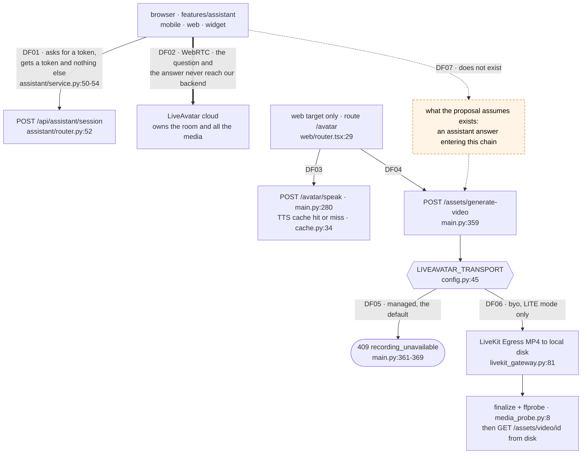
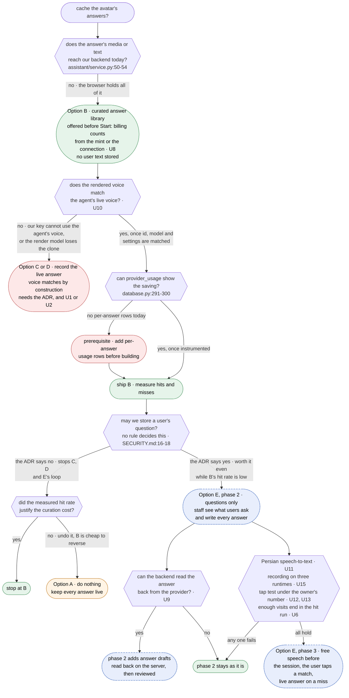

# Spike: Can an avatar answer be captured, stored and replayed, and which parts of the response-cache proposal are new work?

| Field   | Value                                      |
| ------- | ------------------------------------------ |
| Created | 2026-09-19                                 |
| Updated | 2026-09-25                                 |
| Status  | Resolved                                   |
| Domain  | assistant                                  |
| Author  | `respcache-t1-res` (Claude Opus 5), mission `20260919-respcache`; Option E amendment by `optione-t1-res` (Claude Opus 5.5), mission `20260923-respcache-e` |
| Outcome | → ADR                                      |

Every codebase claim below is cited at `file:line` against `main@eb05da0`. Every external claim
names its source and its date. Anything believed but not checked is in section 7 and is labelled
unverified.

**Amendment, 2026-09-23.** Section 5 now also scores the product owner's own design as **Option
E**, and §6, §7 and §8 are re-issued with it. The amendment cites the code at `6a0b8ee`, whose code
is identical to `main@eb05da0` (`git diff --stat eb05da0 6a0b8ee` lists only this file and
`docs/features/INDEX.md`). It also corrects six claims in the earlier text. Each correction is
marked with its date where it applies, and nothing was removed silently. They are in §1 and §4.4
(object storage needs a client), §4.6, Option B (two render sites, and a `<video src>` that plays
on `web` only), Option C (`pgvector` without a dump and restore), §8 (the approval endpoint), and
§6 with two cells of the side-by-side table and Option C's Cost line (turn 2's claim that every
option shares B's authentication and `finalize` costs, narrowed using Option C's own description).

**On the `Status` value.** The author left this spike `In Review`, because promoting a spike to
`Resolved` is the maintainer's call. The owner marked it `Resolved` on 2026-09-25, together with
the answers to ADR 0014 (accepted in part) and ADR 0015 (accepted). The pick stands: Option B (§6).

## 1. The question

> **Can an avatar answer be captured, stored and replayed at all in this system, and if so, which
> of the proposal's four parts (intent matching, video capture, optimization, object storage) are
> new work versus already built?**

**The short answer: yes for one pipeline, no for the pipeline the proposal is about.**

This system has two separate avatar pipelines. The **workbench** pipeline is server-driven and can
already record, store and replay an avatar answer end to end, but that chain is refused in the
default configuration and it is not what users talk to. The **assistant** pipeline is what users
talk to on `mobile`, `web` and `widget`, and it runs entirely in the browser against LiveAvatar's
cloud. No question text, no answer text and no answer media reaches our backend on that path
(`apps/api/services/orchestrator/src/assistant/service.py:50-54`).

Part by part, for the assistant pipeline:

| Proposal part | Verdict | One-line reason |
| ------------- | ------- | --------------- |
| Intent matching | **New** | Nothing matches anything. The only match in the repo is an exact SHA-256 over TTS parameters (`apps/api/services/elevenlabs/cache.py:13`), and the assistant never calls it. |
| Video capture | **Partly built, on the other pipeline** | The whole capture chain exists, is hard-refused in the default transport (`.../src/main.py:361-369`), and is wired only to LITE mode. |
| Optimization | **Partly built** | `ffmpeg` 5.1.9 is already in the API image (`apps/api/services/orchestrator/Dockerfile:11`) and `ffprobe` is already used (`.../src/media_probe.py:8`). The background job runner it would need does not exist. |
| Object storage | **New, but cheaper than assumed** | No client of any kind (`grep -rniE 'boto3\|digitalocean\|minio' apps/api` returns nothing). But `livekit-api==1.0.7` can already upload to S3-compatible storage with no new Python dependency. (Qualified 2026-09-23: only for a file Egress uploads itself. See the correction in §4.4.) |

## 2. Why it is open

The product owner's description rests on two assumptions that the code contradicts.

**Assumption one: nothing is cached today.** A deterministic audio cache already exists and is
already consulted before the provider is called (`apps/api/services/elevenlabs/service.py:59-60`).
Usage rows already carry a `cache_hit` flag
(`apps/api/services/orchestrator/migrations/001_initial.sql:78`). Building a "cache" without
knowing this would produce a second, competing cache.

**Assumption two: the answer's video is simply there to be downloaded.** On the assistant path the
answer is a live WebRTC stream inside a room owned by LiveAvatar. Our backend never sees it. There
is no file to take.

What it costs to guess wrong:

- Build the wrong pipeline. The capture chain that exists serves the `web`-only workbench screen
  at `/avatar` (`apps/frontend/src/app/web/router.tsx:29`), not the assistant. A team that reads
  "video capture already works" and starts from there builds something no user reaches.
- Ship a cache that answers the wrong question. "Same intent" is the load-bearing phrase in the
  whole proposal and it is undefined. Section 5 shows a measured case where the obvious mechanism
  ranks an **opposite-meaning** question far above a same-meaning one.
- Cross a trust boundary that nobody has decided on. `docs/SECURITY.md:16-18` bans *logging*
  prompt and answer text, and makes *storing* it conditional: "If a product promises it does not
  store conversations, that must be true in the code". No such promise is recorded in this
  repository (see C3). So a cache keyed on user questions does not break a written rule. It walks
  into a gap where no rule exists, which is harder to notice and is why the outcome is an ADR.
- Claim a saving that cannot be shown. `provider_usage` records one row per assistant session
  token, with `characters` and `estimated_duration_ms` left null
  (`.../src/assistant/service.py:125-140`). There is no per-answer cost signal to improve.

## 3. Constraints

Any answer has to satisfy all of these.

| # | Constraint | Where it comes from |
| - | ---------- | ------------------- |
| C1 | **Four targets.** `mobile`, `web`, `admin`, `widget` from one codebase. The assistant is on `mobile`, `web` and `widget`. `admin` has no assistant route at all (`apps/frontend/src/app/admin/router.tsx:19-26`). The `widget` has no router and no Redux (ADR 0010). | `CLAUDE.md`, ADR 0004, ADR 0010 |
| C2 | **Layers.** `app → pages → features/entities → shared`. The frontend never calls a provider or object storage directly. Everything goes through `apps/frontend/src/shared/api` into `apps/api`. | `CLAUDE.md`, `AGENTS.md` |
| C3 | **Security.** `docs/SECURITY.md:16-18` bans *logging* prompt and answer text, and makes *storing* it conditional on a product promise. No such promise is recorded here, so storage is undecided rather than forbidden. See the note under this table. `docs/SECURITY.md:23-25` makes the session token a per-conversation credential. Two doors reach the assistant: a signed-in user, or the embed key on an allowed origin (`.../src/assistant/router.py:34-49`). | `docs/SECURITY.md` |
| C4 | **Migrations are append-only**, applied in order at startup, with no downgrade path. | `SPEC.md` §5, `apps/api/README.md:47-49` |
| C5 | **Long work answers `202` with a job id.** Never hold a request open while a model runs. | `docs/API.md:20-22` |
| C6 | **A saving must be measurable from `provider_usage`**, not estimated. | `SPEC.md` §5 |
| C7 | **On-premise installs with no internet access** are a stated customer requirement. | ADR 0006, Context section |
| C8 | **Bilingual, English and Persian, with RTL.** The assistant has two provider modes and they do not speak the same languages (`.../src/assistant/service.py:23-33`). | `CLAUDE.md`, `.env.example:42-49` |
| C9 | **The feature presumes `LIVEAVATAR_SANDBOX=false` with a production avatar configured.** In the default configuration nothing worth caching can be produced. See the note below. | `.../src/config.py:37,71`, `.../src/assistant/service.py:17-18,74-75,221-225` |

C9 is a precondition, not a preference, and turn 1 of this document missed it. `liveavatar_sandbox`
defaults to `True` (`.../src/config.py:37`). While it is on, `_avatar_id()` ignores
`LIVEAVATAR_ASSISTANT_AVATAR_ID` and returns the shared public sandbox avatar
(`.../src/assistant/service.py:221-225`, and `config.py:71`: "Sandbox cannot use a custom avatar,
so this is ignored while sandbox is on"), and every session is clamped to sixty seconds
(`.../src/assistant/service.py:17-18,74-75`).

Two consequences. First, an answer rendered today would show a borrowed avatar that is not the
practitioner, so it is not a reusable asset and caching it would be caching the wrong face.
Second, and more importantly, the decisive argument in §6 is that a wrong cached answer is
attributed to a named practitioner. **That argument only has force outside sandbox.** Inside
sandbox the stakes are lower and so is the value: there is nothing worth storing. Either way the
feature presumes production mode, so §8 places this before the render work.

### C3 in full, because the whole recommendation turns on it

The rule at `docs/SECURITY.md:16-18` reads, exactly:

> An AI gateway logs metadata only: user, model, token counts, latency. Never log prompt or
> answer text. If a product promises it does not store conversations, that must be true in the
> code, not in a setting an operator can flip.

Read precisely, that is a **ban on logging** plus a **conditional** about storage. The condition
fires only if the product has promised not to store conversations. I searched this repository for
such a promise and found none: `grep -rniE "not store|never store|do not store|not record|privacy|retention" docs/ README.md apps/frontend/src/i18n/locales/`
returns only `README.md:153` and `docs/SECURITY.md:75`, and both are about the **session token**,
not about conversation text.

So the honest position is: **nothing in this repository currently forbids storing a user's
question, and nothing permits it either.** That is weaker than "the proposal breaks a written
rule", and it is a better reason for an ADR than the strong version would have been. A rule you
break is a rule someone already thought about. A gap is not.

This matters for scoring. Options C and D do not fail C3; they land in the undecided part of it,
which is why the comparison table says "undecided" rather than "contradicted", and why §8 makes
the ADR a prerequisite rather than a formality.

C8 deserves emphasis, because it decides which language an intent mechanism has to work in.

FULL persona mode is English only. Persian is accepted when the token is minted and rejected when
the session starts, verified against the real provider on 2026-09-11 and written down at
`.../src/config.py:54-61` and `.env.example:67-71`. Persian is reachable only through a LiveAvatar
Voice Agent wrapping the customer's ElevenLabs agent (`.../src/assistant/service.py:79-91`), and
`.env.example:46-49` names that path as the default and "the only path that speaks Persian today".

So the language the assistant is expected to serve in production is Persian, and any
intent-matching mechanism has to work on Persian text first. Section 5.0 measures exactly that, and
Persian is the harder case.

## 4. What the codebase already does

### 4.1 The eleven facts, re-verified

Each row was opened at its cited line at `main@eb05da0`. **Six** were exact at every line cited
(rows 3, 4, 8, 9, 10, 11). **Five** had a line number off by one to four lines with the fact
itself intact (rows 1, 2, 5, 6, 7). **Two of those five also need a substantive correction**, and
those two are marked **correction** below. Rows 5 and 7 are the ones a reader should not skip.

| # | Claim | Verified at | Result |
| - | ----- | ----------- | ------ |
| 1 | A deterministic TTS audio cache exists | `apps/api/services/elevenlabs/cache.py:13` (`deterministic_cache_key`), `:34` (`get`), `:45` (`put`) | **True.** The key is a SHA-256 over the canonical JSON of the TTS parameters (`cache.py:14-15`). Line numbers for `get` and `put` were cited as `:37` and `:47`; they are `:34` and `:45`. |
| 2 | The TTS path checks that cache before calling the provider | `apps/api/services/elevenlabs/service.py:59-60`, and again under a lock at `:67-68` | **True.** It is a double-checked lock: read, take a Redis lock, read again, then call the provider at `:74`. Cited as `:56`, which is a blank line: `:55` closes the `parameters()` dict and `:57` opens `async def generate`. Either way `:56` does not show the cache check. |
| 3 | The schema has `audio_assets`, `video_assets`, `generation_jobs` | `.../migrations/001_initial.sql:22`, `:39`, `:55` | **True, exact.** |
| 4 | Usage records carry a `cache_hit` flag | `.../migrations/001_initial.sql:78` | **True, exact.** |
| 5 | `generation_jobs` has a `dedupe_key` and an index on it | `.../migrations/001_initial.sql:58` (column), `:68` (index) | **Correction.** The SQL is there, cited as `:59,67` and actually at `:58,68`. But **no code reads or writes that table**: `grep -rn "generation_jobs" .` returns only the two migration lines. It is dead schema, not a built feature. There is also no `GET /api/jobs/{jobId}` endpoint, although `docs/API.md:20-21` makes one mandatory for long work. |
| 6 | In `managed` transport the room is LiveAvatar's, so our Egress worker cannot record it | `.../src/config.py:40-42` (comment), `:45` (the setting, default `"managed"`) | **True.** Cited as `:41-43`. The refusal is enforced at `.../src/main.py:361-369`, which answers `409 recording_unavailable`. |
| 7 | `byo` is "the only mode that can record" | `.../src/config.py:43-44` | **Correction.** True as written, and incomplete in the way that matters. `LIVEAVATAR_TRANSPORT` is read only by the LITE-mode `LiveAvatarManager` (`.../src/main.py:96`, `apps/api/services/liveavatar/manager.py:65,102`). The assistant ignores it and hard-codes `"transport": "managed"` in its session row (`.../src/assistant/service.py:119`). `create_full_token` states outright that FULL mode "never create[s] a LiveKit room and never send[s] livekit_config" (`apps/api/services/liveavatar/client.py:88`), and `create_voice_agent_token` sends none either (`client.py:132-138`). **Setting `LIVEAVATAR_TRANSPORT=byo` today would not make one assistant answer recordable.** It only changes the workbench. |
| 8 | The assistant is browser-driven; the backend only mints a token and never sees the question text or the answer media | `.../src/assistant/service.py:50-54` | **True, exact.** The class docstring says it in those words. Confirmed on the frontend: `apps/frontend/src/features/assistant/useAssistantSession.ts:42-49` shows the browser calling `POST /api/assistant/session`, then driving the provider SDK itself. |
| 9 | LiveKit Egress output is a local directory, not object storage | `.../src/config.py:125` (`egress_output_dir: "/out"`) | **True, exact.** `/out` in the egress container is bind-mounted to `./media/video` (`docker-compose.yml:74`), which the orchestrator reads as `/media/video` (`docker-compose.yml:104,108`). `GET /assets/video/{id}` serves that file from disk (`.../src/main.py:436-441`). |
| 10 | An MP4 probe for Egress output exists | `.../src/media_probe.py:8` (`probe_avatar_mp4`) | **True, exact.** It shells out to `ffprobe` and rejects anything that is not non-empty H.264 plus audio (`media_probe.py:34-45`). |
| 11 | No object-storage client is present | `grep -rniE 'boto3\|digitalocean\|minio' apps/api` → exit 1, no output | **True.** `apps/api/services/orchestrator/requirements.txt` has 15 entries and none of them is a storage SDK. |

### 4.2 The two pipelines



Dashed means proposed and not built. The thick edge is the fact the whole spike turns on. The
takeaway: the recording chain (DF04 to DF06) and the conversation users actually have (DF01 and
DF02) are two different pipelines, DF07 between them does not exist, and the one gate in the
recording chain is closed by default.

Two more things the diagram cannot hold:

- `docs/API.md:205-209` classifies `/tts/*`, `/avatar/*` and `/assets/*` as "Phase 1 LITE mode
  workbench" endpoints that are explicitly **not part of the frontend contract**. They also carry
  no authentication: they are registered directly on the app with no dependency
  (`.../src/main.py:254,260,280,359,397,436`), unlike `/api/assistant/*`, which requires a user
  session or the embed key (`.../src/assistant/router.py:34-49`).
- The `/avatar` workbench route on `web` sits above `RequireAuth`
  (`apps/frontend/src/app/web/router.tsx:29` versus `:32`), so it is reachable signed out.

### 4.3 What is measurable today

`usage_summary()` groups `provider_usage` by provider and operation and returns calls, summed
characters, summed duration and a count of cache hits (`.../src/database.py:291-300`). There is no
cost column and no currency anywhere in the schema (`001_initial.sql:70-81`).

For ElevenLabs TTS that is enough to show a real saving: `characters` is `len(text)`
(`.../services/elevenlabs/service.py:118`) and ElevenLabs bills per character, so
`characters` on `cache_hit = true` rows is money not spent.

For the assistant it is not. The only rows written are `assistant_token` and `assistant_close`,
both with `cache_hit` hard-coded false and both leaving `characters` and `estimated_duration_ms`
null (`.../src/assistant/service.py:125-140` and `:189-197`). **Constraint C6 cannot be met for the
assistant without adding per-answer usage rows first.** That is a prerequisite, not a detail.

### 4.4 What is already installed

Measured inside the running `kohandezh-live-avatar-orchestrator-1` container on 2026-09-19:

- `ffmpeg` and `ffprobe` 5.1.9-0+deb12u1, installed by `.../orchestrator/Dockerfile:11`. The
  requester asked to "compress and optimize with Python libraries". The right tool is already
  there and it is not a Python library. No new dependency is needed for optimization.
- `livekit-api` 1.0.7. Its `EncodedFileOutput` message carries the fields
  `file_type, filepath, disable_manifest, s3, gcp, azure, aliOSS`, and its `S3Upload` message
  carries `access_key, secret, region, endpoint, bucket, force_path_style` among others. So Egress
  can upload straight to any S3-compatible store, including DigitalOcean Spaces and a self-hosted
  MinIO, with **no new Python dependency**. Only `filepath` is used today
  (`.../src/livekit_gateway.py:81-96`).

**Correction, 2026-09-23: "no new Python dependency" holds only for a file Egress uploads
itself.** The render chain as built needs the MP4 on local disk. `finalize` waits for the file at
`video_path` (`.../src/main.py:405-413`), probes it (`:414`, `media_probe.py:8`), and
`GET /assets/video/{id}` serves it from disk (`main.py:436-441`). If Egress uploads straight to a
bucket, all three steps break. Keeping the local file and uploading it from the orchestrator after
the probe, or after a compression pass, needs an S3 client in `requirements.txt`, and there is
none (§4.1 row 11). A manually uploaded replacement MP4 has no endpoint and no client either. So
object storage costs one new dependency or a rework of `finalize`, not zero. The measured field
lists below are unchanged.

Reproduce with:

```bash
docker exec kohandezh-live-avatar-orchestrator-1 python -c \
  "from livekit import api; print(list(api.EncodedFileOutput.DESCRIPTOR.fields_by_name)); \
   print(list(api.S3Upload.DESCRIPTOR.fields_by_name))"
```

Primary source for the same capability:
[LiveKit, "Output & streaming options"](https://docs.livekit.io/transport/media/ingress-egress/egress/outputs/),
fetched 2026-09-19, says "Egress supports any S3-compatible storage provider, including the
following:" and names MinIO, Oracle Cloud, CloudFlare R2, **Digital Ocean**, Akamai Linode and
Backblaze, with Azure and GCP covered separately. So the requester's named target is on the
vendor's own supported list.
[DigitalOcean Spaces documentation](https://docs.digitalocean.com/products/spaces/), page generated
2026-09-18, fetched 2026-09-19, says "Spaces Object Storage is an S3-compatible service for
storing and serving large amounts of data" and that "The built-in Spaces CDN minimizes page load
times".

### 4.5 What is not installed

Measured against the running `postgres:16-bookworm` instance on 2026-09-19:

```bash
docker exec kohandezh-live-avatar-postgres-1 psql -U kohandezh -d kohandezh_avatar \
  -c "select name from pg_available_extensions where name in ('vector','pg_trgm','unaccent','fuzzystrmatch');"
```

`pg_trgm`, `unaccent` and `fuzzystrmatch` are **available** and not installed. **`pgvector` is not
available at all** in this image. Vector search therefore needs a different Postgres image
(`pgvector/pgvector:pg16`) or a separate service, on top of the embedding model itself. ADR 0006
anticipated embeddings in Persian and English and named `sentence-transformers`, but nothing of the
kind is installed today.

### 4.6 The four parts of the proposal

Verdict for each part, **for the assistant pipeline**, which is the one the proposal is about.

| Part | Verdict | Evidence | What is actually missing |
| ---- | ------- | -------- | ------------------------ |
| **Intent matching** | **New** | The only matching in the repo is byte equality after a SHA-256 over TTS parameters (`apps/api/services/elevenlabs/cache.py:13-15`), and the assistant never reaches it: `AssistantSessionService` is constructed with only a client, a database and settings (`.../src/main.py:98`). `generation_jobs.dedupe_key` (`001_initial.sql:58`) has no reader and no writer. | Everything. No question text reaches the backend at all, so there is nothing to match on. `pgvector` is unavailable (§4.5). And §5.0 shows the mechanism is an open design problem, not an implementation detail. |
| **Video capture** | **Partly built, on the other pipeline** | The full chain exists: `POST /assets/generate-video` (`.../src/main.py:359`), `start_mp4_egress` (`.../src/livekit_gateway.py:81`), `finalize` (`.../src/main.py:397`), `probe_avatar_mp4` (`.../src/media_probe.py:8`), `GET /assets/video/{id}` (`.../src/main.py:436`). | A way for an assistant answer to enter it. It is refused in the default transport (`.../src/main.py:361-369`) and BYO is implemented only for LITE mode (§4.1 row 7). |
| **Optimization** | **Partly built** | `ffmpeg` and `ffprobe` 5.1.9 are installed in the API image (`apps/api/services/orchestrator/Dockerfile:11`) and `ffprobe` is already called (`.../src/media_probe.py:9-20`). | A background job to run a compression pass, plus the `202` and job-id runner `docs/API.md:20-22` requires. Neither exists, and the existing `finalize` endpoint **breaks that rule today**: `.../src/main.py:406-409` busy-waits up to fifteen seconds for the MP4 to appear. So this is a fix as well as an addition. The requester's "Python libraries" are not needed: `ffmpeg` is the right tool and it is already in the image. |
| **Object storage** | **New, but cheaper than assumed** | No client of any kind: `grep -rniE 'boto3\|digitalocean\|minio' apps/api` exits 1. Output goes to a local directory (`.../src/config.py:125`, `docker-compose.yml:74`). | An upload target and a serving decision. Not a new dependency: `livekit-api==1.0.7` already carries `EncodedFileOutput.s3` with `S3Upload.endpoint` and `force_path_style` (§4.4), which is exactly what DigitalOcean Spaces or a self-hosted MinIO needs. (Qualified 2026-09-23: that holds only when Egress uploads the file itself, which breaks `finalize`, the probe and disk serving. An upload after the probe needs a client. See the correction in §4.4.) |

## 5. Options

### 5.0 The load-bearing phrase: "same intent"

The proposal turns on it and never defines it. Getting it wrong has one specific failure mode:
**the system serves a stored video in which the avatar confidently and fluently answers a different
question.** The user has no way to tell. There is no error, no spinner, no retry. This is worse
than a slow answer and worse than an outage, because it looks like a working product.

I measured the obvious mechanism. Inside a transaction that was rolled back, so nothing was left
installed:

```sql
BEGIN;
CREATE EXTENSION IF NOT EXISTS pg_trgm;
SELECT similarity('ساعت کاری شما چیست؟','چه ساعتی باز هستید؟');              -- fa, same intent
SELECT similarity('آیا این دارو برای کودکان مناسب است؟',
                  'آیا این دارو برای کودکان مناسب نیست؟');                    -- fa, opposite intent
SELECT similarity('what are your opening hours?','when are you open?');       -- en, same intent
SELECT similarity('is this drug safe for children?',
                  'is this drug unsafe for children?');                       -- en, opposite intent
ROLLBACK;
```

| Pair | Trigram similarity |
| ---- | ------------------ |
| Persian, same intent, different words ("what are your working hours?" / "what time are you open?") | **0.15151516** |
| Persian, opposite intent, one word apart ("is this medicine suitable for children?" / "is this medicine **not** suitable for children?") | **0.84210527** |
| English, same intent, different words ("what are your opening hours?" / "when are you open?") | 0.41935483 |
| English, opposite intent, one word apart ("is this drug safe for children?" / "is this drug **un**safe for children?") | 0.82352940 |

The ordering is inverted. Lexical similarity ranks the dangerous pair above the correct pair in
both languages, and the gap is far worse in Persian (5.5x) than in English (2.0x). **No threshold
exists that catches the paraphrase without also catching the negation**, and Persian is the
language the assistant is expected to serve (C8). Trigram matching is therefore not a candidate
mechanism on its own.

Verified locally on 2026-09-19. Afterwards `pg_extension` holds only `pgcrypto` and `plpgsql`, so
the measurement left nothing installed. Four hand-picked pairs are an illustration, not a
benchmark: they show that the mechanism can invert, which is enough to disqualify it, not how often
it inverts.

Candidate mechanisms, with the failure mode of each:

| Mechanism | How it decides "same" | Failure mode | Verdict |
| --------- | --------------------- | ------------ | ------- |
| **Exact string match** (normalized: trim, lowercase, `unaccent`, Persian Y and K folding) | byte equality after normalization | Near-zero hit rate on free speech. Speech-to-text output varies run to run, so even the same spoken sentence rarely matches. Fails **safe**: a miss costs a live generation. | Safe, near useless on free text. Useful only over a **fixed** question set the user picks from. |
| **Trigram / `pg_trgm` similarity** | character overlap | Measured above. Ranks negation above paraphrase. Fails **unsafe** and fails worst in Persian. | Rejected on evidence. |
| **Embedding similarity above a threshold** | cosine distance between sentence vectors | The standard production mechanism, and the standard production hazard. The threshold sets the hit rate, and published numbers are English-only (see the table below this one). It is also attackable: Zhang et al., ["From Similarity to Vulnerability: Key Collision Attack on LLM Semantic Caching"](https://arxiv.org/abs/2601.23088), submitted 2026-01-30, revised 2026-06-30, report that their attack "achieves a hit rate of 86% in LLM response hijacking" and argue the conflict between cache locality and collision resistance is fundamental. | Needs `pgvector` (not available, §4.5), an embedding model, and an extra call on every question. Persian embedding quality is unmeasured here, and no published number covers it. |
| **A closed intent classifier over a fixed label set** | a model maps the question to one of N known intents, or to "none" | Fails safe **if and only if** "none" is a real outcome that falls through to live generation. Needs labelled Persian training data and a retraining loop. Drift is silent. | Viable, but it is a product of its own, not a cache. |
| **The user picks from suggested questions** | there is no matching problem | Not a cache for arbitrary questions. Only covers what staff decided to pre-render. Fails safe by construction. | The only mechanism with no wrong-answer failure mode. |
| **Any of the above plus a verification pass** (a second model judges "does this stored answer answer this question?") | match, then check | Removes most false positives and adds a model call, which is the cost the cache was supposed to remove. This row is my own reasoning, not a cited recommendation. No source in this document proposes it. | Makes the semantic options defensible. It costs latency on every hit, and some money (U7). |

This table is the reason the options below differ mainly in **how "same" is decided**, not in how
video is stored.

#### What the published threshold numbers actually say

The only published numbers I found are English. [Portkey, "Semantic Caching Thresholds and Why
They Matter"](https://portkey.ai/blog/semantic-caching-thresholds/), published 2026-04-18, fetched
2026-09-19, reproduces an AWS benchmark it describes as "AWS tested multiple thresholds on real
chatbot queries using Claude 3 Haiku and Titan Embeddings":

| Threshold | Hit rate | Accuracy | Cost savings |
| --------- | -------- | -------- | ------------ |
| 0.99 (strict) | 23.5% | 92.1% | 15.8% |
| 0.95 | 56.0% | 92.6% | 51.9% |
| 0.90 | 74.5% | 92.3% | 72.5% |
| 0.80 | 87.6% | 91.8% | 84.6% |
| 0.75 (permissive) | 90.3% | 91.2% | 86.3% |

The page's own guidance is one sentence: "Start with a threshold between 0.90 and 0.95." It also
says "Once false positives start to exceed roughly 3% to 5%, you have reached the limit of your
embedding model", and that estimating false positives at all needs "sampling and evaluation using
humans or LLM-based judges". It states that Portkey itself "does not expose user-configurable
thresholds".

Three honest readings, and the third is the one that matters here:

1. The hit rate is the dial. It moves from 23.5% to 90.3% across the range, so the size of the
   saving is a choice, not a property of the workload.
2. Accuracy in that benchmark barely moves (91.2% to 92.6%). The page does not decompose it, so it
   does not tell us how much of the roughly 8% shortfall is the cache and how much is the model
   answering imperfectly anyway. It is not evidence that a permissive threshold is safe, and it is
   not evidence that it is dangerous. It is not decomposed.
3. **Every number in that table is English, on a general chatbot workload.** This system's
   production language is Persian (C8), and the one Persian measurement anyone has run here is the
   trigram result above, where the mechanism inverted. Nothing published tells us where the
   Persian curve sits. That is U3, and it is why these figures inform the question rather than
   settle it.

**Correction, recorded rather than quietly fixed.** Turn 1 of this document attributed to that
page a "2026 production threshold range of 0.92 to 0.97" and "8 to 15 percent false positives at
0.90", and glossed it as describing the threshold as "one knob". The page contains none of those
figures and explicitly says the opposite about the knob. Those numbers came from a search-result
summary that blended several sources, and I attributed them to the one page I linked without
reading it. The block above is what the page says.

### Option A: Do nothing

- **How it works.** Every assistant answer stays live. The existing deterministic TTS cache keeps
  serving the workbench path. Nothing is built.
- **Evidence.** The cost concern is real but currently unquantified in this repo. `provider_usage`
  can count assistant sessions but records no per-answer characters or duration
  (`.../src/assistant/service.py:125-140`), and the schema has no cost column
  (`001_initial.sql:70-81`). The rate limit already caps exposure at
  `ASSISTANT_RATE_LIMIT_PER_HOUR`, default 20 per user or per visitor address
  (`.../src/config.py:79`, `.../src/assistant/router.py:59-63`), and sandbox mode spends no credits
  (`docs/SECURITY.md:71`).
- **Fits the constraints?** C1 to C9: trivially, it changes nothing, and it is the only option
  that needs no answer to C9 because it stores nothing. C6 is the interesting one: it
  is the only option that is honest about the fact that today there is no measurement to improve.
- **Cost.** Build: zero. Migration: none. Operations: none. Lock-in: none. The cost of being wrong
  is the provider bill continuing to grow with no instrument that would tell anyone how fast, and a
  real product gap: repeated common questions are answered slowly and expensively every time.
- **Reversal.** Free. Nothing to undo.

### Option B: A curated library of pre-rendered answers

- **How it works.** Staff write a fixed set of questions and their approved answers in the admin
  target. The existing workbench chain renders each one once, offline: `POST /avatar/speak` for the
  audio (already cached), `POST /assets/generate-video` for the recording, `finalize` for the
  probe. The result is an approved `video_assets` row, which the schema already supports with a
  `VIDEO_APPROVED` status and a review endpoint (`.../src/main.py:444-458`). In the assistant, the
  user reaches these through **suggested questions**, not through free-text matching. Tapping one
  plays the stored MP4. Typing or speaking anything else starts a live session exactly as today.
  (Added 2026-09-23: the suggestions have to sit on the screen before Start. A session is billed
  per minute from the mint or from the connection, so a tap inside an open session saves no
  session minutes. It still saves that turn's language-model cost and the wait for a generated
  answer, because ElevenLabs passes the model cost through separately and the tap never reaches
  the agent. See Option E, "Where the saving happens".)
- **Evidence.** Every server-side piece exists and was verified in §4: Egress
  (`livekit_gateway.py:81`), probe (`media_probe.py:8`), storage rows
  (`001_initial.sql:39`), serving (`main.py:436-441`), approval (`main.py:444-458`). The one gate
  is `LIVEAVATAR_TRANSPORT`, and because rendering is an **offline staff job on the LITE pipeline**,
  it does not need the assistant to change transport at all. It needs a LITE session, which is what
  `LiveAvatarManager` already does (`manager.py:56-90`). Rendering can run on an operator machine
  or a build step with `LIVEAVATAR_TRANSPORT=byo` and a public LiveKit endpoint
  (`manager.py:73-81`), and the resulting file is then a normal asset.
- **Fits the constraints?**
  - **C1 four targets.** The playback UI belongs in `features/assistant` so `mobile`, `web` and
    `widget` all get it from one place. It must not go in a page: the widget has no router
    (ADR 0010). `admin` gains the authoring screen instead. Fully covered on three targets,
    deliberately absent on the fourth.
    **Correction, 2026-09-23: "one place" was wrong.** `features/assistant` holds the one
    controller hook, but the media is rendered in two places. On `mobile` and `web` it is
    `apps/frontend/src/pages/conversation/ConversationStage.tsx:92-101`, mounted by
    `VideoConversationPage.tsx:155` and `AudioConversationPage.tsx:214`. On the widget it is
    `features/assistant/AssistantVideo.tsx:40-49`, mounted by `AssistantPanel.tsx:137`. Turns 1
    and 2 cited only the widget's component. So cached playback has to be built at both render
    sites, or the two stages have to be unified first. Switching one element between a file
    `src` and the SDK's `srcObject` must also respect the `attachedSessionRef` guard
    (`features/assistant/useAssistantSession.ts:72-80,146-152`), which exists to stop an
    `AbortError`. The three targets are still covered. The work is two render sites, not one.
  - **C2 layers.** Playback is a new `entities/cached-answer` with a Zod schema plus a route under
    `/api/`, reached through `shared/api`. No new client.
  - **C3 security. Partly strong, partly new work, and the two halves must be read together.**
    The strong half is real: **no user question text is ever stored**, because the question set is
    staff-authored, so the undecided storage question above never has to be answered for B to
    ship. The playback endpoint reuses `get_principal` (`.../src/assistant/router.py:34`), so the
    two existing doors still apply and no media URL becomes public.
    **Correction, 2026-09-23: true only for `web`, and only when the page and the API are
    same-site.** A `<video src>` request does not go through axios, so it carries none of the
    interceptor headers. `web` sends the `kd_session` cookie, which is `SameSite=Lax`
    (`.../src/auth/sessions.py:52`). `mobile` authenticates with a Bearer header that only the
    axios interceptor adds (`apps/frontend/src/shared/api/interceptors.ts:11-17`). The widget
    authenticates with `X-Embed-Key`, also added only by an interceptor (`interceptors.ts:40-44`),
    and sends no cookies (`shared/api/client.ts:51-52`). So a media URL behind `get_principal`
    plays on `web` and fails on `mobile` and `widget`. A signed URL would put a credential in the
    DOM, which `shared/api/urls.ts:3-6` forbids. The repo already fetches media bytes through
    axios for audio (`shared/api/assets.ts:19-26`). A video fetched that way as a blob keeps both
    doors on every target, at the cost of downloading the whole file before it plays. The serving
    route per target is now a row in the side-by-side table and a question for the ADR (§8).
    The other half: **the authoring path B reuses has no authentication at all today.**
    `/tts/generate`, `/avatar/session`, `/avatar/speak`, `/assets/generate-video`,
    `/assets/video/{id}/finalize` and `GET /assets/video/{id}` are registered directly on the app
    with no `Depends(...)` (`.../src/main.py:254,260,280,359,397,436`), and so is the approval
    endpoint `PATCH /assets/{kind}/{asset_id}/status` (`:444`, added 2026-09-23, see the
    correction under §8 production item 6), unlike
    `/api/assistant/session` (`.../src/assistant/router.py:52`). On `web`, the workbench route is
    mounted above `RequireAuth` (`apps/frontend/src/app/web/router.tsx:29` versus `:32`), so it is
    reachable signed out. That is a pre-existing hole, not one B creates, but B would be the first
    feature to depend on those endpoints in production, so **putting them behind an admin role is
    work the spec has to carry.** Turn 1 of this document stated the strong half alone, which
    overstated the option's security position.
  - **C4 migrations.** One append-only migration: an approved-answer table keyed by a
    staff-authored slug, referencing `video_assets(id)`.
  - **C5 `202` plus job id. B inherits an existing violation, so this is a fix and not only an
    addition.** The runner does not exist (§4.1 row 5), and `generation_jobs` is the table waiting
    for it. Worse, the `finalize` endpoint B reuses **breaks C5 today**: `.../src/main.py:406-409`
    loops `for _ in range(30)` with `await asyncio.sleep(0.5)`, holding the request open for up to
    fifteen seconds waiting for the MP4 to appear. `docs/API.md:20-22` says never hold a request
    open while a model runs. So B's render chain has to be converted to the job pattern, not just
    wrapped in one, and the work estimate is larger than turn 1 of this document implied.
  - **C6 measurable.** A played cached answer writes a `provider_usage` row with
    `provider = 'liveavatar'`, `operation = 'assistant_answer'`, `cache_hit = true`. A live answer
    writes the same row with `cache_hit = false`. `usage_summary()` then shows the ratio with no
    query change (`.../src/database.py:291-300`).
  - **C7 on-premise. Serving is fine, authoring needs the same public endpoint Option D is
    rejected for, and the asymmetry has to be argued rather than assumed.** Serving: files stay on
    local disk exactly as today, and object storage stays optional. Authoring: the render step
    needs `LIVEAVATAR_TRANSPORT=byo`, and `apps/api/services/liveavatar/manager.py:73-81` refuses
    to start a BYO session unless `public_livekit_ready`, which `.../src/main.py:94` fills from
    the `real_livekit_ready` property at `.../src/config.py:182-183`, a `wss://` URL that is not
    localhost. (Corrected 2026-09-24: an earlier version of this bullet named the manager's
    parameter as the property itself; `real_livekit_ready` is the property on `Settings`, and
    `public_livekit_ready` is only the keyword `main.py` passes it under.) That is the same
    requirement that makes D fail C7.
    The difference is **when and where it applies**, not whether it applies: for D it is a
    per-session requirement in every production install, including the air-gapped ones; for B it
    is a one-time offline job that can run at the vendor, with only the finished MP4 shipped to
    the customer. **This is a real difference, but it is a deployment-process argument, not a
    technical exemption**, and it only holds if rendering at the vendor is acceptable to the
    customer. If a no-internet customer insists on rendering their own answers on their own
    hardware, B's authoring step fails C7 exactly as D does, and that customer gets a
    vendor-rendered library or nothing. The spec has to state which it is. See U4, which is the
    related unverified assumption: I did not run the render job outside production.
  - **C8 Persian and RTL.** The questions are authored per language, so Persian quality is a human
    decision, not a model's.
- **Cost.** Build: an admin authoring screen, an offline render job, one playback endpoint, one
  playback mode in `features/assistant`, and the `202` job runner. Migration: one append-only file,
  which fits C4. Operations: staff have to curate and re-approve answers when facts change, and
  someone has to run the render job. That is the real ongoing cost and it is human, not technical.
  (Added 2026-09-23: plus a small code change on the render path to pass the agent's voice
  settings. See Option E, "Voice and avatar parity".)
  Lock-in: none worth naming, because no new dependency and no new service are added. (Qualified
  2026-09-23: that holds while B serves files from local disk, as its C7 bullet assumes. Moving
  them to object storage adds a client, see the correction in §4.4.) The honest
  limitation: it only covers questions someone thought of, so the hit rate is bounded by curation
  effort, not by traffic.
- **Reversal.** Easy. Delete the rows and the suggested-questions UI. The assistant keeps working
  exactly as it does today, because the live path is never removed.

### Option C: Semantic cache with capture in the browser

- **How it works.** The browser already holds everything needed. It receives the user's question as
  a `user_transcript` event and the avatar's answer as an `agent_response` event
  (`apps/frontend/src/features/assistant/state.ts:343-371`), and it holds the answer as a WebRTC
  `MediaStream` attached to a `<video>` element
  (`apps/frontend/src/features/assistant/AssistantVideo.tsx:30-33`). (Corrected 2026-09-23: that
  is the widget's element. On `mobile` and `web` the stream is attached in
  `pages/conversation/ConversationStage.tsx:42-45,92-101`, so capture has two hook points, not
  one. See the correction under Option B's C1.) It would send the question and
  answer text to the backend, record the stream with `MediaRecorder`, and upload the result. The
  backend embeds the question, stores the vector, and on a later question above the similarity
  threshold serves the stored file instead of minting a session. (Added 2026-09-23: that later
  question has to be captured before any session, because the question text exists only inside a
  session today. So C needs the same pre-session capture as Option E. See Option E, "Where the
  saving happens".)
- **Evidence.** The transcript hook points are verified above. The capture hook point is not: I did
  not test `MediaRecorder` against a remote WebRTC track in the Capacitor WebView on iOS, in the
  widget's Shadow DOM, or on desktop Safari. See section 7. The matching evidence is §5.0.
- **Fits the constraints?**
  - **C1** is the weak point. It has to work in three very different runtimes: a Capacitor WebView
    on Android and iOS, a normal browser, and a Shadow DOM on a stranger's website. A capture that
    works on Chrome and fails on iOS produces a cache populated only by Android and desktop users.
  - **C2** holds, but the frontend becomes the source of the cached media, which is a new kind of
    dependency: the backend would be storing and re-serving **media produced by a client**.
  - **C3 is undecided, not failed.** Storing the question and the answer is not banned by
    `docs/SECURITY.md:16-18`, which bans logging them and makes storage conditional on a promise
    this repository does not record (see §3). So C requires a decision nobody has made, rather
    than breaking a written rule. It also replays one user's recorded answer to another user,
    which is a separate question from storage and is the one the ADR has to settle (§8, item 2).
  - **C5** needs the job runner, same as B.
  - **C6** needs the per-answer usage rows, same as B.
  - **C7** needs `pgvector`, which is not in the image (§4.5), plus an embedding model. An
    on-premise install with no internet needs a local embedding model, which is exactly what ADR
    0006 planned for but nothing installs today.
  - **C8** Persian embedding quality is unmeasured, and §5.0 shows Persian is the harder case.
- **Cost.** Build: everything B needs, plus browser capture on three runtimes, an upload path, an
  embedding step and a verification pass. (Corrected 2026-09-23: everything B needs except B's
  workbench authoring path and `finalize`. By C's own "How it works" the browser records and
  uploads, so C never calls `/avatar/speak`, `/assets/generate-video` or `finalize`. It still needs
  the playback endpoint, the playback mode at both render sites, and the job runner.) Migration: not one file but a **Postgres image swap** to
  get `pgvector`, which is a dump and restore of the whole database, not an append-only migration.
  That sits badly with C4.
  **Correction, 2026-09-23: "dump and restore" was never checked, and it is wrong for the right
  image tag.** `pgvector/pgvector:pg16-bookworm` is built `FROM postgres:$PG_MAJOR-$DEBIAN_CODENAME`
  with `ARG DEBIAN_CODENAME=bookworm` ([pgvector
  Dockerfile](https://github.com/pgvector/pgvector/blob/master/Dockerfile), last changed
  2026-07-29, fetched 2026-09-23). That is the same base as the running `postgres:16-bookworm`
  (`docker-compose.yml:13`), and PostgreSQL states that "Minor releases never change the internal
  storage format" ([upgrading](https://www.postgresql.org/docs/16/upgrading.html), fetched
  2026-09-23). So the existing volume can be kept: change the image, then run
  `CREATE EXTENSION vector` in an append-only migration, which fits C4. One trap remains. The
  `pg16-trixie` tag moves to a newer C library, and after such a change the PostgreSQL wiki says
  "All indexes involving columns of type text, varchar, char, and citext should be reindexed"
  ([locale data changes](https://wiki.postgresql.org/wiki/Locale_data_changes), last edited
  2026-03-31, fetched 2026-09-23). So pin `pg16-bookworm`. The bare `pg16` tag points at bookworm
  today, per the pgvector README, but it could move. This is read from the image's source. The
  image was not swapped here. Operations: a retention and deletion process for stored user questions,
  plus ongoing false-positive sampling, which the Portkey page describes as the usual way to
  estimate the rate at all. Lock-in: the embedding model becomes load-bearing, and changing it
  invalidates every stored vector, so every cached answer has to be re-embedded. The embedding and
  judge calls add latency to every question, which is the other half of what the requester asked
  for. Whether they also eat the cost saving is **unverified (U7)**: I have no published price for
  an avatar minute or an embedding call, and §4.3 shows this system records none either.
- **Reversal.** Hard. Once user questions and recorded answers are stored, removing them is a
  privacy exercise with a legal edge, not a config change.

### Option D: Semantic cache with capture server-side, by giving the assistant a BYO transport

- **How it works.** Same matching as C. Capture differs: instead of recording in the browser, the
  assistant session is moved into a LiveKit room we own, so our Egress worker can record it the way
  the workbench already does.
- **Evidence.** This is where the contract's transport fact needed extending (§4.1 row 7). The BYO
  path exists **only for LITE mode**. `create_full_token` says in its own docstring that FULL mode
  never sends `livekit_config` (`apps/api/services/liveavatar/client.py:88`), and
  `create_voice_agent_token` sends none either (`client.py:132-138`). The assistant hard-codes
  `"transport": "managed"` (`.../src/assistant/service.py:119`). So Option D is not a configuration
  change. It requires that LiveAvatar's FULL and voice-agent APIs accept a `livekit_config` at all,
  and **I have no evidence either way**: confirming it means a paid provider call, which this spike
  is not permitted to make. See section 7.
- **Fits the constraints?**
  - **C3** is undecided the same way as C, for the same reason.
  - **C7 fails hard.** BYO needs `PUBLIC_LIVEKIT_URL` to be a trusted public `wss://` endpoint with
    reachable WebRTC ports, and the code refuses to start a BYO session otherwise
    (`apps/api/services/liveavatar/manager.py:73-81`, `.../src/config.py:182-183`). An on-premise
    install with no internet access cannot expose that endpoint to LiveAvatar's cloud. Making BYO
    the default would break the deployments ADR 0006 named.
  - **C1** is better than C: capture is server-side, so it is identical on all three targets.
  - Everything else matches C.
- **Cost.** Highest of all, and gated on a provider capability nobody has confirmed. Build:
  everything C needs except the browser capture, plus a second transport for the assistant.
  Migration: the same `pgvector` image swap as C (an image change plus one append-only migration,
  per the correction under Option C's cost). Operations: running a publicly reachable LiveKit
  with open media ports, which is a new attack surface and a new thing to keep up. Lock-in: the
  deepest of the four. It changes the default deployment topology from "nothing of ours has to be
  reachable from the internet" (`.../src/config.py:40-42`) to "a public media endpoint is
  required". That is a durable architectural change and squarely an ADR.
- **Reversal.** Very hard. Switching the transport back invalidates the capture path the whole
  feature rests on, and the on-premise deployments that C7 protects would have to be re-planned
  twice.

### Option E: The owner's design, a confirmed match before the session and a reviewed draft loop

Added 2026-09-23. This is the product owner's own design. The owner described it in five steps:
the user speaks freely; a model detects the intent; if that question is already in the approved
list and has a video, the video plays; if not, the question goes live to the ElevenLabs agent;
and the live answer is saved as a draft that an admin reviews and can add to the approved list.
The owner called the draft loop the point of the design, not an option, and named DigitalOcean
Spaces as the storage target. The owner also pasted a vendor-neutral architecture document,
written before anyone read this repository. Option E is that design **adapted to this
repository**. Every place where it differs from the pasted document is listed, with the reason,
in "What the pasted document specified differently, and why" at the end of this option.

- **How it works.**
  1. **Before any session.** A new screen, shown before Start, takes the user's question by voice
     or by typing. Voice goes to a new backend speech-to-text endpoint, because today the only
     Persian speech recognition runs inside the billed session. The text is matched against the
     approved list. The matcher is described below.
  2. **Hit.** The screen shows up to three approved questions that match, plus "none of these,
     ask live". The user taps one. The stored MP4 plays and no token is minted. The user can ask
     again on the same screen, which repeats step 1. A single "is this your question?" prompt is
     the variant to test against it (U12), not the default, for the reasons in "The confirm step"
     below.
  3. **Miss, or the user says no.** The screen offers a live answer. The user's tap mints a
     session (`POST /api/assistant/session`), the SDK starts, and on `connected` the hook sends the
     question the user already asked with `sendText`
     (`apps/frontend/src/features/assistant/useAssistantSession.ts:334-384,466-477`). From then on
     the conversation is live, as it is today.
  4. **Draft.** After a live answer, a draft is made from the question that missed on the
     pre-session screen, and only that one. Later turns of the live session make no drafts. That
     question was asked as a first question, it stands on its own, and it is the only kind of
     question the pre-session matcher can ever serve. Follow-up turns often lean on earlier ones
     ("and for children?"). This keeps the volume at one draft per missed visit, and it keeps the
     user text the ADR is asked to allow as small as possible. Drafting every turn is the owner's
     call. One draft per missed visit is the proposed default. In the owner's full design the draft
     also carries the final, corrected answer text. In the phasing §6 recommends, it carries the
     question only until U9 holds, and staff write the answer (see "Provenance of a draft"). No
     media is captured from the live session.
  5. **Review and render.** An admin reads the draft in the `admin` target, edits the text if
     needed, and approves or rejects it. An approved question is reworded, and cleaned of names
     and other personal details, before any other user can see it: approved questions are what
     step 2 shows to other people. Approval creates a render job. The job renders the
     approved text once, offline, through the chain that already exists (`POST /avatar/speak`,
     `POST /assets/generate-video`, `finalize`: `.../src/main.py:280,359,397`). An admin then
     approves the video, and the question joins the approved list. Staff can also add questions
     directly, which is Option B's authoring path.

  Around it: the existing FastAPI orchestrator, the existing Vite targets, the native `<video>`
  elements the stages already render, local disk by default with any S3-compatible store (Spaces
  for this owner) as a setting, and an in-process job runner over `generation_jobs` (see "The job
  runner" below). Option E covers the voice agent mode, which is the Persian path. Persona mode
  sends a typed turn with `message()` instead of `sendUserMessage()`
  (`useAssistantSession.ts:474-477`) and is English only (`.../src/config.py:54-61`), so it would
  need its own handoff.
- **Evidence.**
  - What already fits. The render chain takes text. `GenerateVideoRequest` carries text and an
    optional audio asset id (`.../src/schemas.py:93-97`), and `/avatar/speak` synthesises the text
    with the configured default voice (`.../src/main.py:285-287`). A text-only draft is exactly
    what that chain consumes. `generation_jobs` is shaped for a runner (`001_initial.sql:55-68`).
    A role check for the review endpoints already exists: `require_admin`
    (`.../src/auth/dependencies.py:57-60`).
  - What does not exist. A pre-session input: the only control before connect is Start
    (`apps/frontend/src/pages/conversation/VideoConversationPage.tsx:239-248`), the composer is off
    until `connected` (`useAssistantSession.ts:530`, `VideoConversationPage.tsx:334`), and the
    microphone helper only asks for permission and stops the stream at once
    (`apps/frontend/src/shared/platform/microphone.ts:49-53`). A backend speech-to-text step: none.
    A draft table: a text-only draft does not fit `video_assets`, whose `avatar_id` and
    `video_path` are `NOT NULL` (`001_initial.sql:44,47`), and whose `DRAFT` status already means
    "a recording row was created" (`.../src/database.py:129-134`). A review screen: the `admin`
    router has a dashboard and a user table only (`apps/frontend/src/app/admin/router.tsx:19-26`).
    A job runner: §4.1 row 5.
  - The running install, inspected read-only on 2026-09-23. Only whether each setting is set was
    read, never a secret value: `LIVEAVATAR_SANDBOX=true`, `LIVEAVATAR_TRANSPORT=managed`,
    `PUBLIC_LIVEKIT_URL=ws://localhost:7880`, `LIVEAVATAR_VOICE_AGENT_ID` set,
    `ELEVENLABS_VOICE_ID` set. So the render step cannot run on this install as configured.
    Sandbox is C9, and BYO is refused without a public `wss://` URL
    (`apps/api/services/liveavatar/manager.py:73-81`).
  - External sources were fetched on 2026-09-23 and are cited where they are used below. No
    prototype was written and no provider API was called.
- **Fits the constraints?**
  - **C1 four targets. Partial.** It touches all four: pre-session capture on three runtimes,
    cached playback at two render sites (see the correction under Option B's C1), and new `admin`
    screens for drafts and videos, where no media player exists today. The mobile target has
    never been built natively (`microphone.ts:9-12`, and there is no `android/` or `ios/` folder),
    so recording on iOS is untested (U15). The widget has no microphone onboarding step, so its
    first microphone prompt comes from the customer's origin.
  - **C2 layers. Holds, with new code in the right places.** A recorder behind `shared/platform`,
    entities for approved answers and drafts, and every call through `shared/api`. No new client.
  - **C3 security. Undecided on storage, plus three new exposures.** Storing question and answer
    text is undecided, exactly as for C (§3). New with E: a draft endpoint reachable through the
    public embed door, drafts whose content the browser asserts (see "Provenance of a draft"),
    and user audio or text sent to a third-party speech or embedding API if a hosted model is
    used. The speech-to-text and match endpoints sit on the embed door too. They open no session,
    so the hourly limit, which counts session mints (`.../src/assistant/router.py:59-63`), never
    applies to them. Each of the three new endpoints needs its own limit, and a hosted
    speech-to-text call is a paid call. E also inherits B's unauthenticated authoring path,
    approval endpoint included (§8).
  - **C4 migrations. Holds.** An approved-answer table, a draft table with its own review states,
    and a vector column, all append-only. No Postgres image change at this scale (see "Which
    matcher").
  - **C5 `202` plus job id. Same as B, plus two synchronous calls.** The render runner and the
    `finalize` conversion are B's. The speech-to-text and match calls answer while the user waits.
    `docs/API.md:194` applies the job rule to "anything slower than a few seconds", so they fit
    only if they stay under that. Unmeasured (U11).
  - **C6 measurable. Partly, as for B.** A hit and a session mint are both countable in
    `provider_usage`. Minutes saved are not (§4.3). E also adds a speech-to-text call and an
    embedding call on every question, misses included. Each needs its own `provider_usage` row
    (the provider, the operation, and the audio duration or the characters), or the saving can
    never be shown net of what E spends to find it. The saving exists only before the session
    starts (see "Where the saving happens", and U8 on whether that means before the mint).
  - **C7 on-premise. Weaker than B.** Local speech-to-text and embeddings need a machine-learning
    runtime the image does not have (`requirements.txt:1-15`). Hosted ones need the internet and
    send user data out. Rendering also changes shape. B renders a curated set in batches, which
    can be done at the vendor. E renders on every approval, in the customer's admin, so B's C7
    answer fits E only if each approval is sent to the vendor for rendering.
  - **C8 Persian and RTL. Open.** Persian speech-to-text accuracy on clinic questions is
    unmeasured (U11). Persian embedding quality (U3) still matters, but less than for C, because
    the user confirms. The confirm prompt shows Persian text and must lay out right to left.
    Persona mode is out of scope.
  - **C9 production mode. Same as B**, plus one open question. ADR 0010 says widget sessions stay
    in sandbox (`docs/DECISIONS/0010-website-widget.md:71-73`), while the service reads one global
    sandbox setting for every caller (`.../src/assistant/service.py:71`). Which one is right
    decides whether the widget ever plays production renders.
  - **Provenance, a new row. Fails as written.** A draft is text the browser asserts. The answer
    side passes only with a server-side read-back of the conversation (U9). Until then, the
    phasing in §6 keeps drafts to the question only, and staff write every answer.
- **Cost.** Build: everything B needs, plus pre-session capture on three runtimes, a
  speech-to-text endpoint, a match endpoint with an embedding step, the confirm screen at two
  render sites, a draft endpoint, rate limits on all three new endpoints, a draft review screen,
  and render-on-approval jobs. Like B, it needs a small code change on the render path to pass
  the agent's voice settings (see "Voice and avatar parity"). Dependencies: a speech-to-text model or API, an embedding model or
  API, and an S3 client if Spaces is used. No queue library and no vector database. Migration:
  append-only. Operations: a review queue that grows with every miss, and a re-render of the
  library when the avatar or the voice changes. Risk: provenance, voice parity, and a user who
  confirms without reading. Lock-in: the embedding model, but re-embedding a list of this size is
  cheap. What it makes harder later: once question text is stored it has to be deletable, and
  widget visitors have no user id to delete by (`002_assistant.sql:23-24`).
- **Reversal.** Easy for the parts that store no user text, such as a matcher over
  staff-authored questions. Hard once drafts exist, for the same reason as C: removing stored
  user text is a privacy exercise, not a config change.

#### Option E in detail: the confirm step, scored on its own

The spike's one safe mechanism is "the user picks from suggested questions" (§5.0 table). The
confirm step is a different thing: the system proposes candidates after the user has asked, and
the user picks one or declines. It was never evaluated before, so it is scored here on its own.

- **What it prevents.** The pasted document plays the stored video as soon as the score passes a
  threshold. The user never sees which question was matched. That is the silent match §5.0
  rejects. With a confirm step the matcher only proposes. The person who asked, who knows what
  they meant, decides. A wrong candidate that the user reads and rejects costs one live answer,
  which is safe.
- **What it costs.** One extra tap on every hit. A visible wait before the prompt, for
  speech-to-text plus the match (unmeasured, U11). A decline path. After a decline, the user has
  asked once already and still waits for a session to start. It also buys something: the tap is
  a fresh user gesture, so the stored video can play with sound. Without one, the browser may
  block audio after the asynchronous round trip. The repo already handles that block on the live
  path (`useAssistantSession.ts:115-144`).
- **Its failure mode: a user who taps a candidate without reading.** The worst case is the pair §5.0
  measured: two questions one word apart, where one is the negation of the other. Lexical
  similarity scored that pair 0.842 against 0.152 for a true paraphrase. It is also the pair a
  quick reader is least likely to tell apart, because almost every word is the same. So the
  confirm step is weakest exactly where the matcher is weakest. Published studies point the
  same way, though none of them measures this exact prompt. Levy, Agrawal, Satyanarayan and
  Sontag ([CHI 2021, arXiv 2103.04725](https://arxiv.org/abs/2103.04725), submitted 2021-03-08,
  fetched 2026-09-23) gave 18 clinicians pre-filled labels they could accept with one click.
  When the suggested label was wrong, "the median user accepted suggestions 17% of the time
  without modifications", and "the vast majority of users accepted between 10 and 20% of
  incorrect suggestions". Bravo-Lillo et al., ["Your Attention
  Please"](https://cups.cs.cmu.edu/soups/2013/proceedings/a6_Bravo-Lillo.pdf) (SOUPS 2013, fetched
  2026-09-23), let people get used to a repeated dialog and then changed one field in it. The
  dialogs without an attention-forcing design "reached a maximum of 20%" of people noticing the
  change at once. The Nielsen Norman Group guideline on [confirmation
  dialogs](https://www.nngroup.com/articles/confirmation-dialog/) (2018-02-18, last reviewed
  2026-08-07, fetched 2026-09-23) warns that "if you cry wolf too many times, people will stop
  paying attention to the question". These are clinicians labelling notes and people clicking
  through security dialogs, not patients confirming a question. Carrying their rates over to this
  prompt is my inference. What they do support is that accepting a wrong one-tap suggestion is a
  common outcome, not a rare one, even for experts.
- **Compared with B's row.** B is not free of this failure either. If B's list holds two
  near-identical questions, such as the §5.0 negation pair, a user who skims can tap the one they
  did not mean, and then gets a correct answer to a question they did not ask. The habituation
  sources above are about skimming familiar screens, and a list is one. The difference is in what
  pushes the user toward the wrong item, and it is argued here, not measured. In E the matcher
  picks the stored questions that are closest to what the user just said. When the user's real
  question is not in the list, the closest ones are exactly the near-misses, so E puts the
  dangerous candidate in front of the user by design. It also presents it as the system's answer
  to what the user said, which is the setting Levy et al. measured: a pre-filled suggestion that
  the person only has to accept. In B nothing selects the near-miss. The user reads a list staff
  wrote before any question was asked, and chooses with no prompt from the system. Staff can also
  keep near-identical pairs apart, or word them so the difference is plain. So E's wrong-answer
  risk is lower than that of a silent threshold, and higher than B's. B's residual risk is a
  misread tap that nothing in B steers the user toward.
- **Which form E uses.** E shows up to three candidates plus "none of these, ask live", and the
  user taps one. That forces a choice between visible alternatives and moves E toward B's row.
  The single "is this your question?" prompt is the variant to test against it, because it is
  the purest form of the pre-filled accept. Two more things to test, not assumed: showing the
  first sentence of the stored answer under each candidate, and never selecting a candidate on
  the user's behalf. Whether any of these brings the unread-tap rate low enough is a usability
  measurement (U12). The acceptable rate is the owner's decision (U13).

#### Option E in detail: which matcher, and why

The owner's words describe a **closed** decision: "a model detects the intent" and "if that
question is already in the approved list". The pasted document specifies an **open** one: an
embedding similarity search in a vector database, with a threshold of 0.88 that plays the video.
Option E uses the closed form, built by retrieval. It embeds the user's question, compares it only
with the approved questions, and returns up to three nearest above a floor, or "none".

- **Why not a trained classifier.** A classifier over N intents needs labelled Persian examples
  per intent and a retrain whenever the label set changes (§5.0 table). In E the label set changes
  on every approval, because adding approved questions is what the draft loop is for.
  Nearest-neighbour retrieval over the approved questions is the training-free form of the same
  closed decision. A new approval adds one vector.
- **Why not the pasted document's silent threshold.** The confirm step above replaces it. The
  number 0.88 has no source in this repository, and it sits below the only published starting
  range, 0.90 to 0.95, which is for English (§5.0, the Portkey page).
- **What the floor means in E.** Below it, no candidate is shown and the user goes live. A floor
  set too high costs sessions. A floor set too low shows irrelevant candidates. Neither one plays
  a wrong answer by itself, because the confirm step carries the safety. This is why U3 matters
  less for E than for C and D. It still matters: a matcher that ranks the negation first puts the
  dangerous candidate at the top of the list the user skims.
- **No vector database at this scale.** The approved list is reviewed by people, so it holds tens
  or hundreds of entries, not millions. That size is an estimate: it is bounded by what staff can
  review, and nothing measures it yet. Comparing one vector with a few hundred is a loop, not a
  database feature. So the vectors live in a column of the approved-answer table, with the model
  id and version next to each one, so that a model change is a visible re-embed. The vector is
  written in the same transaction as the approval, so a rejected or deleted entry cannot keep
  matching, which is the sync problem a separate vector store has. `pgvector` earns its place only
  if the list grows by orders of magnitude. The correction under Option C says what that change
  costs.
- **The model.** The pasted document names `e5-multilingual`. On Hugging Face the family is
  `intfloat/multilingual-e5-small`, `-base`, `-large` and `-large-instruct`, with embeddings of
  384, 768 and 1024 dimensions. Each card says "It supports 100 languages from xlm-roberta,"
  and warns that "low-resource languages may see performance degradation" (model cards, fetched
  2026-09-23). Persian (`fa`) is in the cards' language list. No card reports a Persian paraphrase
  or negation test, so U3 is not settled by them (U14). Running any of them needs a
  machine-learning runtime the image does not have (`requirements.txt:1-15`), which ADR 0006
  anticipated when it named `sentence-transformers`
  (`docs/DECISIONS/0006-backend-stack.md:33`). A hosted model such as `text-embedding-3-large` sends every user
  question to a third party at query time and does not work without internet (C7). No rule in
  this repository decides whether that is allowed, so the question goes to the ADR (§8).

#### Option E in detail: where the saving happens

- **Billing counts from the mint or from the connection. Where exactly is not settled (U8).** The
  backend's own comment on a mint that fails half-way assumes the mint: "Nobody will ever receive
  this token, so the session at the provider has to end here. Otherwise it runs, and counts, until
  its own timeout" (`.../src/assistant/service.py:141-144`). LiveAvatar's credits page says it
  "charges per minute of session time" and adds that it "starts the session before enabling client
  token generation, so you're not metered during frontend setup" ([credits](https://docs.liveavatar.com/docs/faq/credits),
  fetched 2026-09-23, no date on the page). Its older FAQ says "Minutes are counted from the moment
  the live chat connects to the avatar" ([master FAQ](https://docs.liveavatar.com/docs/faq/master-faq), which shows
  "last updated 2026-06-03"; fetched 2026-09-23 through Notion's page data; source not verifiable by review: a Notion page that renders only with JavaScript). The voice agent path is a LITE session at "1 credit per session
  minute" on the LiveAvatar side ([ElevenLabs agent connector](https://docs.liveavatar.com/docs/lite-mode/connectors/elevenlabs-agent)).
  The ElevenLabs minutes are billed on top, and "a session must never start without a user
  action" (`.../src/config.py:62-66`, `docs/API.md:126-129`). ElevenLabs measures an agent call
  "based on the connection duration. This includes the time from when you begin the call, to when
  you end the call or the window is closed" ([help center, "How much does ElevenAgents
  cost"](https://elevenlabs.io/docs/help-center/product/eleven-agents/how-much-does-eleven-agents-cost), fetched
  2026-09-23, no date on the page). So the provider pages point at the connection, and the
  repository's comment points at the mint. Either way the answer is the same for design: a stored
  answer saves session minutes only if it is served before `session.start()`, and before
  `POST /api/assistant/session` if the repository's comment is right. If the mint turns out to be
  free, the pre-session screen could mint while it matches, to shorten the wait on a miss, and
  stop the unused session on a hit.
- **Inside an open session there is nowhere to hold a turn.** The provider hears the user,
  transcribes, and answers by itself: "LiveAvatar runs the whole conversation in their cloud and
  the browser only publishes the microphone" (`.env.example:42-43`). The browser learns the question
  only as an SDK event (`useAssistantSession.ts:270-292`, `state.ts:343-356`), when the answer is
  already under way. At best it could interrupt an answer that is already being produced and
  billed.
- **So E saves on the run of hits from the start of a visit up to the first miss.** The
  pre-session screen can keep matching question after question as long as each one hits. After
  the first miss a session is open, and everything after it is live. Closing the session after
  each live answer to go back to matching would mint again, and the Persian path cannot hand the
  earlier turns to a new session, because it rejects per-session overrides
  (`apps/api/services/liveavatar/client.py:128-129`).
- **A miss is slower than today.** Today: Start, wait for the session, speak, hear the answer. E on
  a miss: speak, wait for speech-to-text and the match, tap for a live answer, wait for the
  session, then the question is sent. That is everything today's flow has, plus the pre-session
  round trip and a tap.
- **How much this saves cannot be said.** It depends on how many visits end inside the hit run.
  That is U6 in a sharper form: not "are questions repeated" but "are the first questions of a
  visit repeated, and does the visit end there". `provider_usage` cannot answer it today (§4.3).
- **This is not specific to E.** It applies to every option, and it is a new row in the
  side-by-side table. B saves session minutes only if its suggestions are offered before Start,
  not inside a session. C and D, as written, serve a stored file "instead of minting a session", but the
  question text they match on exists only inside a session today (`useAssistantSession.ts:466-469`,
  and C's own trigger is the in-session `user_transcript` event), so they need E's pre-session
  capture too.

#### Option E in detail: provenance of a draft

- **The backend never sees the live conversation** (`.../src/assistant/service.py:50-54`). The
  only copy of the question and the answer is in the browser, as SDK events
  (`useAssistantSession.ts:270-292`). So a draft is whatever the caller posts.
- **Who can post.** A signed-in user, or anyone with the widget's embed key. The key is public by
  design (`.../src/config.py:75-76`, `docs/SECURITY.md:67-68`). The origin check reads the
  `Origin` request header (`.../src/assistant/router.py:45-47`). A browser sets that header and a
  page cannot change it, but a client outside a browser can send any value. That last point is my
  reasoning from how HTTP works, not something tested here. The hourly limit counts session mints
  (`router.py:59-63`), not other calls, so a caller could post drafts without opening any session.
  A draft endpoint needs its own limit. Whether drafts may come from the embed door at all, or
  only from signed-in users, is a decision for the ADR (§8, question 5).
- **What the reviewer can know:** whether the text is correct, safe, and something the
  practitioner would say. **What the reviewer cannot know:** whether the agent ever said it,
  whether any user asked it, or whether many users asked it. A count of identical drafts cannot be
  trusted either, since one caller can post many.
- **The consequence.** A label and reviewer care are not enough. A draft reaches the reviewer
  pre-filled, while a staff member writing an answer for Option B starts from a blank page. That
  is the setting Levy et al. measured: clinicians accepted pre-filled wrong labels without change,
  "the median user accepted suggestions 17% of the time without modifications" (see "The confirm
  step"). An admin approving a draft answer is closer to that study than a patient is. So a
  planted answer can end up spoken with the practitioner's face to every user, which is the same
  harm §6 rejects C and D for. **Until a server-side read-back works (U9), drafts carry the
  question only, and staff write every answer from a blank page.** That has a cost: staff write
  every answer until U9 holds, which is the recurring work the owner's draft loop was meant to
  save. What is kept is learning which questions people ask, which needs only the question side
  (see "What survives either way" below).
- **The fix that would remove the problem.** Read the conversation back on the server, after the
  session, by its provider id, and build the draft from that with no browser input. The
  ElevenLabs half of this exists (all pages fetched 2026-09-23, none dated). A server can fetch a
  conversation by id, `GET /v1/convai/conversations/{conversation_id}`, and gets a `transcript`
  whose entries carry a `role` of `user` or `agent` ([API
  reference](https://elevenlabs.io/docs/eleven-agents/api-reference/conversations/get)). It can list the
  "conversations of agents that user owns. With option to restrict to a specific agent"
  ([list](https://elevenlabs.io/docs/eleven-agents/api-reference/conversations/list)). A workspace can also push a
  `post_call_transcription` webhook that "Contains full conversation data including transcripts"
  ([post-call webhooks](https://elevenlabs.io/docs/eleven-agents/workflows/post-call-webhooks)). And the client
  learns the id at the start, in a `conversation_initiation_metadata` event that carries
  `conversation_id` ([client events](https://elevenlabs.io/docs/eleven-agents/customization/events/client-events)).
  The LiveAvatar half is weaker. LiveAvatar has a `GET /v1/sessions/{session_id}/transcript`
  endpoint, but its changelog introduces it for "transcriptions between users and avatars in FULL
  Mode sessions" ([changelog](https://docs.liveavatar.com/changelog), entry dated November 2025), and a stored
  `elevenlabs_agent` "produces an **Avatar Only (LITE mode)** session" ([voice
  agents](https://docs.liveavatar.com/docs/core-concepts/voice-agents)). Those two fetchable pages are the evidence. The
  master FAQ adds "Lite mode does not store session data at all" (source not verifiable by review: a Notion page that renders only with JavaScript). So for this
  path the read-back has to come from ElevenLabs. The connector page says the events passed through to the browser include "Initial
  metadata, includes `conversation_id`" ([ElevenLabs agent
  connector](https://docs.liveavatar.com/docs/lite-mode/connectors/elevenlabs-agent), fetched 2026-09-23). Today the
  hook ignores every ElevenLabs event except transcripts, corrections and interruptions
  (`state.ts:337-392`), so the id is not kept. Two things are not known for this set-up (U9). Does
  a conversation run through the LiveAvatar Voice Agent appear in the customer's ElevenLabs
  workspace like any other? And does this backend's `ELEVENLABS_API_KEY` belong to that
  workspace? ElevenLabs user keys "belong to an individual user and inherit that user's access to
  workspace resources" ([API keys](https://elevenlabs.io/docs/overview/administration/workspaces/api-keys)). If
  both hold, the browser sends only a
  conversation id, and the backend reads the question and the answer from the provider itself. A
  caller could still name a different conversation, but only a real one of the same agent, so
  the text would still be something the agent said. That also removes the need to accept draft
  text from the public embed door. The webhook route would instead send every transcript of the
  workspace to this backend, which is itself storage under the ADR. Even with the read-back, the
  answer is still reviewed: the agent can be wrong, and a read-back only proves it said the text.
- **What survives either way.** The question side of a draft tells staff which questions people
  ask. That is the gap B could not close: staff can see that curation is falling behind but not
  which questions are missing (§6 trade-offs). It still needs question text, so it still needs the
  ADR.

#### Option E in detail: voice and avatar parity

- **Rendered answers.** `/avatar/speak` builds a speech request from the text alone,
  `TTSRequest(text=payload.text)` (`.../src/main.py:285`). So the voice id and the model come from
  configuration: `ELEVENLABS_VOICE_ID`, empty by default, and `eleven_v3_conversational`
  (`.../src/config.py:22-23`, passed in at `main.py:80-81`, used at
  `apps/api/services/elevenlabs/service.py:47-48`). The tuning values do not. `config.py:29-32`
  defines `ELEVENLABS_STABILITY`, `_SIMILARITY`, `_STYLE` and `_SPEED`, but nothing reads them
  (`grep -rn "elevenlabs_similarity\|elevenlabs_stability\|elevenlabs_style\|elevenlabs_speed" apps/api`
  finds only those four lines). The values that reach the provider are the request schema's
  defaults (`.../src/schemas.py:34-37`). With the default `eleven_v3` model the client uses
  Text-to-Dialogue and sends `stability` only (`apps/api/services/elevenlabs/client.py:50-53,114-118,123-138`).
  The video row records the voice id (`.../src/main.py:388`).
- **Live answers.** The voice agent "carries the Persian ASR, the Persian LLM prompt and the
  cloned voice" (`.env.example:51-53`, and `docs/API.md:126-128`). That voice is configured at the
  provider, not in this repository.
- **What is known.** On the running install `ELEVENLABS_VOICE_ID` is set. **What is not.** Nothing
  in this repository says whether it is the agent's cloned voice. The same voice id would not be
  enough anyway. An agent has its own `tts.model_id`, "default: eleven_flash_v2", chosen from six
  models that include `eleven_v3_conversational`, its own `voice_id`, and its own voice settings,
  for example `similarity_boost` with "default: 0.8" ([agent
  reference](https://elevenlabs.io/docs/eleven-agents/api-reference/agents/create), fetched 2026-09-23, no date on
  the page). So matching needs three things. The voice id and the model can be matched in
  configuration. The settings need a small code change on the render path, because the render
  sends schema defaults, and on the v3 path only `stability`. That code change is a cost for B and
  for E. The page on the expressive model adds two points about `eleven_v3_conversational`, which
  is this repository's default speech model: it "adapts delivery to match the tone and intent of
  each exchange", and it "does not currently preserve PVC characteristics well" ([expressive
  mode](https://elevenlabs.io/docs/eleven-agents/customization/voice/expressive-mode), fetched 2026-09-23). Its
  limitations list says it more strongly: it "does not preserve the characteristics of
  Professional Voice Clones". If the practitioner's voice is a professional clone, the render
  model this repository uses by default may itself move the voice away from the clone. Whether it
  is one is not recorded here. If the two voices differ, a cached answer and the next live answer
  sound like two different people in one conversation. Unverified (U10). Settling it means
  reading the agent's voice settings at the provider, which this spike did not do because it is a
  provider call.
- **When parity cannot be reached.** Two conditions, and only these, make it impossible rather
  than work. First, this backend's ElevenLabs key cannot use the agent's voice, because the voice
  lives in a workspace the key does not reach (the workspace question in U9 and U17). Second, the
  voice is a professional clone and no model the render path can use keeps it. In either case
  the choice is between accepting two voices and recording the live answer (C or D).
- **Avatar.** The LITE render uses `LIVEAVATAR_AVATAR_ID` unless the request names another
  avatar (`.../src/main.py:93`, `manager.py:63`). Its default,
  `dd73ea75-1218-4ef3-92ce-606d5f7fbc0a` (`.../src/config.py:35`), is the public sandbox avatar:
  LiveAvatar's sandbox page says "only the Wayne avatar is available" and gives that id ([sandbox
  mode](https://docs.liveavatar.com/docs/sandbox-mode), fetched 2026-09-23). The assistant uses
  `LIVEAVATAR_ASSISTANT_AVATAR_ID` outside sandbox (`.../src/assistant/service.py:221-225`). The
  render job must pass the assistant's avatar id explicitly. `/avatar/session` accepts one
  (`main.py:265`).
- **Not specific to E.** Option B renders through the same chain and has the same gap. Options C
  and D record the live answer, so they have parity by construction. That is the one thing they
  still offer that B and E do not.

#### Option E in detail: the job runner

- **What exists.** No worker library, process or container. The API is one uvicorn process
  (`apps/api/services/orchestrator/Dockerfile:28`) and the compose file has no worker service
  (`docker-compose.yml:91-127`). The only background work is `asyncio.create_task` inside the API
  (`manager.py:137`, `apps/api/services/liveavatar/connection.py:37`). Redis serves locks,
  rate limits and short-lived state (`.../src/coordination.py:30-107`), not a queue, and a
  duplicate job is refused with `409` rather than queued (`coordination.py:35-36`,
  `.../src/errors.py:36-38`).
- **The pasted document's two choices.** BullMQ's main library is Node. Its Python package is at
  3.2.6, released 2026-09-21, and still carries "Development Status :: 3 - Alpha"
  ([PyPI](https://pypi.org/pypi/bullmq/json), fetched 2026-09-23). The summary of its documentation page
  calls it "an experimental python package" ([docs.bullmq.io](https://docs.bullmq.io/python/introduction),
  page description, fetched 2026-09-23), and its PyPI description says "the library does not support all the features
  available in the NodeJS version". Celery is a new dependency, a new process and a new role for
  Redis as a broker. If a queue library is ever needed, `arq` is asyncio-native and marked
  "Development Status :: 5 - Production/Stable" (0.28.0, released 2026-04-16,
  [PyPI](https://pypi.org/pypi/arq/json), fetched 2026-09-23). It would still be a new dependency.
- **Why a separate worker buys little here.** A render job owns a LITE session, and in this code
  the sessions live in the API process's memory (`manager.py:53,137-139`), so a worker process
  cannot reuse a session the API opened. The provider does not force that: LiveAvatar's own BYO
  LiveKit guide hands `ws_url` to a separate worker and tells the backend to "fire-and-forget after
  `create_dispatch` and let the worker handle lifecycle" ([BYO LiveKit
  agent](https://docs.liveavatar.com/docs/guides/livekit/byo-livekit-agent), fetched 2026-09-23). "One WebSocket per
  session. Opening a new connection replaces the existing one" ([LITE
  events](https://docs.liveavatar.com/docs/lite-mode/events)). So a worker could own the whole lifecycle itself. It
  would still be a new process, a new container, and a second copy of the session code, for a job
  that is short and rare. A render is bounded by the session length (default 60 seconds, up to
  3600: `.../src/config.py:38`, `schemas.py:70`) and by Egress's own ten-minute file limit
  (`infra/livekit-egress/egress.yaml:17-18`).
- **So E uses an in-process runner over `generation_jobs`.** This is a choice for simplicity, not
  a constraint. One table owns the job state, which
  answers "who owns the state" without a broker. The table has no attempt count, lease or worker
  id (`001_initial.sql:55-67`), so one append-only migration adds them, and a job whose lease
  expires after a restart is retried. `GET /api/jobs/{jobId}` (`docs/API.md:20-22`) and its mock
  route come with it. Job volume is set by admin approvals, which is low. This is a durable choice
  and no ADR covers background jobs (`apps/api/README.md:47-49`), so §8 sends it to the ADR.

#### What the pasted document specified differently, and why

| The pasted document says | Option E does instead | Why, with the evidence |
| ------------------------ | --------------------- | ---------------------- |
| Play the cached video when similarity is at or above a threshold, "e.g., 0.88" | Show up to three matching approved questions; the user taps one, or asks live | §5.0 rejects a silent match on free text. 0.88 has no source here and is below the only published starting range, 0.90 to 0.95, for English (§5.0). See "The confirm step". |
| Backend in FastAPI or Node.js / NestJS | The existing FastAPI orchestrator | ADR 0006 chose Python because the work is speech and embeddings, and a Node backend "would need a second Python service beside it, which means two authentication paths" (`docs/DECISIONS/0006-backend-stack.md:33`). This feature is that work. |
| Frontend in React / Next.js | The existing React and Vite targets | One Vite build per target (`docs/DECISIONS/0004-app-targets.md:20`), the widget an IIFE in a Shadow DOM (`0010-website-widget.md:34-39`), the mobile build the Capacitor `webDir` (`apps/frontend/capacitor.config.ts:7`). Next.js fits none of them. |
| Video.js for playback | The native `<video>` elements the stages already use | The stages already switch between a native file `<video>` and the live `<video>` (`ConversationStage.tsx:66-101`). Video.js would land in the widget file, which cannot code-split (`0010-website-widget.md:54-56`). |
| Pre-generation asks the ElevenLabs agent for the text, then calls a LiveAvatar / HeyGen API that returns an MP4 | Text comes from the reviewed draft or from staff. Rendering drives a live LITE session with speech audio and records it with Egress | There is no text-to-MP4 call in this repository. The render is a real-time session that Egress records (`apps/api/services/liveavatar/client.py:48-54`, `.../src/main.py:280-334,359-394`, `livekit_gateway.py:81-96`). LiveAvatar has no render endpoint: its OpenAPI file lists paths for avatars, contexts, languages, language-model configurations and models, memory, secrets, sessions, credits, voice agents, voices and embeds, and none that produces a video file ([openapi.json](https://docs.liveavatar.com/openapi.json), fetched 2026-09-23). (Corrected 2026-09-23: an earlier draft of this amendment quoted "there is no batch processing or queuing delay on the LiveAvatar side" as evidence here. That sentence sits under "Latency" on the LITE lifecycle page and is about real-time streaming, not about rendering.) HeyGen's `POST /v3/videos` creates a video "from a HeyGen avatar or an arbitrary image" ([HeyGen API](https://developers.heygen.com/reference/create-video), fetched 2026-09-23). LiveAvatar trains its own custom avatars from "Two minutes of input footage" ([avatars](https://docs.liveavatar.com/docs/core-concepts/avatars), fetched 2026-09-23). The only direct statement that the two are not interchangeable, "HeyGen and LiveAvatar avatars are trained on different models and are not cross-compatible", is in the LiveAvatar master FAQ (source not verifiable by review: a Notion page that renders only with JavaScript). So a batch render would most likely show a different model of the practitioner's face. That is unverified (U16). ElevenLabs can answer a text question from the existing agent: `text_only` means "audio will not be processed and only text will be used" ([agent reference](https://elevenlabs.io/docs/eleven-agents/api-reference/agents/create)), billed "for each text message" with the language model's cost on top (the help center page cited under "Where the saving happens"), while the old simulate-conversation endpoint is "Deprecated" (fetched 2026-09-23). That can pre-fill an answer for a staff-entered question. It is still reviewed like any draft. |
| Storage in AWS S3 or Cloudflare R2, behind a CDN | Local disk by default. Any S3-compatible store, Spaces for this owner, as a setting. Served through the backend | Egress speaks any S3-compatible API (§4.4), so the vendor is a setting. A public CDN URL skips both doors (`.../src/assistant/router.py:34-49`) and cannot be reached by a no-internet install (C7). A direct Egress upload breaks `finalize` (correction in §4.4). Spaces can give "time-limited access to a private file" through a presigned URL ([file permissions](https://docs.digitalocean.com/products/spaces/how-to/set-file-permissions/), page dated 2026-07-13), but "Requests made using presigned URLs aren’t cached by the Spaces CDN" ([enable the CDN](https://docs.digitalocean.com/products/spaces/how-to/enable-cdn/), page dated 2026-09-03). Both were fetched 2026-09-23. So the CDN helps only public objects, which is exactly the case that skips the doors. |
| Queue in BullMQ or Celery | An in-process runner over `generation_jobs` | See "The job runner". |
| Saving the new pair to the admin queue is marked "Optional" | The draft loop is core, as the owner says, and it is gated | The owner's description makes it the point of the design. It needs question text stored, which the ADR has to allow (§8), and it needs provenance handled (see "Provenance of a draft"). |
| A vector database (Qdrant, pgvector or ChromaDB) | A vector column on the approved-answer table, compared in the backend | See "Which matcher". A list this size needs no index, and a separate store shares no transaction with the approval. |
| A hosted embedding model (`text-embedding-3-large`) or `e5-multilingual` | Local or hosted is left to the ADR | A hosted model sends every user question to a third party and fails C7. A local one needs a runtime the image lacks (`requirements.txt:1-15`). |
| Real-time streaming speech-to-text (Whisper or ElevenLabs) | One recorded question, sent once to a backend endpoint | The pre-session screen has one question to transcribe, not a stream. ElevenLabs lists Persian (`fas`) for Scribe v2 in its "High Accuracy (>5% to ≤10% WER)" tier, measured on its own benchmark, not on clinic questions ([speech to text](https://elevenlabs.io/docs/overview/capabilities/speech-to-text), fetched 2026-09-23). That model is hosted, so it sends the user's voice out and fails C7. A local model such as `faster-whisper`, which ADR 0006 names, is unmeasured on Persian here (U11). |
| The cached video plays "immediately (< 500ms latency)" | No latency target is claimed | The path is record, transcribe, embed, match, then a tap. None of it is measured here (U11). |
| `video_url` stored in the vector metadata | The URL is derived from the asset id when answering | The repository builds media URLs from the id at response time (`.../src/main.py:419`, `apps/frontend/src/shared/api/assets.ts:48`). A stored URL freezes the host and the access rule into data. |
| `qualification_node` in the metadata | Not supported | It implies dialogue state. The Persian path rejects per-session variables (`apps/api/services/liveavatar/client.py:128-129`), so no state from cached turns can reach the live agent. |
| On a miss, "Route live user message to ElevenLabs Agent" at once | The screen offers a live answer, and the user's tap starts it | A session "must never start without a user action" (`.../src/config.py:62-66`, `docs/API.md:128-129`), because the ElevenLabs minutes are billed separately. This also bends the owner's step 4 ("the question goes live") by one tap. The same tap is needed when a stored video fails to play. |
| "Route live user message to ElevenLabs Agent (WebSocket)" and "Stream response audio/video dynamically via LiveAvatar WebRTC connection" | The existing combined path: the browser drives one LiveAvatar Voice Agent session that wraps the ElevenLabs agent | The assistant mints one voice agent token (`.../src/assistant/service.py:81-91`), and the SDK drives the whole session (`useAssistantSession.ts:334-373`). LiveAvatar's connector page says "the ElevenLabs agent WebSocket is not exposed by this connector" ([ElevenLabs agent connector](https://docs.liveavatar.com/docs/lite-mode/connectors/elevenlabs-agent), fetched 2026-09-23). Sending agent audio and avatar video on separate paths is the LITE bring-your-own-audio design the workbench uses (`apps/api/services/liveavatar/client.py:41-54`), not the assistant. |
| "Ability to re-generate or manually upload a custom MP4 replacement" | Re-generate: yes, as a new render job. Manual upload: not in E's phases | No upload endpoint and no upload parser exist: `grep -rn -e UploadFile -e multipart apps/api` finds nothing. An upload endpoint must enforce a maximum size and a content-type allowlist on the server (`docs/SECURITY.md:19-20`). The existing probe (`.../src/media_probe.py:34-45`) could check the file. A spec can add it if the owner wants it. |

#### Two readings of the pasted document that are not scored

**Matching inside an open session.** One reading runs the match while a live session is already
open: the user talks to the avatar, and a hit swaps the live stream for a stored video. It is not
scored, because it cannot deliver the feature's purpose. Billing counts from the token mint or
from the connection (U8, and "Where the saving happens" above), so a session that is open is
already paid for. Once connected, the provider
transcribes and answers by itself (`.env.example:42-43`), and the browser sees the question
only as an event, after the fact (`useAssistantSession.ts:270-285`, `state.ts:343-356`). There is
no point where the browser can hold a turn. A hit inside a session would save no minutes, and at
best could interrupt an answer that is already in progress.

**Capturing media from the live session.** Another reading records the live answer's video and
stores it. It is not scored as part of E, because the spike already covers it as Options C and D.
The assistant's media never reaches the backend (`.../src/assistant/service.py:50-54`). BYO
transport exists only for LITE mode (`apps/api/services/liveavatar/client.py:86-88`). The two
capabilities this reading would rest on, U1 and U2, are unverified. Option E renders from text
instead and captures no media.

### The five side by side

| | A: do nothing | B: curated library | C: browser capture | D: BYO transport | E: owner's design |
| - | - | - | - | - | - |
| Wrong-answer risk | none | none from matching. A misread tap on a list is possible, and nothing steers the user toward it | high as written, with a silent threshold (§5.0). With E's confirm step, the same as E | same as C | lower than a silent threshold, higher than B: the matcher puts the nearest questions, near-misses included, in front of a user who may tap one without reading (U12) |
| Where the saving happens (billing counts from the mint or the connection, U8) | nowhere | only if the suggestions are offered before Start | needs E's pre-session capture: the question text exists only inside a session today | same as C | before the session starts, from the first question to the first miss |
| C3 storage of user text (`SECURITY.md:16-18`) | untouched | untouched | **undecided** | **undecided** | **undecided** for the draft loop; untouched for a matcher over staff-authored questions |
| C3 authoring path authentication | n/a | must be added (no auth today, approval endpoint included) | its own new upload path, authenticated from the start | must be added | must be added, plus the draft, speech-to-text and match endpoints on the public embed door, each with its own rate limit |
| Provenance of what gets stored | n/a | staff-authored | media recorded in the browser: whatever the client uploads | recorded by our own Egress | text the browser asserts. The answer side waits for a server-side read-back (U9). Until then drafts carry the question only, and staff write the answers |
| Voice matches the live answer | n/a | unverified: speech voice against the agent's cloned voice (U10) | yes, by construction | yes, by construction | same as B (U10) |
| Serving route per target | n/a | `<video src>` plays on `web` only; a blob through axios plays on all three | same | same | same |
| Who owns job state | n/a | `generation_jobs`, which no code uses yet | same, plus upload jobs | same | same, plus the draft review state |
| C5 `202` plus job id | n/a | existing violation to fix (`main.py:406-409`) | needs the runner; does not use `finalize` | same as B | same as B, plus speech-to-text and match calls that must stay under a few seconds (U11) |
| C7 on-premise | fine | serving fine, authoring needs a public LiveKit endpoint once, offline | needs a local embedding model | **broken, every session** | local speech and embedding models, and a render on every approval |
| New dependency | none | none | `pgvector` image, embedding model | same, plus public LiveKit | speech-to-text and embedding models or APIs, and an S3 client if Spaces is used; no vector database, no queue library |
| Covers all assistant targets | n/a | yes (`mobile`, `web`, `widget`), at two render sites | uncertain on iOS | yes | uncertain: pre-session recording is untested on all three runtimes (U15) |
| Blocked on an unverified provider capability | no | no | no | **yes** | no for the core; provenance read-back is external (U9) |
| C9 needs production mode first | no | yes | yes | yes | yes |
| Reversal | free | easy | hard | very hard | easy before drafts exist, hard after |

Five rows are new on 2026-09-23: where the saving happens, provenance, voice, serving route per
target, and who owns job state. Scoring E forced them, and they are filled for A to D too. Three
of them land on B: B has to offer its suggestions before Start, its renders may not speak with the
agent's voice, and its playback URL works on `web` only.

Two cells for C also changed on 2026-09-23, as a sixth correction. Option C's own "How it works"
shows that its path never touches the workbench endpoints or `finalize`: the browser records and
uploads, and the backend embeds and serves. So C does not inherit their missing authentication or
the busy-wait. It needs its own upload path and the job runner. The rows "C3 authoring path
authentication" and "C5" now say so, and so does C's Cost line.

The wrong-answer row scores C and D in two forms. As written they play the stored answer above a
silent threshold, which is §5.0's high risk. But C and D need the same pre-session screen as E
(the row "Where the saving happens"), so they can take E's confirm step too, and then their
matching risk equals E's. With equal matching, what separates E from C and D is the rest of the
table: E renders from reviewed text while C and D replay a recording of one user's live answer;
C and D get voice parity by construction; the media's provenance is weakest in C and strongest in
D; and on C7, D fails every session while E needs local models and a render on each approval.

## 6. Recommendation

Re-issued on 2026-09-23 with Option E in the field. The reasoning from turns 1 and 2 that still
holds is kept. What changed is said where it changed.

**Option B stays the pick. Option E does not replace it. E becomes the path beyond B, in two
gated phases.** The one reason that decides it is unchanged: Option B is the only option that
serves a stored answer instead of a live one **without a mechanism that can serve a confidently
wrong answer**. The avatar speaks with a named practitioner's face and voice (the service is
titled "Dr.Kohandezh Live Avatar Phase 1", `.../src/main.py:133`), so a fluent answer to the wrong
question is attributed to a real person. That argument assumes C9, production mode with a custom
avatar. In the default sandbox configuration the face is a borrowed public avatar and the stakes
are lower, but so is the point of the feature, because nothing worth storing gets produced.

**Does Option E change the pick?** No, but it changes what comes after B. Four reasons, each
traced to the evidence in §5.

1. **The confirm step is a real answer to §5.0, but not a complete one.** It turns the matcher
   from a decision into a suggestion, which is better than a silent threshold. It leaves one
   failure: a user who taps a candidate without reading. That failure is sharpest on the pair §5.0
   measured as most dangerous, two questions one negation apart. Two published numbers bear on
   it, and they measure different things (Option E, "The confirm step"). Levy et al. found that
   clinicians accepted 10 to 20% of wrong pre-filled labels. Bravo-Lillo et al. found that at most
   20% of people noticed a changed field in a dialog they had seen many times, so 80% or more
   missed it. B is not free of the failure either: a user can misread a list and tap the wrong
   item. The difference, argued in "The confirm step", is that E's matcher puts the near-miss in
   front of the user by design and presents it as the system's answer, while in B nothing steers
   the user toward it. So E's risk is lower than a silent threshold and higher than B's. C and D
   could take the same confirm step, because they need the same pre-session screen. Scored that
   way, their matching risk equals E's, and what separates the three is the rest of the table
   (the note under it).
2. **E's saving lives where B's does, before the session starts.** Billing counts from the mint
   or from the connection (U8), and inside a session there is nowhere to hold a turn. So E saves
   on the run of hits before the first miss, and B saves on the suggestions tapped before Start. E's extra reach over B is the
   set of questions a user says freely before any session, that are in the library, and that the
   user would not have picked from a list. Nobody can size that today (U6, §4.3).
3. **E's core loop needs the decision B does not.** The draft loop stores question and answer
   text, so it lands in the undecided half of C3, exactly like C and D. B needs no answer to that
   question. E also adds a new problem nobody had named: a draft is text the browser asserts, and
   the reviewer cannot know whether the agent ever said it. A reviewer shown a pre-filled answer
   is in Levy's setting, so review alone is not a control. That is why phase 2 keeps drafts to
   the question only until a server-side read-back works (U9).
4. **E costs much more than B, on every constraint where they differ.** Pre-session capture on
   three runtimes, a speech-to-text step whose Persian accuracy is unmeasured, an embedding step,
   a public draft endpoint, a review screen, and a render on every approval, which weakens C7.

What E gives that B lacks is worth keeping. The question side of the drafts tells staff which
questions users ask. That closes B's one unmitigated trade-off in turn 2 ("staff can see that
curation is falling behind but not which questions are missing"), once the ADR allows it. This
is why E is phase 2 and phase 3 in the diagram below, and not a rejected option.

**What the new rows did to B.** Scoring E added five rows to the side-by-side table, and three of
them land on B. B must offer its suggestions before Start, or a tap saves no session minutes. B's
renders speak with the speech voice, which may not be the agent's cloned voice (U10), and matching
the voice settings needs a small code change. B's playback URL works on `web` only, unless the
video is fetched as a blob (the correction under Option B's C3). The correction under Option B's
C1 adds a fourth cost: playback has two render sites, not one. So B got more expensive again, as
it did in turn 2. The ranking does not move, because E carries all four and more. It also gives C
and D back one real advantage: they record the live answer, so its voice matches by construction.
That matters only if parity cannot be reached by rendering, which happens in two cases: this
backend's key cannot use the agent's voice (U9, U17), or the voice is a professional clone that
the render model cannot keep (Option E, "Voice and avatar parity").

**The turn 2 symmetry claim, narrowed (a sixth correction, 2026-09-23).** Turn 2 said "every
option has to fix the authentication and the `202` violation". Option C's own "How it works"
shows that this does not hold for C: the browser records and uploads, so C's path never touches
the workbench endpoints or `finalize`. Only the `202` job runner lands on every option. The
missing authentication and the `finalize` conversion land on B, D and E, which render or record
through the workbench chain. So strict scoring cost B slightly more than turn 2 said, not nothing.
The pick survives, because it never rested on those costs: it rests on the wrong-answer risk and
the undecided storage question, and neither moved.

**What Option E would have to prove to win.** This is the evidence the owner can buy. Each item
is a measurement or a decision, not more argument.

1. **The ADR allows it** (§8): storing question text, and answer text once item 2 holds; showing
   a question that came from one user, reworded and cleaned, to other users; deleting a widget
   visitor's text; whether drafts may come from the embed door at all; and sending speech or text
   to any third-party model E uses.
2. **Provenance** (U9): a server-side read-back of the conversation works for this provider
   set-up. Until it does, phase 2 carries the question only, and staff write every answer from a
   blank page. A label on the draft plus reviewer care is not a substitute: a reviewer shown a
   pre-filled answer is in the setting where Levy et al. measured 10 to 20% acceptance of wrong
   entries.
3. **Voice parity** (U10): the rendered voice and the live voice are the same, with the voice id
   and the model matched in configuration and the settings matched by a small code change, then
   checked by listening. This gates B too.
4. **Persian speech-to-text** (U11): accuracy on recorded clinic questions above a bar the owner
   sets, with a model that fits the ADR's answer on third parties and C7, and a round trip within
   a few seconds.
5. **Recording before the session** (U15): the pre-session recorder works in the Capacitor
   WebView on iOS and Android, in a browser, and in the widget's Shadow DOM.
6. **The confirm step** (U12, U13): a usability test with Persian near-miss pairs, including
   negations, showing an unread-tap rate under a number the owner sets.
7. **The reach** (U6): per-answer usage rows, usage rows for E's own speech-to-text and embedding
   calls, and B's own pre-session numbers, showing that enough visits end inside the hit run to
   pay for those calls on every question.

Item 3 gates every render, B's included. With item 1, phase 2 is worth a spec on its own, with
questions only. Item 2 adds the answer side to phase 2. Items 4 to 7 open phase 3, free speech
before the session.



Green is the recommended path, red is a fallback or a prerequisite, orange is a forced outcome,
and dashed blue is Option E, gated later phases that are not built. The takeaway: B is picked and
offered before Start, because billing counts from the mint or the connection. It is gated on the
voice check and on a cost measurement that does not exist yet. The storage question comes right
after B ships, whatever B's hit rate is, on purpose: a low curated hit rate is the case phase 2
exists to fix. If the ADR allows storing questions, phase 2 starts with questions only, and staff
write every answer. Its answer side waits for a server-side read-back (U9). Free speech before the
session (phase 3) waits for four measurements and the owner's number. If the ADR says no, B's
measured hit rate decides between keeping B and undoing it. The hit-rate check still applies after
phase 2 has fed curation: a B that still does not pay is undone then. C or D stay reachable for one reason
only: voice parity that rendering cannot reach. Phase 3 does not technically need phase 2. It is
drawn after it because both need the ADR's answer on user speech, and phase 2's drafts are the
cheapest way to learn which questions free speech would hit. The diagram leaves out C9
(production mode) and the shared prerequisites (authentication, the job runner), because they gate
every branch, including doing nothing well. They are in §3, §5 and §8.

**What this trades off, and the mitigation for each:**

| Trade-off | Mitigation |
| --------- | ---------- |
| The hit rate is bounded by what staff curate, not by traffic. It will be lower than a semantic cache's. | Partly mitigable. The per-answer usage rows make the **miss count** visible without storing any question text. Seeing **which** questions are missing needs question text: that is E's phase 2, after the ADR, and the diagram reaches it whatever B's hit rate is. |
| Users who say or type a different wording get a live answer, so the saving is smaller than promised. | This is the point. A miss costs one live generation. A false hit costs trust. E's phase 3 is the route to free wording, behind its proofs. |
| It does not deliver the owner's design as written: no free speech matching and no draft loop in the first release, and when the loop comes, its drafts carry questions only until U9 holds. | Say so plainly. The loop is phase 2 and free speech is phase 3, each gated on named evidence (the list above), not deferred without a condition. The loop keeps learning which questions users ask, which needs only the question side, but staff write every answer until U9 holds. |
| B's suggestions save no session minutes if they are offered inside a session, because a session is billed per minute from the mint or from the connection (U8). A tap there still saves that turn's language-model cost and the wait. | Offer them on the screen before Start. That screen is a list of buttons: no microphone, no speech-to-text. It is also where E's phase 3 input would later go. |
| Rendered answers may not sound like the live agent (U10). | Check the agent's voice settings before the first render. Match the voice id and model in configuration, and the settings with a small code change on the render path. If parity still cannot be reached (the key cannot use the agent's voice, or the render model cannot keep a professional clone), choose between accepting two voices and recording the live answer (C or D). |
| Cached playback has two render sites, and a `<video src>` URL plays on `web` only. | Fetch the video through the shared axios client as a blob, as the audio path already does (`apps/frontend/src/shared/api/assets.ts:19-26`), and build playback at both sites. |
| The offline render job and the `202` job runner are real work that the proposal did not budget for. | `generation_jobs` and its `dedupe_key` index are already in the schema (`001_initial.sql:55-68`) waiting for exactly this. |
| B inherits an existing `202` violation rather than only a missing runner: `finalize` busy-waits up to fifteen seconds (`.../src/main.py:406-409`). | Not mitigable, and it should not be hidden in the estimate. Converting `finalize` is part of B's cost. D and E inherit it too. C does not. |
| B's authoring path runs on endpoints with no authentication (`.../src/main.py:254,260,280,359,397,436,444`). | Put them behind the admin role in the same spec, the approval endpoint first. B is the first feature that would depend on them in production. |
| B's render step needs a public LiveKit endpoint, which is the same requirement Option D is rejected over (C7). | It applies once, offline, at authoring time, not per session in every install, so a no-internet customer can be shipped a vendor-rendered library. That is a deployment-process answer, not a technical exemption, and the spec has to state it. If a customer must render on their own hardware, B's authoring fails C7 as D does. |

**How hard to undo:** easy, for serving. No user data is stored and no new dependency is added.
The one caveat is authoring: the render step needs a public LiveKit endpoint while it runs, so
"no deployment topology changes" is true of the running product and not of the authoring process.
Reversibility is still the main reason B wins over C, D and E's draft loop, all of which are close
to irreversible once user questions and answers are stored.

## 7. Assumptions not verified

| # | Assumption | Status | Why it matters |
| - | ---------- | ------ | -------------- |
| U1 | LiveAvatar's FULL and voice-agent session APIs accept a `livekit_config`, so the assistant could use a BYO room. | **Unverified.** Confirming it needs a call to a paid provider API, which this spike is not permitted to make. Our own client never sends one (`apps/api/services/liveavatar/client.py:88,132-138`), which is evidence about our code, not about their API. | Option D is entirely blocked on this. A spec that proposes D must verify it first, through the opt-in provider tests. |
| U2 | `MediaRecorder` can record a remote WebRTC track in the Capacitor WebView on iOS, and inside the widget's Shadow DOM. | **Unverified.** Not tested on any target. | Option C's coverage of `mobile` depends on it. If it fails on iOS the cache is populated by some users and served to all. |
| U3 | Persian sentence embeddings separate paraphrase from negation well enough to be safe at any usable threshold. | **Unverified.** §5.0 measured only the lexical mechanism, which failed. No embedding model is installed and `pgvector` is unavailable, so the semantic mechanism could not be tested here. | Options C and D rest on it. Every published figure in §5.0 is from an English workload, so none of them speaks to this. |
| U4 | The offline render job can drive a LITE BYO session from an operator machine or a build step. | **Partly verified.** The code path exists (`manager.py:73-90`) and its preconditions are explicit (`config.py:182-183`), but I did not run it. | Option B's authoring step depends on it. If it cannot run outside production, B needs another way to render. |
| U5 | The published threshold figures transfer to this system. | **Unverified, and narrower than it looks.** The figures in §5.0 are an AWS benchmark on English chatbot queries with Claude 3 Haiku and Titan Embeddings, republished by [Portkey](https://portkey.ai/blog/semantic-caching-thresholds/) (2026-04-18), a vendor blog rather than peer-reviewed work. The [arXiv paper](https://arxiv.org/abs/2601.23088) (2026-01-30, revised 2026-06-30) is a preprint. Nothing in either covers Persian. | They inform the direction and cannot settle the threshold. The decisive evidence for this repo is the local trigram measurement in §5.0, which is reproducible here. Every external link in this document was re-opened on 2026-09-19 and checked against what it is quoted as saying; see the correction note in §5.0 for the one that failed. |
| U6 | Provider cost is actually dominated by repeated similar questions. | **Unverified, and currently unverifiable.** §4.3 shows `provider_usage` has no per-answer signal for the assistant. | This is the premise of the whole feature. It is why the recommendation makes instrumentation a prerequisite rather than a follow-up. |
| U7 | An embedding call and a judge call are cheap relative to an avatar video minute. | **Unverified.** I have no published price for a LiveAvatar minute, for the ElevenLabs conversation minutes the voice agent path bills separately (`.../src/config.py:65-66`), or for an embedding call. §4.3 shows this system records no cost figure of its own, so the comparison cannot be made from `provider_usage` either. Turn 1 of this document asserted it three times as if it were established; it is an inference. | It is the reason Options C and D stay reachable as later fallbacks rather than being ruled out on cost. If it is false, the semantic options lose their remaining advantage and the answer collapses to Option B or Option A. Whoever writes the ADR should price it. |
| U8 | The provider starts billing at the token mint (`POST /v1/sessions/token`), as `.../src/assistant/service.py:141-144` assumes. | **Unverified, and the sources disagree.** LiveAvatar's credits page says it "charges per minute of session time" and that "you're not metered during frontend setup"; its older master FAQ counts minutes "from the moment the live chat connects" (that page renders only with JavaScript, so this quote is not verifiable by review). ElevenLabs counts "connection duration" (Option E, "Where the saving happens"). Settled by one sandbox-free test session, comparing its creation time, duration and credits charged, or by asking LiveAvatar support. | Decides whether a stored answer must be served before the mint or only before `session.start()`. The design conclusion does not change: after connection there is no point to hold a turn. |
| U9 | The backend can read a finished voice agent conversation back from ElevenLabs, for draft provenance. | **Partly verified.** The ElevenLabs API can return a conversation's transcript by id, and LiveAvatar passes the `conversation_id` to the browser (Option E, "Provenance of a draft"). LiveAvatar's own transcript endpoint is documented for FULL mode, and the voice agent runs as LITE. Not verified: that conversations run through the LiveAvatar Voice Agent appear in the customer's ElevenLabs workspace, and that this backend's `ELEVENLABS_API_KEY` belongs to that workspace. Settled by one test conversation and one read of it, which is a provider call this spike did not make. | It gates the answer side of Option E's phase 2. Until it holds, drafts carry the question only and staff write every answer, because a reviewer shown a pre-filled answer is not a reliable control (Option E, "Provenance of a draft"). |
| U10 | The rendered voice (`ELEVENLABS_VOICE_ID` with `eleven_v3_conversational`, `.../src/config.py:22-23`) sounds like the agent's live cloned voice. | **Unverified.** `ELEVENLABS_VOICE_ID` is set on the running install. The agent's voice id, model and settings live at the provider. The render path sends the request schema's default settings (`.../src/schemas.py:34-37`), and on the v3 model only `stability` (`apps/api/services/elevenlabs/client.py:50-53`), so matching the settings needs a small code change. ElevenLabs' own page says `eleven_v3_conversational` "does not currently preserve PVC characteristics well". Settled by reading the agent's `tts` settings and a listening test of one rendered answer against one live answer. | Options B and E. If false, cached and live answers sound like two people in one conversation, and recording the live answer (C or D) is the only route to the same voice (§6 diagram). |
| U11 | Persian speech-to-text is accurate enough on recorded clinic questions, and speech-to-text plus the match answer within "a few seconds" (`docs/API.md:194`). | **Unverified.** ElevenLabs Scribe v2 puts Persian in its ">5% to ≤10% WER" tier on its own benchmark; that is a hosted model. `faster-whisper`, which ADR 0006 names for local use, is not installed and was not measured. `.../src/config.py:57-59` records that none of the speech providers behind LiveAvatar's FULL mode, ElevenLabs included, support Persian. That is about LiveAvatar's set-up, not about Scribe, and ElevenLabs publishes no Persian figure for its realtime model. Settled by a labelled set of recorded Persian clinic questions, run through each candidate, with accuracy and time measured. | Option E's phase 3 and its C5, C7 and C8 scores. |
| U12 | Users read the candidates before tapping one, including when a candidate differs from their question by one negation. | **Unverified.** Published one-click studies put wrong-suggestion acceptance at 10 to 20% for clinicians and change detection at 20% or less after habituation (Option E, "The confirm step"). None of them tested this prompt. Settled by a usability test with Persian near-miss pairs, on the pre-session screen, with the single-candidate and the pick-from-three variants. | The one failure left in Option E's matching. |
| U13 | There is an accepted false-hit or false-confirm rate, and the pasted document's `0.88` has a source. | **Unverified, and it is a decision, not a fact.** No number is stated anywhere in the repository, and `0.88` has no source here. It sits below the only published starting range, 0.90 to 0.95, which is English (§5.0). Settled by the owner stating the rate the product can carry. | Without a number, U12's test cannot pass or fail, and C, D and E cannot be judged, only argued about. |
| U14 | A multilingual embedding model ranks a Persian paraphrase above a Persian negation, and runs on the orchestrator's CPU fast enough. | **Unverified.** The `multilingual-e5` model cards list Persian and report no Persian paraphrase or negation test (Option E, "Which matcher"). No machine-learning runtime is installed (`requirements.txt:1-15`). Settled by running the §5.0 pairs, and a larger labelled Persian set, through the candidate models, with timing. | E's matcher quality. It is U3 applied to E, with lower stakes because the user confirms. |
| U15 | A pre-session microphone recording works in the Capacitor WebView on iOS and Android, in a browser, and in the widget's Shadow DOM on a customer's page. | **Unverified.** The mobile target has never been built natively (`apps/frontend/src/shared/platform/microphone.ts:9-12`). This is the local microphone, not the remote track U2 is about. Settled by a recording test on each runtime. | Option E's C1 score. |
| U16 | A provider batch render could replace the live LITE render, with this project's avatar and voice. | **Unverified, likely negative for the avatar.** LiveAvatar's OpenAPI file has no render endpoint, and HeyGen's API renders "from a HeyGen avatar or an arbitrary image" (Option E, deltas table). The only direct statement that a LiveAvatar avatar cannot be used there is in the LiveAvatar master FAQ, which renders only with JavaScript and is not verifiable by review. A HeyGen avatar or a photo of the practitioner would be a different model of the face. HeyGen's self-serve price is shown only in its dashboard. Settled by asking HeyGen or LiveAvatar support whether a LiveAvatar avatar id works in `POST /v3/videos`, a side-by-side look at the two avatar models, and a price from the dashboard. | If a batch render were possible, the render step would not need a public LiveKit endpoint, which would remove B's and E's C7 problem. |
| U17 | A server can ask the customer's existing ElevenLabs agent a text question with this backend's key. | **Partly verified.** ElevenLabs agents have a text-only mode billed per message (Option E, deltas table). Not verified: whether this backend's key reaches the customer's agent, which is the same workspace question as U9. | Only for pre-filling answers to staff-entered questions. E's core does not need it. |
| U18 | A render job can own a whole LITE session inside the API process, with a lease and a retry, within the account's session limits. | **Partly verified.** The code path exists (`apps/api/services/liveavatar/manager.py:56-190`). LiveAvatar documents one WebSocket per session and a five-minute idle timeout ([LITE events](https://docs.liveavatar.com/docs/lite-mode/events)). Plan limits on session length and concurrency differ between LiveAvatar's pages. Settled with U4, by running the render job once outside production. | Option E's job runner. It shares U4's evidence. |
| U19 | Spaces can serve private renders through its CDN, and LiveKit Egress keeps a local copy when an upload fails. | **Checked and negative on both.** Presigned requests "aren’t cached by the Spaces CDN" (Option E, deltas table). Egress replaced the `backup_storage` key with a `backup` block in v1.9.0 (`pkg/config/base.go` at [v1.8.6](https://github.com/livekit/egress/blob/v1.8.6/pkg/config/base.go) against [v1.9.0](https://github.com/livekit/egress/blob/v1.9.0/pkg/config/base.go), fetched 2026-09-23), and this repository runs v1.14.1 (`docker-compose.yml:65`) with the old key (`infra/livekit-egress/egress.yaml:10`). My inference, not tested: the old key is ignored, so today there is no backup location for a failed upload. It does not matter while Egress writes to local disk. | Only if renders move to Spaces. It is also a small config finding outside this spike's files. |
| U20 | A hosted speech-to-text or embedding API may receive user speech or question text at query time. | **Undecided. It is a decision, not a fact.** No rule in the repository covers it. | Goes to the ADR (§8, question 4). |

**Note on U7, 2026-09-23.** Some prices are now public, and U7's text is left as it was because
they do not settle it. LiveAvatar lists "Avatar Only (LITE mode)" at 1 credit per minute and
overage at "$0.10/credit" on its Pro and Scale plans ([credits](https://docs.liveavatar.com/docs/faq/credits)).
ElevenLabs lists "Additional call minutes cost $0.08 per minute" for agents
([pricing](https://elevenlabs.io/pricing/agents)) and "Speech to Text $0.22 per hour (Scribe)"
([API pricing](https://elevenlabs.io/pricing/api)), all fetched 2026-09-23. On those list prices one
voice agent minute costs about $0.18 before the language model, and transcribing a ten-second
question costs well under one cent. That is my arithmetic on list prices, not a measured bill. No
embedding price was fetched, and the included plan minutes change the real numbers.

The Option E amendment on 2026-09-23 also executed nothing new against the database. It read the
running orchestrator's configuration (whether each setting is set, never a secret value) and
fetched public documentation. No provider API was called.

No prototype code was written for this spike. The only things executed were read-only inspections
of running containers and one SQL measurement inside a rolled-back transaction, confirmed to have
left no extension installed.

## 8. Outcome

**→ ADR.** Re-issued on 2026-09-23. The outcome is unchanged, and Option E strengthens it.

The trigger is the one `.claude/skills/writing-spikes/references/adr-escalation.md:27` calls a new
trust boundary: "A new way something reaches the app from outside, or a new place user data
lives". It is also a one-way door: once user questions are stored, removing them is a privacy
exercise. The recommendation depends on a decision that outlives this feature and that no
existing ADR covers: **may the assistant's conversation text be sent to our backend and stored,
and if so, under what retention?**

Note what the gap is, because it is not what it first looks like. `docs/SECURITY.md:16-18` bans
logging prompt and answer text and makes storing it conditional on a product promise that this
repository does not record (§3). So nothing forbids storage today, and nothing permits it. An
undecided question is a better reason for an ADR than a rule someone would be breaking: a broken
rule can be escalated to whoever wrote it, while a gap gets filled by whichever feature ships
first. Options C and D both need it answered, and so does Option E's draft loop. Option B does
not, but the boundary should be written down anyway so the next feature does not cross it by
accident.

Option D adds a second durable decision: whether the assistant gets a BYO transport, which would
make a public LiveKit endpoint a per-session deployment requirement and break the no-internet
on-premise installs ADR 0006 names. Option E adds a third: how background jobs run. No ADR covers
it today (`docs/DECISIONS/` ends at 0013), and `apps/api/README.md:47-49` says further decisions
are recorded as ADRs.

Write `docs/DECISIONS/0014-conversation-data-retention.md` before any spec. It must settle:

1. May a user's question text, the avatar's answer text, or the answer's media be persisted by our
   backend at all? If yes: for how long, on what legal basis, and how is it deleted? That covers
   drafts, rejected drafts and approved answers born from a conversation.
2. May media generated during one user's conversation be replayed to a different user? That is a
   distinct question from storage and it is the one the proposal actually needs. Under Option E
   the media is rendered later, but its text still comes from one user's conversation. The same
   holds for the question's wording: may a question one user asked be shown to other users as a
   suggestion or a match, after staff reword it and remove names and other personal details?
3. **Deletion for widget visitors.** Widget sessions have no user id (`002_assistant.sql:23-24`,
   `.../src/assistant/router.py:49`). If their text is stored, what key deletes it on request? Or
   is nothing stored from the widget door at all?
4. **Third parties at query time.** May a user's recorded speech or question text be sent to a
   hosted speech-to-text or embedding API (for example `text-embedding-3-large` or ElevenLabs
   speech-to-text)? No rule decides this today. What does a no-internet install use instead (C7)?
5. **Provenance of drafts.** Must a draft come from a server-side read-back of the conversation
   (U9), or may the browser submit one? This spike's answer for the answer side is the
   read-back only (§6, item 2). For the question side: may drafts come from the widget's public
   embed door at all, or only from signed-in users? And who may approve a draft, with what audit
   record?
6. Does object storage become a platform dependency? If yes, what is the on-premise story
   (self-hosted MinIO reached through the same `S3Upload` fields, per §4.4, which needs no new
   client only if Egress uploads directly; see the correction there)? And what is the **serving
   route per target**: proxied behind `get_principal` (`.../src/assistant/router.py:34`) and
   fetched as a blob, a signed URL, or a public URL? A `<video src>` behind `get_principal` plays
   on `web` only (the correction under Option B's C3). A public URL bypasses both doors.
7. Does the assistant get a BYO transport? Only if U1 is verified first, and only with an answer
   for constraint C7.

The background-job question can go into the same file or a separate, smaller ADR. Either way it
must settle: an in-process runner over `generation_jobs` or a queue library, which one place owns
job state, and how a job that dies with the process is retried (Option E, "The job runner").

**What becomes production work, in order:**

1. Per-answer `provider_usage` rows on the assistant path, so constraint C6 can be met at all. This
   is small, it is independent of the ADR, and nothing else should start before it. It needs its
   own decision about what may be recorded: a count and a duration are metadata, which
   `docs/SECURITY.md:16` permits; the question text is not.
2. **Leave sandbox (C9).** `LIVEAVATAR_SANDBOX=false` with `LIVEAVATAR_ASSISTANT_AVATAR_ID` set.
   Until then the avatar is a borrowed public one and every session is clamped to sixty seconds
   (`.../src/assistant/service.py:17-18,74-75,221-225`), so there is nothing worth rendering. This
   is a configuration and commercial step, not code, but it gates every render. Settle the widget
   question with it: ADR 0010 says widget sessions stay in sandbox
   (`docs/DECISIONS/0010-website-widget.md:71-73`), while the service reads one global setting
   (`.../src/assistant/service.py:71`).
3. **Check voice parity (U10).** Read the agent's voice settings at the provider and compare them
   with `ELEVENLABS_VOICE_ID` and `ELEVENLABS_MODEL_ID`. Plan the small code change that passes the
   agent's voice settings on the render path, which today sends schema defaults (Option E, "Voice
   and avatar parity"). It gates every render, B's included.
4. The ADR above.
5. A `SPEC.md` for Option B, in this folder, via the `writing-specs` skill. It must place the
   suggestions before Start, build playback at both render sites, and fetch the video in a way
   that works on all three assistant targets.
6. Authentication on the authoring endpoints. `/tts/*`, `/avatar/*` and `/assets/*` take no
   `Depends(...)` today (`.../src/main.py:254,260,280,359,397,436`) and the `web` workbench route
   sits above `RequireAuth` (`apps/frontend/src/app/web/router.tsx:29`). B is the first feature
   that would depend on them in production.
   **Correction, 2026-09-23: the line list missed the approval endpoint.**
   `PATCH /assets/{kind}/{asset_id}/status` (`.../src/main.py:444-458`) is how an asset becomes
   `VIDEO_APPROVED`, and it takes no `Depends(...)` either. It is public through nginx, which
   forwards every `/api/` path to the orchestrator (`infra/nginx/default.conf:6-7`). It sets the
   status without checking that the video file exists (`.../src/database.py:171-182`). Nothing
   records who approved: `video_assets` has no reviewer column (`001_initial.sql:39-53`).
   Approval decides what the practitioner's face says to every user, so this endpoint needs the
   admin role and an audit record. The role check already exists as `require_admin`
   (`.../src/auth/dependencies.py:57-60`), used by the admin router (`.../src/auth/admin.py:7`).
7. The `202` plus job-id runner and `GET /api/jobs/{jobId}`, which `docs/API.md:20-21` already
   requires and which `generation_jobs` (`001_initial.sql:55-68`) was already shaped for. This
   includes **converting** `finalize`, which busy-waits up to fifteen seconds today
   (`.../src/main.py:406-409`), not just wrapping it.
8. **Only if the ADR allows storing question text:** a spec for Option E's phase 2, the draft
   loop, with questions only. Staff write every answer. The answer side is added only after U9 is
   settled, by a server-side read-back, never from browser-submitted text.
9. **Only after U11, U12, U15 and U6 have evidence, and the owner has set U13's number:** a spec
   for Option E's phase 3, free speech before the session with a confirm step.

**Open questions for whoever writes that spec.**

Option B's failure paths are the first three. This spike does not answer them, and it should not:
they are behaviour, which is a spec's job. But `AGENTS.md` makes loading, empty and error states
mandatory for every async screen, and B adds a new playback path on three targets, so the spec
author must not meet them cold.

- **What does the user see when a cached answer is missing, slow or corrupt?** The row exists but
  the file does not, or the file is being served over a slow connection, or `ffprobe` passed at
  render time and the browser still cannot play it. Falling back silently to a live session is
  one answer and is probably the right one, but it has a cost implication (the saving disappears
  exactly when the system is already unhealthy) and a UX one (the user waits twice).
- **What happens when a render job fails, and how often does it retry?** Egress can fail, the MP4
  can fail the probe (`.../src/media_probe.py:34-45`), the LITE session can time out. Who is told,
  what is the retry policy, and does a half-rendered answer ever become visible? `generation_jobs`
  has `error_code` and `error_message` columns (`001_initial.sql:60-61`) and nothing writes them.
- **What happens to stored answers when the avatar, the voice or the persona changes at the
  provider?** This one is sharpened by C9 and by §6: the recommendation's decisive argument is
  about whose face is on screen, so a library rendered with last quarter's avatar is a library of
  answers from a face the practitioner no longer uses. Is the library versioned by avatar id and
  voice id, and does changing either invalidate every entry? Note this is also the unresolved
  half of "what is the cache key": §5.0 settles the question side of the key and says nothing
  about the persona side.
- What is the acceptable false-hit rate, stated as a number, before any matching beyond exact match
  is allowed? Without that number Options C and D cannot be evaluated, only argued about.
- Does a user have to be told they are watching a recording rather than a live avatar? This is a
  product and possibly a regulatory question, not an engineering one, and it changes the UI.
- What happens to a stored answer when the underlying facts change? A cached medical or commercial
  answer that is now wrong is worse than no cache. Option B's approval status
  (`.../src/main.py:444-458`) gives somewhere to hang an expiry, but nothing sets one.
- `docs/DATA_MODEL.md` documents only `users`, the dashboard summary and the assistant session. It
  does not document `audio_assets`, `video_assets`, `generation_jobs` or `provider_usage`. The spec
  that touches them should close that gap. This spike did not, because those files are outside its
  scope.
- **Added 2026-09-23, for Option E's phases.** What does the pre-session screen show while speech
  is being transcribed and matched, and when either step is slow or fails? What does a decline
  do: go live at once, or offer the pick list first? The saving is lost on every decline.
- How long are drafts and rejected drafts kept, who may approve one, and how is an approval
  recorded? Today nothing records who approved a video (§8 production item 6).
- Does `response_text` become a transcript turn when a cached answer plays? Today transcript turns
  come only from provider events (`apps/frontend/src/features/assistant/useAssistantSession.ts:270-292`),
  so a cached answer leaves no text on screen unless new code adds it. That matters for captions
  and for accessibility.
- A draft table adds to the `docs/DATA_MODEL.md` gap named above. Two lifecycles are involved and
  should not share a status column: the question's review, and the media's render. `DRAFT` already
  means "recording row created" on `video_assets` (`.../src/database.py:129-134`), so the draft
  status needs another name.
- **Also added 2026-09-23, for Option E's phases.** Each is a gap this spike names and does not
  answer.
  - Which language's approved entries does a user see? The list is authored per language. A
    Persian speaker who types in English, or the reverse, may match nothing or the wrong list.
  - Does the key-collision attack (§5.0) still matter once the user taps the match? A crafted
    question now shows its crafted candidate only to the person who crafted it. The poisoning path
    moves to the draft endpoint, which "Provenance of a draft" covers. Say which the spec assumes.
  - Should declines ("none of these") be recorded? They are measurable without storing user
    text, and they show the matcher's misses. They do not show an unread tap, which looks like a
    success.
  - How are near-duplicate drafts grouped for review? Grouping needs the same embedding step, and
    a count of duplicates cannot be trusted (see "Provenance of a draft").
  - Whose words are rendered after an admin edits an answer? From then on the text is staff's,
    not the agent's, and it can drift from the ElevenLabs knowledge base. Is an approved answer
    checked against the knowledge base, and again when the knowledge base changes?
  - What does one render cost? One LITE session for the length of the answer (1 credit per
    minute, see the note on U7), the speech characters, and Egress CPU. Nothing measures it yet.
  - How are rejected or replaced renders deleted from a bucket, if Spaces is used? No delete path
    exists today. A blob fetched through the backend needs no extra `media-src` origin in a
    customer's policy. A direct bucket URL would.
  - The widget opens in voice mode (`apps/frontend/src/app/widget/config.ts:73`), so a hit there
    plays audio only unless the panel switches to video. Which one does the spec want?
