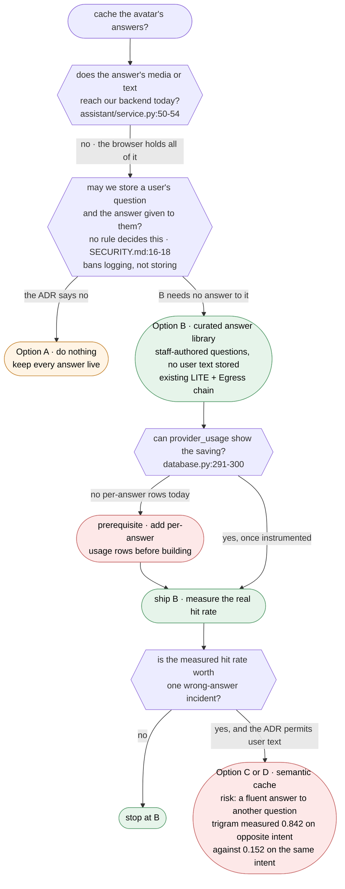

# Spike: Can an avatar answer be captured, stored and replayed, and which parts of the response-cache proposal are new work?

| Field   | Value                                      |
| ------- | ------------------------------------------ |
| Created | 2026-09-19                                 |
| Updated | 2026-09-19                                 |
| Status  | In Review                                  |
| Domain  | assistant                                  |
| Author  | `respcache-t1-res` (Claude Opus 5), mission `20260919-respcache` |
| Outcome | → ADR                                      |

Every codebase claim below is cited at `file:line` against `main@eb05da0`. Every external claim
names its source and its date. Anything believed but not checked is in section 7 and is labelled
unverified.

**On the `Status` value.** `docs/templates/SPIKE.md` offers only `Open / Resolved`, and the
`writing-spikes` skill's close-out step says to set `Resolved`. This document uses `In Review`
deliberately, because promoting a spike to `Resolved` is the maintainer's call, not the author's.
`docs/features/INDEX.md` therefore carries `Research: Open`, which is consistent: this is not
resolved yet. Do not "fix" it back. Whether the template should gain `In Review` as a value is a
separate question for whoever owns the templates.

## 1. The question

> **Can an avatar answer be captured, stored and replayed at all in this system, and if so, which
> of the proposal's four parts (intent matching, video capture, optimization, object storage) are
> new work versus already built?**

**The short answer: yes for one pipeline, no for the pipeline the proposal is about.**

This system has two separate avatar pipelines. The **workbench** pipeline is server-driven and can
already record, store and replay an avatar answer end to end, but that chain is refused in the
default configuration and it is not what users talk to. The **assistant** pipeline is what users
talk to on `mobile`, `web` and `widget`, and it runs entirely in the browser against LiveAvatar's
cloud. No question text, no answer text and no answer media reaches our backend on that path
(`apps/api/services/orchestrator/src/assistant/service.py:50-54`).

Part by part, for the assistant pipeline:

| Proposal part | Verdict | One-line reason |
| ------------- | ------- | --------------- |
| Intent matching | **New** | Nothing matches anything. The only match in the repo is an exact SHA-256 over TTS parameters (`apps/api/services/elevenlabs/cache.py:13`), and the assistant never calls it. |
| Video capture | **Partly built, on the other pipeline** | The whole capture chain exists, is hard-refused in the default transport (`.../src/main.py:361-369`), and is wired only to LITE mode. |
| Optimization | **Partly built** | `ffmpeg` 5.1.9 is already in the API image (`apps/api/services/orchestrator/Dockerfile:11`) and `ffprobe` is already used (`.../src/media_probe.py:8`). The background job runner it would need does not exist. |
| Object storage | **New, but cheaper than assumed** | No client of any kind (`grep -rniE 'boto3\|digitalocean\|minio' apps/api` returns nothing). But `livekit-api==1.0.7` can already upload to S3-compatible storage with no new Python dependency. |

## 2. Why it is open

The product owner's description rests on two assumptions that the code contradicts.

**Assumption one: nothing is cached today.** A deterministic audio cache already exists and is
already consulted before the provider is called (`apps/api/services/elevenlabs/service.py:59-60`).
Usage rows already carry a `cache_hit` flag
(`apps/api/services/orchestrator/migrations/001_initial.sql:78`). Building a "cache" without
knowing this would produce a second, competing cache.

**Assumption two: the answer's video is simply there to be downloaded.** On the assistant path the
answer is a live WebRTC stream inside a room owned by LiveAvatar. Our backend never sees it. There
is no file to take.

What it costs to guess wrong:

- Build the wrong pipeline. The capture chain that exists serves the `web`-only workbench screen
  at `/avatar` (`apps/frontend/src/app/web/router.tsx:29`), not the assistant. A team that reads
  "video capture already works" and starts from there builds something no user reaches.
- Ship a cache that answers the wrong question. "Same intent" is the load-bearing phrase in the
  whole proposal and it is undefined. Section 5 shows a measured case where the obvious mechanism
  ranks an **opposite-meaning** question far above a same-meaning one.
- Cross a trust boundary that nobody has decided on. `docs/SECURITY.md:16-18` bans *logging*
  prompt and answer text, and makes *storing* it conditional: "If a product promises it does not
  store conversations, that must be true in the code". No such promise is recorded in this
  repository (see C3). So a cache keyed on user questions does not break a written rule. It walks
  into a gap where no rule exists, which is harder to notice and is why the outcome is an ADR.
- Claim a saving that cannot be shown. `provider_usage` records one row per assistant session
  token, with `characters` and `estimated_duration_ms` left null
  (`.../src/assistant/service.py:125-140`). There is no per-answer cost signal to improve.

## 3. Constraints

Any answer has to satisfy all of these.

| # | Constraint | Where it comes from |
| - | ---------- | ------------------- |
| C1 | **Four targets.** `mobile`, `web`, `admin`, `widget` from one codebase. The assistant is on `mobile`, `web` and `widget`. `admin` has no assistant route at all (`apps/frontend/src/app/admin/router.tsx:19-26`). The `widget` has no router and no Redux (ADR 0010). | `CLAUDE.md`, ADR 0004, ADR 0010 |
| C2 | **Layers.** `app → pages → features/entities → shared`. The frontend never calls a provider or object storage directly. Everything goes through `apps/frontend/src/shared/api` into `apps/api`. | `CLAUDE.md`, `AGENTS.md` |
| C3 | **Security.** `docs/SECURITY.md:16-18` bans *logging* prompt and answer text, and makes *storing* it conditional on a product promise. No such promise is recorded here, so storage is undecided rather than forbidden. See the note under this table. `docs/SECURITY.md:23-25` makes the session token a per-conversation credential. Two doors reach the assistant: a signed-in user, or the embed key on an allowed origin (`.../src/assistant/router.py:34-49`). | `docs/SECURITY.md` |
| C4 | **Migrations are append-only**, applied in order at startup, with no downgrade path. | `SPEC.md` §5, `apps/api/README.md:47-49` |
| C5 | **Long work answers `202` with a job id.** Never hold a request open while a model runs. | `docs/API.md:20-22` |
| C6 | **A saving must be measurable from `provider_usage`**, not estimated. | `SPEC.md` §5 |
| C7 | **On-premise installs with no internet access** are a stated customer requirement. | ADR 0006, Context section |
| C8 | **Bilingual, English and Persian, with RTL.** The assistant has two provider modes and they do not speak the same languages (`.../src/assistant/service.py:23-33`). | `CLAUDE.md`, `.env.example:42-49` |
| C9 | **The feature presumes `LIVEAVATAR_SANDBOX=false` with a production avatar configured.** In the default configuration nothing worth caching can be produced. See the note below. | `.../src/config.py:37,71`, `.../src/assistant/service.py:17-18,74-75,221-225` |

C9 is a precondition, not a preference, and turn 1 of this document missed it. `liveavatar_sandbox`
defaults to `True` (`.../src/config.py:37`). While it is on, `_avatar_id()` ignores
`LIVEAVATAR_ASSISTANT_AVATAR_ID` and returns the shared public sandbox avatar
(`.../src/assistant/service.py:221-225`, and `config.py:71`: "Sandbox cannot use a custom avatar,
so this is ignored while sandbox is on"), and every session is clamped to sixty seconds
(`.../src/assistant/service.py:17-18,74-75`).

Two consequences. First, an answer rendered today would show a borrowed avatar that is not the
practitioner, so it is not a reusable asset and caching it would be caching the wrong face.
Second, and more importantly, the decisive argument in §6 is that a wrong cached answer is
attributed to a named practitioner. **That argument only has force outside sandbox.** Inside
sandbox the stakes are lower and so is the value: there is nothing worth storing. Either way the
feature presumes production mode, so §8 places this before the render work.

### C3 in full, because the whole recommendation turns on it

The rule at `docs/SECURITY.md:16-18` reads, exactly:

> An AI gateway logs metadata only: user, model, token counts, latency. Never log prompt or
> answer text. If a product promises it does not store conversations, that must be true in the
> code, not in a setting an operator can flip.

Read precisely, that is a **ban on logging** plus a **conditional** about storage. The condition
fires only if the product has promised not to store conversations. I searched this repository for
such a promise and found none: `grep -rniE "not store|never store|do not store|not record|privacy|retention" docs/ README.md apps/frontend/src/i18n/locales/`
returns only `README.md:153` and `docs/SECURITY.md:75`, and both are about the **session token**,
not about conversation text.

So the honest position is: **nothing in this repository currently forbids storing a user's
question, and nothing permits it either.** That is weaker than "the proposal breaks a written
rule", and it is a better reason for an ADR than the strong version would have been. A rule you
break is a rule someone already thought about. A gap is not.

This matters for scoring. Options C and D do not fail C3; they land in the undecided part of it,
which is why the comparison table says "undecided" rather than "contradicted", and why §8 makes
the ADR a prerequisite rather than a formality.

C8 deserves emphasis, because it decides which language an intent mechanism has to work in.

FULL persona mode is English only. Persian is accepted when the token is minted and rejected when
the session starts, verified against the real provider on 2026-09-11 and written down at
`.../src/config.py:54-61` and `.env.example:67-71`. Persian is reachable only through a LiveAvatar
Voice Agent wrapping the customer's ElevenLabs agent (`.../src/assistant/service.py:79-91`), and
`.env.example:46-49` names that path as the default and "the only path that speaks Persian today".

So the language the assistant is expected to serve in production is Persian, and any
intent-matching mechanism has to work on Persian text first. Section 5.0 measures exactly that, and
Persian is the harder case.

## 4. What the codebase already does

### 4.1 The eleven facts, re-verified

Each row was opened at its cited line at `main@eb05da0`. **Six** were exact at every line cited
(rows 3, 4, 8, 9, 10, 11). **Five** had a line number off by one to four lines with the fact
itself intact (rows 1, 2, 5, 6, 7). **Two of those five also need a substantive correction**, and
those two are marked **correction** below. Rows 5 and 7 are the ones a reader should not skip.

| # | Claim | Verified at | Result |
| - | ----- | ----------- | ------ |
| 1 | A deterministic TTS audio cache exists | `apps/api/services/elevenlabs/cache.py:13` (`deterministic_cache_key`), `:34` (`get`), `:45` (`put`) | **True.** The key is a SHA-256 over the canonical JSON of the TTS parameters (`cache.py:14-15`). Line numbers for `get` and `put` were cited as `:37` and `:47`; they are `:34` and `:45`. |
| 2 | The TTS path checks that cache before calling the provider | `apps/api/services/elevenlabs/service.py:59-60`, and again under a lock at `:67-68` | **True.** It is a double-checked lock: read, take a Redis lock, read again, then call the provider at `:74`. Cited as `:56`, which is a blank line: `:55` closes the `parameters()` dict and `:57` opens `async def generate`. Either way `:56` does not show the cache check. |
| 3 | The schema has `audio_assets`, `video_assets`, `generation_jobs` | `.../migrations/001_initial.sql:22`, `:39`, `:55` | **True, exact.** |
| 4 | Usage records carry a `cache_hit` flag | `.../migrations/001_initial.sql:78` | **True, exact.** |
| 5 | `generation_jobs` has a `dedupe_key` and an index on it | `.../migrations/001_initial.sql:58` (column), `:68` (index) | **Correction.** The SQL is there, cited as `:59,67` and actually at `:58,68`. But **no code reads or writes that table**: `grep -rn "generation_jobs" .` returns only the two migration lines. It is dead schema, not a built feature. There is also no `GET /api/jobs/{jobId}` endpoint, although `docs/API.md:20-21` makes one mandatory for long work. |
| 6 | In `managed` transport the room is LiveAvatar's, so our Egress worker cannot record it | `.../src/config.py:40-42` (comment), `:45` (the setting, default `"managed"`) | **True.** Cited as `:41-43`. The refusal is enforced at `.../src/main.py:361-369`, which answers `409 recording_unavailable`. |
| 7 | `byo` is "the only mode that can record" | `.../src/config.py:43-44` | **Correction.** True as written, and incomplete in the way that matters. `LIVEAVATAR_TRANSPORT` is read only by the LITE-mode `LiveAvatarManager` (`.../src/main.py:96`, `apps/api/services/liveavatar/manager.py:65,102`). The assistant ignores it and hard-codes `"transport": "managed"` in its session row (`.../src/assistant/service.py:119`). `create_full_token` states outright that FULL mode "never create[s] a LiveKit room and never send[s] livekit_config" (`apps/api/services/liveavatar/client.py:88`), and `create_voice_agent_token` sends none either (`client.py:132-138`). **Setting `LIVEAVATAR_TRANSPORT=byo` today would not make one assistant answer recordable.** It only changes the workbench. |
| 8 | The assistant is browser-driven; the backend only mints a token and never sees the question text or the answer media | `.../src/assistant/service.py:50-54` | **True, exact.** The class docstring says it in those words. Confirmed on the frontend: `apps/frontend/src/features/assistant/useAssistantSession.ts:42-49` shows the browser calling `POST /api/assistant/session`, then driving the provider SDK itself. |
| 9 | LiveKit Egress output is a local directory, not object storage | `.../src/config.py:125` (`egress_output_dir: "/out"`) | **True, exact.** `/out` in the egress container is bind-mounted to `./media/video` (`docker-compose.yml:74`), which the orchestrator reads as `/media/video` (`docker-compose.yml:104,108`). `GET /assets/video/{id}` serves that file from disk (`.../src/main.py:436-441`). |
| 10 | An MP4 probe for Egress output exists | `.../src/media_probe.py:8` (`probe_avatar_mp4`) | **True, exact.** It shells out to `ffprobe` and rejects anything that is not non-empty H.264 plus audio (`media_probe.py:34-45`). |
| 11 | No object-storage client is present | `grep -rniE 'boto3\|digitalocean\|minio' apps/api` → exit 1, no output | **True.** `apps/api/services/orchestrator/requirements.txt` has 15 entries and none of them is a storage SDK. |

### 4.2 The two pipelines


Dashed means proposed and not built. The thick edge is the fact the whole spike turns on. The
takeaway: the recording chain (DF04 to DF06) and the conversation users actually have (DF01 and
DF02) are two different pipelines, DF07 between them does not exist, and the one gate in the
recording chain is closed by default.

Two more things the diagram cannot hold:

- `docs/API.md:205-209` classifies `/tts/*`, `/avatar/*` and `/assets/*` as "Phase 1 LITE mode
  workbench" endpoints that are explicitly **not part of the frontend contract**. They also carry
  no authentication: they are registered directly on the app with no dependency
  (`.../src/main.py:254,260,280,359,397,436`), unlike `/api/assistant/*`, which requires a user
  session or the embed key (`.../src/assistant/router.py:34-49`).
- The `/avatar` workbench route on `web` sits above `RequireAuth`
  (`apps/frontend/src/app/web/router.tsx:29` versus `:32`), so it is reachable signed out.

### 4.3 What is measurable today

`usage_summary()` groups `provider_usage` by provider and operation and returns calls, summed
characters, summed duration and a count of cache hits (`.../src/database.py:291-300`). There is no
cost column and no currency anywhere in the schema (`001_initial.sql:70-81`).

For ElevenLabs TTS that is enough to show a real saving: `characters` is `len(text)`
(`.../services/elevenlabs/service.py:118`) and ElevenLabs bills per character, so
`characters` on `cache_hit = true` rows is money not spent.

For the assistant it is not. The only rows written are `assistant_token` and `assistant_close`,
both with `cache_hit` hard-coded false and both leaving `characters` and `estimated_duration_ms`
null (`.../src/assistant/service.py:125-140` and `:189-197`). **Constraint C6 cannot be met for the
assistant without adding per-answer usage rows first.** That is a prerequisite, not a detail.

### 4.4 What is already installed

Measured inside the running `kohandezh-live-avatar-orchestrator-1` container on 2026-09-19:

- `ffmpeg` and `ffprobe` 5.1.9-0+deb12u1, installed by `.../orchestrator/Dockerfile:11`. The
  requester asked to "compress and optimize with Python libraries". The right tool is already
  there and it is not a Python library. No new dependency is needed for optimization.
- `livekit-api` 1.0.7. Its `EncodedFileOutput` message carries the fields
  `file_type, filepath, disable_manifest, s3, gcp, azure, aliOSS`, and its `S3Upload` message
  carries `access_key, secret, region, endpoint, bucket, force_path_style` among others. So Egress
  can upload straight to any S3-compatible store, including DigitalOcean Spaces and a self-hosted
  MinIO, with **no new Python dependency**. Only `filepath` is used today
  (`.../src/livekit_gateway.py:81-96`).

Reproduce with:

```bash
docker exec kohandezh-live-avatar-orchestrator-1 python -c \
  "from livekit import api; print(list(api.EncodedFileOutput.DESCRIPTOR.fields_by_name)); \
   print(list(api.S3Upload.DESCRIPTOR.fields_by_name))"
```

Primary source for the same capability:
[LiveKit, "Output & streaming options"](https://docs.livekit.io/transport/media/ingress-egress/egress/outputs/),
fetched 2026-09-19, says "Egress supports any S3-compatible storage provider, including the
following:" and names MinIO, Oracle Cloud, CloudFlare R2, **Digital Ocean**, Akamai Linode and
Backblaze, with Azure and GCP covered separately. So the requester's named target is on the
vendor's own supported list.
[DigitalOcean Spaces documentation](https://docs.digitalocean.com/products/spaces/), page generated
2026-09-18, fetched 2026-09-19, says "Spaces Object Storage is an S3-compatible service for
storing and serving large amounts of data" and that "The built-in Spaces CDN minimizes page load
times".

### 4.5 What is not installed

Measured against the running `postgres:16-bookworm` instance on 2026-09-19:

```bash
docker exec kohandezh-live-avatar-postgres-1 psql -U kohandezh -d kohandezh_avatar \
  -c "select name from pg_available_extensions where name in ('vector','pg_trgm','unaccent','fuzzystrmatch');"
```

`pg_trgm`, `unaccent` and `fuzzystrmatch` are **available** and not installed. **`pgvector` is not
available at all** in this image. Vector search therefore needs a different Postgres image
(`pgvector/pgvector:pg16`) or a separate service, on top of the embedding model itself. ADR 0006
anticipated embeddings in Persian and English and named `sentence-transformers`, but nothing of the
kind is installed today.

### 4.6 The four parts of the proposal

Verdict for each part, **for the assistant pipeline**, which is the one the proposal is about.

| Part | Verdict | Evidence | What is actually missing |
| ---- | ------- | -------- | ------------------------ |
| **Intent matching** | **New** | The only matching in the repo is byte equality after a SHA-256 over TTS parameters (`apps/api/services/elevenlabs/cache.py:13-15`), and the assistant never reaches it: `AssistantSessionService` is constructed with only a client, a database and settings (`.../src/main.py:98`). `generation_jobs.dedupe_key` (`001_initial.sql:58`) has no reader and no writer. | Everything. No question text reaches the backend at all, so there is nothing to match on. `pgvector` is unavailable (§4.5). And §5.0 shows the mechanism is an open design problem, not an implementation detail. |
| **Video capture** | **Partly built, on the other pipeline** | The full chain exists: `POST /assets/generate-video` (`.../src/main.py:359`), `start_mp4_egress` (`.../src/livekit_gateway.py:81`), `finalize` (`.../src/main.py:397`), `probe_avatar_mp4` (`.../src/media_probe.py:8`), `GET /assets/video/{id}` (`.../src/main.py:436`). | A way for an assistant answer to enter it. It is refused in the default transport (`.../src/main.py:361-369`) and BYO is implemented only for LITE mode (§4.1 row 7). |
| **Optimization** | **Partly built** | `ffmpeg` and `ffprobe` 5.1.9 are installed in the API image (`apps/api/services/orchestrator/Dockerfile:11`) and `ffprobe` is already called (`.../src/media_probe.py:9-20`). | A background job to run a compression pass, plus the `202` and job-id runner `docs/API.md:20-22` requires. Neither exists, and the existing `finalize` endpoint **breaks that rule today**: `.../src/main.py:406-409` busy-waits up to fifteen seconds for the MP4 to appear. So this is a fix as well as an addition. The requester's "Python libraries" are not needed: `ffmpeg` is the right tool and it is already in the image. |
| **Object storage** | **New, but cheaper than assumed** | No client of any kind: `grep -rniE 'boto3\|digitalocean\|minio' apps/api` exits 1. Output goes to a local directory (`.../src/config.py:125`, `docker-compose.yml:74`). | An upload target and a serving decision. Not a new dependency: `livekit-api==1.0.7` already carries `EncodedFileOutput.s3` with `S3Upload.endpoint` and `force_path_style` (§4.4), which is exactly what DigitalOcean Spaces or a self-hosted MinIO needs. |

## 5. Options

### 5.0 The load-bearing phrase: "same intent"

The proposal turns on it and never defines it. Getting it wrong has one specific failure mode:
**the system serves a stored video in which the avatar confidently and fluently answers a different
question.** The user has no way to tell. There is no error, no spinner, no retry. This is worse
than a slow answer and worse than an outage, because it looks like a working product.

I measured the obvious mechanism. Inside a transaction that was rolled back, so nothing was left
installed:

```sql
BEGIN;
CREATE EXTENSION IF NOT EXISTS pg_trgm;
SELECT similarity('ساعت کاری شما چیست؟','چه ساعتی باز هستید؟');              -- fa, same intent
SELECT similarity('آیا این دارو برای کودکان مناسب است؟',
                  'آیا این دارو برای کودکان مناسب نیست؟');                    -- fa, opposite intent
SELECT similarity('what are your opening hours?','when are you open?');       -- en, same intent
SELECT similarity('is this drug safe for children?',
                  'is this drug unsafe for children?');                       -- en, opposite intent
ROLLBACK;
```

| Pair | Trigram similarity |
| ---- | ------------------ |
| Persian, same intent, different words ("what are your working hours?" / "what time are you open?") | **0.15151516** |
| Persian, opposite intent, one word apart ("is this medicine suitable for children?" / "is this medicine **not** suitable for children?") | **0.84210527** |
| English, same intent, different words ("what are your opening hours?" / "when are you open?") | 0.41935483 |
| English, opposite intent, one word apart ("is this drug safe for children?" / "is this drug **un**safe for children?") | 0.82352940 |

The ordering is inverted. Lexical similarity ranks the dangerous pair above the correct pair in
both languages, and the gap is far worse in Persian (5.5x) than in English (2.0x). **No threshold
exists that catches the paraphrase without also catching the negation**, and Persian is the
language the assistant is expected to serve (C8). Trigram matching is therefore not a candidate
mechanism on its own.

Verified locally on 2026-09-19. Afterwards `pg_extension` holds only `pgcrypto` and `plpgsql`, so
the measurement left nothing installed. Four hand-picked pairs are an illustration, not a
benchmark: they show that the mechanism can invert, which is enough to disqualify it, not how often
it inverts.

Candidate mechanisms, with the failure mode of each:

| Mechanism | How it decides "same" | Failure mode | Verdict |
| --------- | --------------------- | ------------ | ------- |
| **Exact string match** (normalized: trim, lowercase, `unaccent`, Persian Y and K folding) | byte equality after normalization | Near-zero hit rate on free speech. Speech-to-text output varies run to run, so even the same spoken sentence rarely matches. Fails **safe**: a miss costs a live generation. | Safe, near useless on free text. Useful only over a **fixed** question set the user picks from. |
| **Trigram / `pg_trgm` similarity** | character overlap | Measured above. Ranks negation above paraphrase. Fails **unsafe** and fails worst in Persian. | Rejected on evidence. |
| **Embedding similarity above a threshold** | cosine distance between sentence vectors | The standard production mechanism, and the standard production hazard. The threshold sets the hit rate, and published numbers are English-only (see the table below this one). It is also attackable: Zhang et al., ["From Similarity to Vulnerability: Key Collision Attack on LLM Semantic Caching"](https://arxiv.org/abs/2601.23088), submitted 2026-01-30, revised 2026-06-30, report that their attack "achieves a hit rate of 86% in LLM response hijacking" and argue the conflict between cache locality and collision resistance is fundamental. | Needs `pgvector` (not available, §4.5), an embedding model, and an extra call on every question. Persian embedding quality is unmeasured here, and no published number covers it. |
| **A closed intent classifier over a fixed label set** | a model maps the question to one of N known intents, or to "none" | Fails safe **if and only if** "none" is a real outcome that falls through to live generation. Needs labelled Persian training data and a retraining loop. Drift is silent. | Viable, but it is a product of its own, not a cache. |
| **The user picks from suggested questions** | there is no matching problem | Not a cache for arbitrary questions. Only covers what staff decided to pre-render. Fails safe by construction. | The only mechanism with no wrong-answer failure mode. |
| **Any of the above plus a verification pass** (a second model judges "does this stored answer answer this question?") | match, then check | Removes most false positives and adds a model call, which is the cost the cache was supposed to remove. This row is my own reasoning, not a cited recommendation. No source in this document proposes it. | Makes the semantic options defensible. It costs latency on every hit, and some money (U7). |

This table is the reason the options below differ mainly in **how "same" is decided**, not in how
video is stored.

#### What the published threshold numbers actually say

The only published numbers I found are English. [Portkey, "Semantic Caching Thresholds and Why
They Matter"](https://portkey.ai/blog/semantic-caching-thresholds/), published 2026-04-18, fetched
2026-09-19, reproduces an AWS benchmark it describes as "AWS tested multiple thresholds on real
chatbot queries using Claude 3 Haiku and Titan Embeddings":

| Threshold | Hit rate | Accuracy | Cost savings |
| --------- | -------- | -------- | ------------ |
| 0.99 (strict) | 23.5% | 92.1% | 15.8% |
| 0.95 | 56.0% | 92.6% | 51.9% |
| 0.90 | 74.5% | 92.3% | 72.5% |
| 0.80 | 87.6% | 91.8% | 84.6% |
| 0.75 (permissive) | 90.3% | 91.2% | 86.3% |

The page's own guidance is one sentence: "Start with a threshold between 0.90 and 0.95." It also
says "Once false positives start to exceed roughly 3% to 5%, you have reached the limit of your
embedding model", and that estimating false positives at all needs "sampling and evaluation using
humans or LLM-based judges". It states that Portkey itself "does not expose user-configurable
thresholds".

Three honest readings, and the third is the one that matters here:

1. The hit rate is the dial. It moves from 23.5% to 90.3% across the range, so the size of the
   saving is a choice, not a property of the workload.
2. Accuracy in that benchmark barely moves (91.2% to 92.6%). The page does not decompose it, so it
   does not tell us how much of the roughly 8% shortfall is the cache and how much is the model
   answering imperfectly anyway. It is not evidence that a permissive threshold is safe, and it is
   not evidence that it is dangerous. It is not decomposed.
3. **Every number in that table is English, on a general chatbot workload.** This system's
   production language is Persian (C8), and the one Persian measurement anyone has run here is the
   trigram result above, where the mechanism inverted. Nothing published tells us where the
   Persian curve sits. That is U3, and it is why these figures inform the question rather than
   settle it.

**Correction, recorded rather than quietly fixed.** Turn 1 of this document attributed to that
page a "2026 production threshold range of 0.92 to 0.97" and "8 to 15 percent false positives at
0.90", and glossed it as describing the threshold as "one knob". The page contains none of those
figures and explicitly says the opposite about the knob. Those numbers came from a search-result
summary that blended several sources, and I attributed them to the one page I linked without
reading it. The block above is what the page says.

### Option A: Do nothing

- **How it works.** Every assistant answer stays live. The existing deterministic TTS cache keeps
  serving the workbench path. Nothing is built.
- **Evidence.** The cost concern is real but currently unquantified in this repo. `provider_usage`
  can count assistant sessions but records no per-answer characters or duration
  (`.../src/assistant/service.py:125-140`), and the schema has no cost column
  (`001_initial.sql:70-81`). The rate limit already caps exposure at
  `ASSISTANT_RATE_LIMIT_PER_HOUR`, default 20 per user or per visitor address
  (`.../src/config.py:79`, `.../src/assistant/router.py:59-63`), and sandbox mode spends no credits
  (`docs/SECURITY.md:71`).
- **Fits the constraints?** C1 to C9: trivially, it changes nothing, and it is the only option
  that needs no answer to C9 because it stores nothing. C6 is the interesting one: it
  is the only option that is honest about the fact that today there is no measurement to improve.
- **Cost.** Build: zero. Migration: none. Operations: none. Lock-in: none. The cost of being wrong
  is the provider bill continuing to grow with no instrument that would tell anyone how fast, and a
  real product gap: repeated common questions are answered slowly and expensively every time.
- **Reversal.** Free. Nothing to undo.

### Option B: A curated library of pre-rendered answers

- **How it works.** Staff write a fixed set of questions and their approved answers in the admin
  target. The existing workbench chain renders each one once, offline: `POST /avatar/speak` for the
  audio (already cached), `POST /assets/generate-video` for the recording, `finalize` for the
  probe. The result is an approved `video_assets` row, which the schema already supports with a
  `VIDEO_APPROVED` status and a review endpoint (`.../src/main.py:444-458`). In the assistant, the
  user reaches these through **suggested questions**, not through free-text matching. Tapping one
  plays the stored MP4. Typing or speaking anything else starts a live session exactly as today.
- **Evidence.** Every server-side piece exists and was verified in §4: Egress
  (`livekit_gateway.py:81`), probe (`media_probe.py:8`), storage rows
  (`001_initial.sql:39`), serving (`main.py:436-441`), approval (`main.py:444-458`). The one gate
  is `LIVEAVATAR_TRANSPORT`, and because rendering is an **offline staff job on the LITE pipeline**,
  it does not need the assistant to change transport at all. It needs a LITE session, which is what
  `LiveAvatarManager` already does (`manager.py:56-90`). Rendering can run on an operator machine
  or a build step with `LIVEAVATAR_TRANSPORT=byo` and a public LiveKit endpoint
  (`manager.py:73-81`), and the resulting file is then a normal asset.
- **Fits the constraints?**
  - **C1 four targets.** The playback UI belongs in `features/assistant` so `mobile`, `web` and
    `widget` all get it from one place. It must not go in a page: the widget has no router
    (ADR 0010). `admin` gains the authoring screen instead. Fully covered on three targets,
    deliberately absent on the fourth.
  - **C2 layers.** Playback is a new `entities/cached-answer` with a Zod schema plus a route under
    `/api/`, reached through `shared/api`. No new client.
  - **C3 security. Partly strong, partly new work, and the two halves must be read together.**
    The strong half is real: **no user question text is ever stored**, because the question set is
    staff-authored, so the undecided storage question above never has to be answered for B to
    ship. The playback endpoint reuses `get_principal` (`.../src/assistant/router.py:34`), so the
    two existing doors still apply and no media URL becomes public.
    The other half: **the authoring path B reuses has no authentication at all today.**
    `/tts/generate`, `/avatar/session`, `/avatar/speak`, `/assets/generate-video`,
    `/assets/video/{id}/finalize` and `GET /assets/video/{id}` are registered directly on the app
    with no `Depends(...)` (`.../src/main.py:254,260,280,359,397,436`), unlike
    `/api/assistant/session` (`.../src/assistant/router.py:52`). On `web`, the workbench route is
    mounted above `RequireAuth` (`apps/frontend/src/app/web/router.tsx:29` versus `:32`), so it is
    reachable signed out. That is a pre-existing hole, not one B creates, but B would be the first
    feature to depend on those endpoints in production, so **putting them behind an admin role is
    work the spec has to carry.** Turn 1 of this document stated the strong half alone, which
    overstated the option's security position.
  - **C4 migrations.** One append-only migration: an approved-answer table keyed by a
    staff-authored slug, referencing `video_assets(id)`.
  - **C5 `202` plus job id. B inherits an existing violation, so this is a fix and not only an
    addition.** The runner does not exist (§4.1 row 5), and `generation_jobs` is the table waiting
    for it. Worse, the `finalize` endpoint B reuses **breaks C5 today**: `.../src/main.py:406-409`
    loops `for _ in range(30)` with `await asyncio.sleep(0.5)`, holding the request open for up to
    fifteen seconds waiting for the MP4 to appear. `docs/API.md:20-22` says never hold a request
    open while a model runs. So B's render chain has to be converted to the job pattern, not just
    wrapped in one, and the work estimate is larger than turn 1 of this document implied.
  - **C6 measurable.** A played cached answer writes a `provider_usage` row with
    `provider = 'liveavatar'`, `operation = 'assistant_answer'`, `cache_hit = true`. A live answer
    writes the same row with `cache_hit = false`. `usage_summary()` then shows the ratio with no
    query change (`.../src/database.py:291-300`).
  - **C7 on-premise. Serving is fine, authoring needs the same public endpoint Option D is
    rejected for, and the asymmetry has to be argued rather than assumed.** Serving: files stay on
    local disk exactly as today, and object storage stays optional. Authoring: the render step
    needs `LIVEAVATAR_TRANSPORT=byo`, and `apps/api/services/liveavatar/manager.py:73-81` refuses
    to start a BYO session unless `public_livekit_ready`, defined at `.../src/config.py:182-183`
    as a `wss://` URL that is not localhost. That is the same requirement that makes D fail C7.
    The difference is **when and where it applies**, not whether it applies: for D it is a
    per-session requirement in every production install, including the air-gapped ones; for B it
    is a one-time offline job that can run at the vendor, with only the finished MP4 shipped to
    the customer. **This is a real difference, but it is a deployment-process argument, not a
    technical exemption**, and it only holds if rendering at the vendor is acceptable to the
    customer. If a no-internet customer insists on rendering their own answers on their own
    hardware, B's authoring step fails C7 exactly as D does, and that customer gets a
    vendor-rendered library or nothing. The spec has to state which it is. See U4, which is the
    related unverified assumption: I did not run the render job outside production.
  - **C8 Persian and RTL.** The questions are authored per language, so Persian quality is a human
    decision, not a model's.
- **Cost.** Build: an admin authoring screen, an offline render job, one playback endpoint, one
  playback mode in `features/assistant`, and the `202` job runner. Migration: one append-only file,
  which fits C4. Operations: staff have to curate and re-approve answers when facts change, and
  someone has to run the render job. That is the real ongoing cost and it is human, not technical.
  Lock-in: none worth naming, because no new dependency and no new service are added. The honest
  limitation: it only covers questions someone thought of, so the hit rate is bounded by curation
  effort, not by traffic.
- **Reversal.** Easy. Delete the rows and the suggested-questions UI. The assistant keeps working
  exactly as it does today, because the live path is never removed.

### Option C: Semantic cache with capture in the browser

- **How it works.** The browser already holds everything needed. It receives the user's question as
  a `user_transcript` event and the avatar's answer as an `agent_response` event
  (`apps/frontend/src/features/assistant/state.ts:343-371`), and it holds the answer as a WebRTC
  `MediaStream` attached to a `<video>` element
  (`apps/frontend/src/features/assistant/AssistantVideo.tsx:30-33`). It would send the question and
  answer text to the backend, record the stream with `MediaRecorder`, and upload the result. The
  backend embeds the question, stores the vector, and on a later question above the similarity
  threshold serves the stored file instead of minting a session.
- **Evidence.** The transcript hook points are verified above. The capture hook point is not: I did
  not test `MediaRecorder` against a remote WebRTC track in the Capacitor WebView on iOS, in the
  widget's Shadow DOM, or on desktop Safari. See section 7. The matching evidence is §5.0.
- **Fits the constraints?**
  - **C1** is the weak point. It has to work in three very different runtimes: a Capacitor WebView
    on Android and iOS, a normal browser, and a Shadow DOM on a stranger's website. A capture that
    works on Chrome and fails on iOS produces a cache populated only by Android and desktop users.
  - **C2** holds, but the frontend becomes the source of the cached media, which is a new kind of
    dependency: the backend would be storing and re-serving **media produced by a client**.
  - **C3 is undecided, not failed.** Storing the question and the answer is not banned by
    `docs/SECURITY.md:16-18`, which bans logging them and makes storage conditional on a promise
    this repository does not record (see §3). So C requires a decision nobody has made, rather
    than breaking a written rule. It also replays one user's recorded answer to another user,
    which is a separate question from storage and is the one the ADR has to settle (§8, item 2).
  - **C5** needs the job runner, same as B.
  - **C6** needs the per-answer usage rows, same as B.
  - **C7** needs `pgvector`, which is not in the image (§4.5), plus an embedding model. An
    on-premise install with no internet needs a local embedding model, which is exactly what ADR
    0006 planned for but nothing installs today.
  - **C8** Persian embedding quality is unmeasured, and §5.0 shows Persian is the harder case.
- **Cost.** Build: everything B needs, plus browser capture on three runtimes, an upload path, an
  embedding step and a verification pass. Migration: not one file but a **Postgres image swap** to
  get `pgvector`, which is a dump and restore of the whole database, not an append-only migration.
  That sits badly with C4. Operations: a retention and deletion process for stored user questions,
  plus ongoing false-positive sampling, which the Portkey page describes as the only way to
  estimate the rate at all. Lock-in: the embedding model becomes load-bearing, and changing it
  invalidates every stored vector, so every cached answer has to be re-embedded. The embedding and
  judge calls add latency to every question, which is the other half of what the requester asked
  for. Whether they also eat the cost saving is **unverified (U7)**: I have no published price for
  an avatar minute or an embedding call, and §4.3 shows this system records none either.
- **Reversal.** Hard. Once user questions and recorded answers are stored, removing them is a
  privacy exercise with a legal edge, not a config change.

### Option D: Semantic cache with capture server-side, by giving the assistant a BYO transport

- **How it works.** Same matching as C. Capture differs: instead of recording in the browser, the
  assistant session is moved into a LiveKit room we own, so our Egress worker can record it the way
  the workbench already does.
- **Evidence.** This is where the contract's transport fact needed extending (§4.1 row 7). The BYO
  path exists **only for LITE mode**. `create_full_token` says in its own docstring that FULL mode
  never sends `livekit_config` (`apps/api/services/liveavatar/client.py:88`), and
  `create_voice_agent_token` sends none either (`client.py:132-138`). The assistant hard-codes
  `"transport": "managed"` (`.../src/assistant/service.py:119`). So Option D is not a configuration
  change. It requires that LiveAvatar's FULL and voice-agent APIs accept a `livekit_config` at all,
  and **I have no evidence either way**: confirming it means a paid provider call, which this spike
  is not permitted to make. See section 7.
- **Fits the constraints?**
  - **C3** fails the same way as C, for the same reason.
  - **C7 fails hard.** BYO needs `PUBLIC_LIVEKIT_URL` to be a trusted public `wss://` endpoint with
    reachable WebRTC ports, and the code refuses to start a BYO session otherwise
    (`apps/api/services/liveavatar/manager.py:73-81`, `.../src/config.py:182-183`). An on-premise
    install with no internet access cannot expose that endpoint to LiveAvatar's cloud. Making BYO
    the default would break the deployments ADR 0006 named.
  - **C1** is better than C: capture is server-side, so it is identical on all three targets.
  - Everything else matches C.
- **Cost.** Highest of all, and gated on a provider capability nobody has confirmed. Build:
  everything C needs except the browser capture, plus a second transport for the assistant.
  Migration: the same `pgvector` image swap as C. Operations: running a publicly reachable LiveKit
  with open media ports, which is a new attack surface and a new thing to keep up. Lock-in: the
  deepest of the four. It changes the default deployment topology from "nothing of ours has to be
  reachable from the internet" (`.../src/config.py:40-42`) to "a public media endpoint is
  required". That is a durable architectural change and squarely an ADR.
- **Reversal.** Very hard. Switching the transport back invalidates the capture path the whole
  feature rests on, and the on-premise deployments that C7 protects would have to be re-planned
  twice.

### The four side by side

| | A: do nothing | B: curated library | C: browser capture | D: BYO transport |
| - | - | - | - | - |
| Wrong-answer risk | none | none (no matching) | high (§5.0) | high (§5.0) |
| C3 storage of user text (`SECURITY.md:16-18`) | untouched | untouched | **undecided** | **undecided** |
| C3 authoring path authentication | n/a | must be added (no auth today) | must be added | must be added |
| C5 `202` plus job id | n/a | existing violation to fix (`main.py:406-409`) | same | same |
| C7 on-premise | fine | serving fine, authoring needs a public LiveKit endpoint once, offline | needs a local embedding model | **broken, every session** |
| New dependency | none | none | `pgvector` image, embedding model | same, plus public LiveKit |
| Covers all assistant targets | n/a | yes (`mobile`, `web`, `widget`) | uncertain on iOS | yes |
| Blocked on an unverified provider capability | no | no | no | **yes** |
| C9 needs production mode first | no | yes | yes | yes |
| Reversal | free | easy | hard | very hard |

## 6. Recommendation

**Option B, and only after the measurement it depends on exists.** The one reason that decides it:
Option B is the only option that delivers the outcome the product owner wants (a stored answer,
served instead of a live generation, cutting cost and latency) **without a mechanism that can serve
a confidently wrong answer**. §5.0 is the whole argument. Every matching mechanism that works on
free text either has a near-zero hit rate or has a false-positive rate that this product cannot
carry: the avatar speaks with a named practitioner's face and voice (the service is titled
"Dr.Kohandezh Live Avatar Phase 1", `.../src/main.py:133`), so a fluent answer to the wrong
question is attributed to a real person. That argument assumes C9, production mode with a custom
avatar. In the default sandbox configuration the face is a borrowed public avatar and the stakes
are lower, but so is the point of the feature, because nothing worth storing gets produced.

**Does B still win once it is scored as strictly as C and D?** Yes, and the margin is clearer than
turn 1 of this document made it look, though for a different reason than turn 1 gave.

Scoring B honestly added three costs it had been let off: the authoring endpoints have no
authentication (C3), the `finalize` endpoint it reuses already breaks the `202` rule (C5), and its
render step needs the same public LiveKit endpoint that Option D is rejected over (C7). Those are
real and they make B more expensive than turn 1 implied.

But none of them is a **discriminator**, because C and D need all three too, and need them in
worse forms. Every option has to fix the authentication and the `202` violation. The C7 difference
is genuine but narrow: B needs the public endpoint once, offline, at authoring time, and can push
it to the vendor; D needs it in every production install for every session. So the honest effect
of strict scoring is that the whole field got more expensive, and the ranking did not move.

What still separates them is unchanged and is the thing worth deciding on: B needs no answer to
the storage question and has no mechanism that can serve a fluent answer to the wrong question,
while C and D need both. Correcting the security reading (§3) weakens the *form* of that argument,
from "C breaks a rule" to "C needs a decision nobody has made", but not its direction.



Green is the recommended path, red is a fallback or a prerequisite, orange is a forced outcome. The
takeaway: B is picked because it is the branch that needs no answer to the undecided storage
question, it is still gated on a cost measurement that does not exist yet, and C or D stay
reachable later only if B's measured hit rate justifies the wrong-answer risk. The diagram leaves
out C9 (production mode) and the three shared prerequisites, because they gate every branch
including doing nothing well; they are in §3, §5 and §8.

**What this trades off, and the mitigation for each:**

| Trade-off | Mitigation |
| --------- | ---------- |
| The hit rate is bounded by what staff curate, not by traffic. It will be lower than a semantic cache's. | Partly mitigable, and honestly so. The per-answer usage rows make the **miss count** visible without storing any question text, so staff can see that curation is not keeping up. Seeing **which** questions are missing needs question text, which is the ADR's decision, not this document's. Until then curation is informed guessing, and the spec should say so. |
| Users who type a slightly different wording get a live answer, so the saving is smaller than promised. | This is the point. A miss costs one live generation. A false hit costs trust. |
| It does not answer the requester's literal request, which was matching on meaning. | Say so plainly, with §5.0 as the reason, and keep C and D reachable behind the gate in the diagram. |
| The offline render job and the `202` job runner are real work that the proposal did not budget for. | `generation_jobs` and its `dedupe_key` index are already in the schema (`001_initial.sql:55-68`) waiting for exactly this. |
| B inherits an existing `202` violation rather than only a missing runner: `finalize` busy-waits up to fifteen seconds (`.../src/main.py:406-409`). | Not mitigable, and it should not be hidden in the estimate. Converting `finalize` to the job pattern is part of B's cost, and every other option inherits it too. |
| B's authoring path runs on endpoints with no authentication (`.../src/main.py:254,260,280,359,397,436`). | Put them behind the admin role in the same spec. B is the first feature that would depend on them in production, so this stops being somebody else's problem. |
| B's render step needs a public LiveKit endpoint, which is the same requirement Option D is rejected over (C7). | It applies once, offline, at authoring time, not per session in every install, so a no-internet customer can be shipped a vendor-rendered library. That is a deployment-process answer, not a technical exemption, and the spec has to state it. If a customer must render on their own hardware, B's authoring fails C7 as D does. |
| Staff can see **that** curation is falling behind but not **which** questions are missing, because that needs question text. | Genuinely unmitigated until the ADR decides. Named here rather than papered over. |

**How hard to undo:** easy, for serving. No user data is stored and no new dependency is added.
The one caveat is authoring: the render step needs a public LiveKit endpoint while it runs, so
"no deployment topology changes" is true of the running product and not of the authoring process.
Reversibility is still the main reason it wins over C and D, both of which are close to
irreversible once user questions and recorded answers exist.

## 7. Assumptions not verified

| # | Assumption | Status | Why it matters |
| - | ---------- | ------ | -------------- |
| U1 | LiveAvatar's FULL and voice-agent session APIs accept a `livekit_config`, so the assistant could use a BYO room. | **Unverified.** Confirming it needs a call to a paid provider API, which this spike is not permitted to make. Our own client never sends one (`apps/api/services/liveavatar/client.py:88,132-138`), which is evidence about our code, not about their API. | Option D is entirely blocked on this. A spec that proposes D must verify it first, through the opt-in provider tests. |
| U2 | `MediaRecorder` can record a remote WebRTC track in the Capacitor WebView on iOS, and inside the widget's Shadow DOM. | **Unverified.** Not tested on any target. | Option C's coverage of `mobile` depends on it. If it fails on iOS the cache is populated by some users and served to all. |
| U3 | Persian sentence embeddings separate paraphrase from negation well enough to be safe at any usable threshold. | **Unverified.** §5.0 measured only the lexical mechanism, which failed. No embedding model is installed and `pgvector` is unavailable, so the semantic mechanism could not be tested here. | Options C and D rest on it. Every published figure in §5.0 is from an English workload, so none of them speaks to this. |
| U4 | The offline render job can drive a LITE BYO session from an operator machine or a build step. | **Partly verified.** The code path exists (`manager.py:73-90`) and its preconditions are explicit (`config.py:182-183`), but I did not run it. | Option B's authoring step depends on it. If it cannot run outside production, B needs another way to render. |
| U5 | The published threshold figures transfer to this system. | **Unverified, and narrower than it looks.** The figures in §5.0 are an AWS benchmark on English chatbot queries with Claude 3 Haiku and Titan Embeddings, republished by [Portkey](https://portkey.ai/blog/semantic-caching-thresholds/) (2026-04-18), a vendor blog rather than peer-reviewed work. The [arXiv paper](https://arxiv.org/abs/2601.23088) (2026-01-30, revised 2026-06-30) is a preprint. Nothing in either covers Persian. | They inform the direction and cannot settle the threshold. The decisive evidence for this repo is the local trigram measurement in §5.0, which is reproducible here. Every external link in this document was re-opened on 2026-09-19 and checked against what it is quoted as saying; see the correction note in §5.0 for the one that failed. |
| U6 | Provider cost is actually dominated by repeated similar questions. | **Unverified, and currently unverifiable.** §4.3 shows `provider_usage` has no per-answer signal for the assistant. | This is the premise of the whole feature. It is why the recommendation makes instrumentation a prerequisite rather than a follow-up. |
| U7 | An embedding call and a judge call are cheap relative to an avatar video minute. | **Unverified.** I have no published price for a LiveAvatar minute, for the ElevenLabs conversation minutes the voice agent path bills separately (`.../src/config.py:65-66`), or for an embedding call. §4.3 shows this system records no cost figure of its own, so the comparison cannot be made from `provider_usage` either. Turn 1 of this document asserted it three times as if it were established; it is an inference. | It is the reason Options C and D stay reachable as later fallbacks rather than being ruled out on cost. If it is false, the semantic options lose their remaining advantage and the answer collapses to Option B or Option A. Whoever writes the ADR should price it. |

No prototype code was written for this spike. The only things executed were read-only inspections
of running containers and one SQL measurement inside a rolled-back transaction, confirmed to have
left no extension installed.

## 8. Outcome

**→ ADR.**

The recommendation depends on a decision that outlives this feature and that no existing ADR
covers: **may the assistant's conversation text be sent to our backend and stored, and if so, under
what retention?**

Note what the gap is, because it is not what it first looks like. `docs/SECURITY.md:16-18` bans
logging prompt and answer text and makes storing it conditional on a product promise that this
repository does not record (§3). So nothing forbids storage today, and nothing permits it. An
undecided question is a better reason for an ADR than a rule someone would be breaking: a broken
rule can be escalated to whoever wrote it, while a gap gets filled by whichever feature ships
first. Options C and D both need it answered. Option B does not, but the boundary should be
written down anyway so the next feature does not cross it by accident.

Option D adds a second durable decision: whether the assistant gets a BYO transport, which would
make a public LiveKit endpoint a per-session deployment requirement and break the no-internet
on-premise installs ADR 0006 names.

Write `docs/DECISIONS/0014-conversation-data-retention.md` before any spec. It must settle:

1. May a user's question text, the avatar's answer text, or the answer's media be persisted by our
   backend at all? If yes: for how long, on what legal basis, and how is it deleted?
2. May media generated during one user's conversation be replayed to a different user? That is a
   distinct question from storage and it is the one the proposal actually needs.
3. Does object storage become a platform dependency? If yes, what is the on-premise story
   (self-hosted MinIO reached through the same `S3Upload` fields, per §4.4), and is a stored answer
   served through a signed URL or proxied behind `get_principal`
   (`.../src/assistant/router.py:34`)? A public URL would bypass both existing doors.
4. Does the assistant get a BYO transport? Only if U1 is verified first, and only with an answer
   for constraint C7.

**What becomes production work, in order:**

1. Per-answer `provider_usage` rows on the assistant path, so constraint C6 can be met at all. This
   is small, it is independent of the ADR, and nothing else should start before it. It needs its
   own decision about what may be recorded: a count and a duration are metadata, which
   `docs/SECURITY.md:16` permits; the question text is not.
2. **Leave sandbox (C9).** `LIVEAVATAR_SANDBOX=false` with `LIVEAVATAR_ASSISTANT_AVATAR_ID` set.
   Until then the avatar is a borrowed public one and every session is clamped to sixty seconds
   (`.../src/assistant/service.py:17-18,74-75,221-225`), so there is nothing worth rendering. This
   is a configuration and commercial step, not code, but it gates every render.
3. The ADR above.
4. A `SPEC.md` for Option B, in this folder, via the `writing-specs` skill.
5. Authentication on the authoring endpoints. `/tts/*`, `/avatar/*` and `/assets/*` take no
   `Depends(...)` today (`.../src/main.py:254,260,280,359,397,436`) and the `web` workbench route
   sits above `RequireAuth` (`apps/frontend/src/app/web/router.tsx:29`). B is the first feature
   that would depend on them in production.
6. The `202` plus job-id runner and `GET /api/jobs/{jobId}`, which `docs/API.md:20-21` already
   requires and which `generation_jobs` (`001_initial.sql:55-68`) was already shaped for. This
   includes **converting** `finalize`, which busy-waits up to fifteen seconds today
   (`.../src/main.py:406-409`), not just wrapping it.

**Open questions for whoever writes that spec.**

Option B's failure paths are the first three. This spike does not answer them, and it should not:
they are behaviour, which is a spec's job. But `AGENTS.md` makes loading, empty and error states
mandatory for every async screen, and B adds a new playback path on three targets, so the spec
author must not meet them cold.

- **What does the user see when a cached answer is missing, slow or corrupt?** The row exists but
  the file does not, or the file is being served over a slow connection, or `ffprobe` passed at
  render time and the browser still cannot play it. Falling back silently to a live session is
  one answer and is probably the right one, but it has a cost implication (the saving disappears
  exactly when the system is already unhealthy) and a UX one (the user waits twice).
- **What happens when a render job fails, and how often does it retry?** Egress can fail, the MP4
  can fail the probe (`.../src/media_probe.py:34-45`), the LITE session can time out. Who is told,
  what is the retry policy, and does a half-rendered answer ever become visible? `generation_jobs`
  has `error_code` and `error_message` columns (`001_initial.sql:60-61`) and nothing writes them.
- **What happens to stored answers when the avatar, the voice or the persona changes at the
  provider?** This one is sharpened by C9 and by §6: the recommendation's decisive argument is
  about whose face is on screen, so a library rendered with last quarter's avatar is a library of
  answers from a face the practitioner no longer uses. Is the library versioned by avatar id and
  voice id, and does changing either invalidate every entry? Note this is also the unresolved
  half of "what is the cache key": §5.0 settles the question side of the key and says nothing
  about the persona side.
- What is the acceptable false-hit rate, stated as a number, before any matching beyond exact match
  is allowed? Without that number Options C and D cannot be evaluated, only argued about.
- Does a user have to be told they are watching a recording rather than a live avatar? This is a
  product and possibly a regulatory question, not an engineering one, and it changes the UI.
- What happens to a stored answer when the underlying facts change? A cached medical or commercial
  answer that is now wrong is worse than no cache. Option B's approval status
  (`.../src/main.py:444-458`) gives somewhere to hang an expiry, but nothing sets one.
- `docs/DATA_MODEL.md` documents only `users`, the dashboard summary and the assistant session. It
  does not document `audio_assets`, `video_assets`, `generation_jobs` or `provider_usage`. The spec
  that touches them should close that gap. This spike did not, because those files are outside its
  scope.
