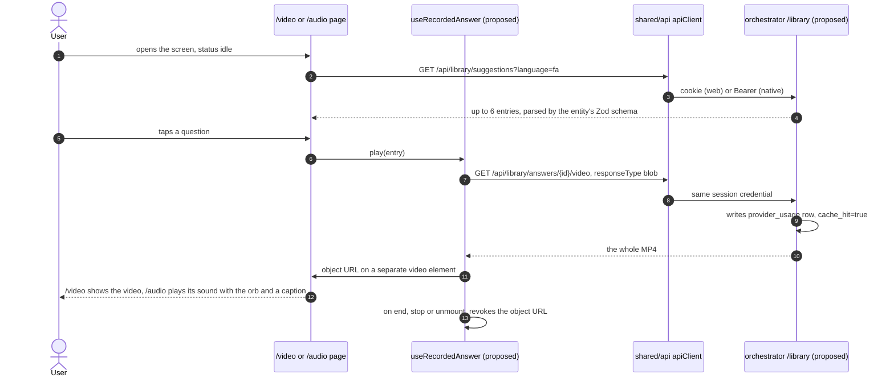
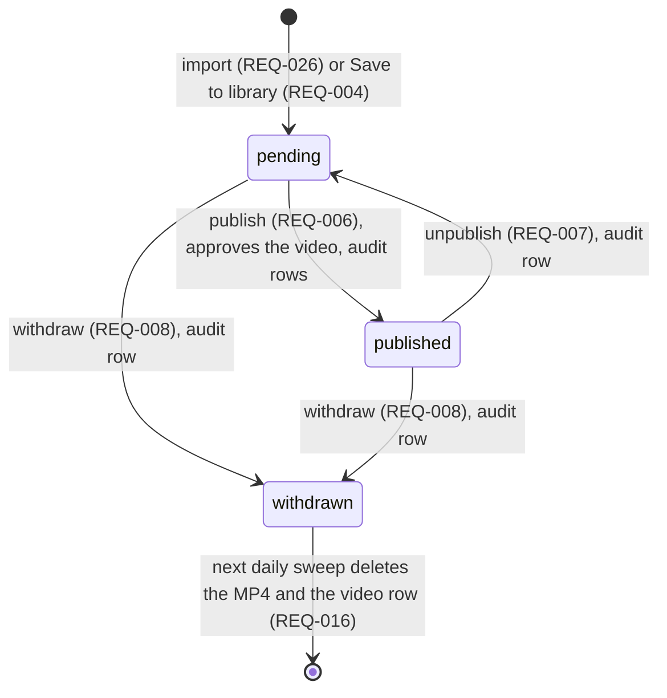
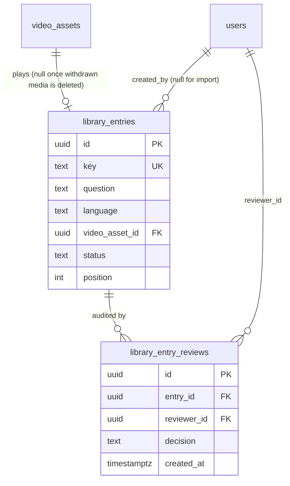

# Response caching for assistant answers

| Field   | Value                                          |
| ------- | ---------------------------------------------- |
| Created | 2026-09-19                                     |
| Updated | 2026-09-25                                     |
| Status  | Draft                                          |
| Domain  | assistant                                      |
| Targets | mobile, web, admin (the widget is excluded, see section 2) |
| Author  | `respcache-t2-res` (Claude Opus 5), mission `20260919-respcache`, section 1; `spec-t1-res` (Claude Opus 5.5), mission `20260925-optionb`, team `spec-t1`, sections 2 to 13 |
| Sources | `docs/features/response-caching/RESEARCH.md` (Resolved, Option B), `docs/DECISIONS/0014-conversation-data-retention.md` (Accepted), `docs/DECISIONS/0015-background-jobs.md` (Accepted) |

Code is cited at `main@a366451`. `.../` means `apps/api/services/orchestrator/`. Frontend paths
start at `apps/frontend/`.

## 1. Purpose

Every answer the assistant gives is generated live, so a repeated question costs full price
every time. The assistant pipeline runs in the browser against LiveAvatar's cloud. Our backend
mints a session token and sees nothing else: no question text, no answer text, no answer media
(`apps/api/services/orchestrator/src/assistant/service.py:50-54`). There is no answer to keep
and no way to serve one again. Caching is not missing from this system, but the one cache that
exists is a deterministic TTS audio cache consulted before the provider is called
(`apps/api/services/elevenlabs/service.py:59-60`), and it sits on the Phase 1 workbench path,
which is not what users talk to (RESEARCH.md §1).

This spec covers a curated library of pre-rendered answers. Staff author a fixed set of
questions in the `admin` target and approve the rendered video. Signed-in users reach those
answers through suggested questions on `mobile` and `web`, and anything typed or spoken freely
still starts a live session. The `widget` gets no library answers until a signed-in widget ADR is
accepted and built (ADR 0014 item 3). The library is reached by selection, not by matching
free-text questions, because matching cannot be made safe here on the evidence available: in
production the avatar speaks with a named practitioner's face, so a fluent answer to the wrong
question is attributed to a real person (RESEARCH.md §5.0, §6). The gain is lower provider
cost and a faster answer on the questions asked most. Its size can now be measured: the
assistant already writes one `provider_usage` row per live answer with `cache_hit=false`
(`.../src/assistant/service.py:216-260`), and a played library answer writes the same kind of row
with `cache_hit=true` (section 5, REQ-015), so `GET /usage` shows the ratio.

## 2. Scope

**In scope.** What this spec delivers.

- **A. The library in the backend.** One append-only migration with a `library_entries` table and
  a `library_entry_reviews` audit table. Admin endpoints to list, create, edit, publish, unpublish
  and withdraw entries. Two signed-in user endpoints: the suggestion list and the video bytes of
  one entry. A usage row with `cache_hit=true` for every played answer. One step added to the ADR
  0015 `retention_sweep` that deletes the media of a withdrawn entry.
- **B. The import of the render sprint.** A command-line import, run on the server, that turns the
  render sprint's sheet (`key, question, answer, video_asset_id, external_id, duration_ms`) and its
  MP4 files into new rows and library entries waiting for review, on whichever install runs it.
- **C. The admin screens.** An "Answer library" screen in the `admin` target (list, review, publish,
  unpublish, withdraw) and a "Record answer" screen that holds the recording workbench, moved from
  the `web` route `/avatar`. The `web` route `/avatar` is removed.
- **D. Playback on `mobile` and `web`.** On `/video` and `/audio`, while the conversation status is
  `idle`, the screen lists suggested questions under Start. A tap fetches the MP4 as a blob through
  the shared axios client and plays it. `/video` shows the video. `/audio` plays its sound with the
  orb and shows the answer text as a caption. Both show a "Recorded answer" label.

**Out of scope.** Explicit exclusions.

- This phase does not give the `widget` any library playback, and the widget calls no library
  endpoint. That waits for the signed-in widget ADR (ADR 0014 item 3).
- This phase does not match free text or speech against the library. That is Option E, phase 3
  (RESEARCH.md §6).
- This phase does not store any user text: no drafts, no questions, no recordings of live answers.
  Drafts are Option E, phase 2. Recorded live answers are Option D, built after this spec
  (ADR 0014 item 7).
- This phase does not render answers in a background job. `render_video` waits on its own
  precondition (ADR 0015 item 3). Recording stays the manual workbench chain, now in `admin`.
- This phase does not replace the video of an existing entry. To change an answer, staff record a
  new entry and withdraw the old one.
- This phase does not let staff reorder suggestions. The order is the order entries were created.
- This phase does not move media to object storage. Files stay on local disk (ADR 0014 item 6).
- This phase does not specify the two dependency pull requests: (a) `require_admin` on every
  authoring endpoint, plus an approval that requires `VIDEO_GENERATED` and writes an
  `asset_reviews` audit row in migration 004; (b) the ADR 0015 job runner, with
  `GET /api/jobs/{jobId}` and a `finalize` that answers `202` with a job. This spec relies on both.
- This phase does not add a consent step. Nothing from a user is stored, so ADR 0014 item 1's
  consent step belongs to the Option D spec.

## 3. Actors and permissions

| Actor | Door | What they can do |
| ----- | ---- | ---------------- |
| Signed-in user on `mobile` or `web` | `get_current_user` (`.../src/auth/dependencies.py:50-54`): the `kd_session` cookie on web, `Authorization: Bearer` on native | read the suggestion list, fetch the video of a published entry |
| Admin in the `admin` target | `require_admin` (`.../src/auth/dependencies.py:57-60`) on the router, the same pattern as `.../src/auth/admin.py:7` | everything in the library, and the workbench endpoints once dependency (a) lands |
| Operator with a shell on the server | none over HTTP: the import runs inside the orchestrator container | import the sheet and the MP4 files |
| Anonymous widget visitor | the embed key plus an allowed `Origin` (`.../src/assistant/router.py:39-54`) | nothing in the library. The library endpoints use `get_current_user`, not `get_principal`, so the embed key gets `401` |

The library user endpoints deliberately do not use `get_principal`. ADR 0014 item 6 names
`get_principal` as the serving door, but item 3 says the widget plays no library entries until
the signed-in widget ADR. `get_current_user` enforces item 3 on the server. When the widget signs
users in, it becomes a signed-in user and passes the same check with no change here.

`RequireAuth`, `RequireProfile` and `RequireRole` on the frontend routes are UX only
(`apps/frontend/src/app/admin/router.tsx:10-14`). The backend checks every request.

## 4. User and system flow

### 4.1 Authoring: from a render to a published entry

Two ways in, one way out.

1. **Import (the render sprint).** An operator copies the sheet as a CSV file and the MP4 files to
   the install that will serve the library, then runs the import inside its orchestrator container
   (REQ-020). Each valid row becomes a new `video_assets` row and a `pending` entry on that install.
   The render server's `video_asset_id` values are not trusted there (owner, 2026-09-25). The render
   droplet is temporary.
2. **Record in `admin`.** An admin opens Answer library, then Record answer. The screen is today's
   workbench (`apps/frontend/src/pages/avatar-session/AvatarSessionPage.tsx:13-40`) plus a question
   field. The chain is unchanged: TTS (`src/features/text-to-speech/useTtsGeneration.ts:18`), avatar
   session (`src/features/avatar-session/useAvatarSession.ts:77`), `generate-video`
   (`src/features/recording/useRecording.ts:29-42`), speak
   (`src/features/avatar-session/useAvatarSession.ts:114-124`), `finalize`
   (`src/features/recording/useRecording.ts:54-59`, which answers `202` plus a job once dependency
   (b) lands). When the job is `done`, the admin presses Save to library, and the entry is created
   `pending`.
3. **Review.** In the Answer library list the admin opens a `pending` entry, watches the whole video
   (fetched as a blob), reads the question and the answer text, and presses Publish. The backend
   approves the video if needed, publishes the entry and writes the audit rows, in one transaction.

### 4.2 Playback: a tap on a suggested question

Every participant marked proposed is new. The page, `apiClient`
(`src/shared/api/client.ts:19`) and the session door exist today. The takeaway: the whole file is
downloaded through the same client and the same credential as every other request, before one
frame plays. No media URL leaves the app.

The screen before and after, per target:

| Step | `/video` (mobile and web) | `/audio` (mobile and web) |
| ---- | ------------------------- | ------------------------- |
| status `idle` | Start, and under it the suggested questions | Start, and under it the suggested questions |
| downloading | the tapped question shows a spinner; a status line says the answer is loading; Stop is shown | same |
| playing | the recorded video covers the stage, with the "Recorded answer" label and the answer text as a caption; Stop; Start stays | the orb shows its speaking state, the answer text shows as a caption with the "Recorded answer" label; Stop; Start stays |
| ended or stopped | back to the `idle` screen, focus on the question that was played | same |
| Start pressed | playback stops, then the live session starts as today | same |
| status `ended` or `error` | no suggestions (owner decision 3) | no suggestions |

## 5. Behaviour

Requirements carry ids. Each group is one pull request (section 11).

### Group A: the library in the backend

- **REQ-001.** A migration, the next free number after dependencies (a) and (b), adds the tables of
  section 7. It is additive only.
- **REQ-002.** An entry has a `status` of `pending`, `published` or `withdrawn`. It never uses
  `video_assets.status`: the question's review and the media's render are two lifecycles
  (ADR 0014, Context).
- **REQ-003.** The answer text of an entry is `video_assets.text` of its video. The entry does not
  copy it. One fact lives in one place.
- **REQ-004.** `POST /api/admin/library/entries` creates a `pending` entry for a video that exists,
  has status `VIDEO_GENERATED` or `VIDEO_APPROVED`, and has a non-empty file at `video_path`. A video
  already used by another entry is refused (`409 library_video_in_use`). A missing `key` defaults to
  the video's `external_id`. A taken key is refused (`409 library_key_taken`). `position` is the
  current maximum plus one. `created_by` is the admin.
- **REQ-005.** `PATCH /api/admin/library/entries/{id}` changes `question` only, and only while the
  entry is `pending` (`409 library_entry_not_pending` otherwise).
- **REQ-006.** `POST /api/admin/library/entries/{id}/publish`, in one transaction: checks the entry is
  `pending`; checks the video file exists; if the video is
  `VIDEO_GENERATED`, approves it through the approval function of dependency (a), which writes its
  `asset_reviews` row; if the video is `VIDEO_APPROVED`, leaves it; any other video status answers
  `409 library_video_not_ready`. Then it sets the entry `published` with `published_at`, and writes
  a `library_entry_reviews` row (`published`).
- **REQ-007.** `POST /api/admin/library/entries/{id}/unpublish` sets a `published` entry back to
  `pending` and writes a review row (`unpublished`). The video keeps `VIDEO_APPROVED`. Users stop
  seeing the entry at their next suggestion fetch.
- **REQ-008.** `POST /api/admin/library/entries/{id}/withdraw` sets a `pending` or `published` entry to
  `withdrawn` with `withdrawn_at`, and writes a review row (`withdrawn`). It is final: no endpoint
  moves an entry out of `withdrawn`.
- **REQ-009.** `GET /api/admin/library/entries` returns a page of entries, filterable by `status`,
  `language` and a text search `q` over `key` and `question`, with the shape of section 6.
- **REQ-010.** The library does not depend on LiveAvatar (owner, 2026-09-25). Recorded answers are
  our own MP4 files. Sandbox mode (`LIVEAVATAR_SANDBOX`), the state of the LiveAvatar subscription
  and the assistant's avatar settings change nothing in REQ-011 to REQ-015: the same entries are
  listed and played. Start keeps its current behaviour, so a live question still needs an active
  account. One consequence is accepted with it: on a sandbox install a recorded answer shows the
  practitioner and a live answer shows the public sandbox avatar
  (`.../src/assistant/service.py:311-315`).
- **REQ-011.** One query decides whether a user may see an entry. An entry is **servable** when it
  is `published`, its language equals the requested language, its video is `VIDEO_APPROVED`, and
  its video file exists. REQ-012 and REQ-013 both use it. A user sees only entries in the app's
  language (owner, 2026-09-25). The rendered answers are `fa`, so an `en` user sees no
  suggestions until `en` entries exist.
- **REQ-012.** `GET /api/library/suggestions?language=&limit=` returns the servable entries in
  `position` order, then `id`, at most `limit` (1 to 20, default 6).
- **REQ-013.** `GET /api/library/answers/{id}/video` returns the MP4 of a servable entry. Any entry
  that is not servable, or does not exist, answers `404 not_found` with the same body.
- **REQ-014.** The video endpoint is rate limited per user with the existing
  `Coordinator.rate_limit` (`.../src/coordination.py:48`), key `library:user:<id>`, a new setting
  `LIBRARY_PLAYBACK_RATE_LIMIT_PER_HOUR` with default 60. Over the limit it answers
  `429 library_rate_limited` with the wait, the same way `.../src/assistant/router.py:63-67` does.
- **REQ-015.** A `200` from the video endpoint writes one `provider_usage` row before the body is
  sent: `provider='liveavatar'`, `operation='assistant_answer'`, `provider_resource_id` null,
  `model` null, `characters` null, `estimated_duration_ms` the video's `duration_ms`,
  `cache_hit=true`, `metadata` `{principal: "user:<id>", library_entry_id, video_asset_id,
  language, source: "library"}`. A response other than `200` writes no row. The row counts a
  delivered file, not a watched one: a user who closes the screen mid-download is still counted.
- **REQ-016.** The ADR 0015 `retention_sweep` gains one step. For each `withdrawn` entry whose
  `video_asset_id` is not null, it deletes the MP4 file (a missing file is not an error), then in one
  transaction sets the entry's `video_asset_id` to null and deletes the `video_assets` row. The
  entry and its review rows stay, so the audit history survives (ADR 0014 item 5, owner decision).
- **REQ-017.** No library log line carries question text or answer text. Events log ids only:
  `library_entry_created`, `library_entry_published`, `library_entry_unpublished`,
  `library_entry_withdrawn`, `library_media_deleted`, each with the entry id and the admin id in
  `extra` (the house shape, `.../src/auth/router.py:51`).

### Group B: the import of the render sprint

- **REQ-020.** A command, `python -m services.orchestrator.src.library_import`, runs inside the
  orchestrator container of any install, with that install's settings and database. Arguments, all
  required except the last: `--sheet <csv>`, `--media-dir <dir>` (the MP4 files),
  `--language fa|en` (the sheet has no language column), `--avatar-id` and `--voice-id` (the values
  the render used; they fill the `NOT NULL` columns of `video_assets`,
  `.../migrations/001_initial.sql:44-45`), `--dry-run`.
- **REQ-021.** The sheet is UTF-8 CSV with exactly the header
  `key,question,answer,video_asset_id,external_id,duration_ms`. Any other header stops the import
  before a row is read.
- **REQ-022.** Each row is checked. `key` matches `^[A-Za-z0-9_-]{1,80}$`. `question` is 1 to 300
  characters after trimming. `answer` is 1 to 5000 characters (the limit of
  `GenerateVideoRequest.text`, `.../src/schemas.py:96`). `video_asset_id` is a UUID. `duration_ms` is
  a positive integer.
- **REQ-023.** The import always creates new rows. The render server's `video_asset_id` values are
  not trusted on the target install (owner, 2026-09-25): the import never looks a row up by them
  and never reuses one, even when the render server and the target are the same install. The
  sheet's `video_asset_id` and `external_id` are kept only as provenance in the new row's
  `metadata.imported_from`.
- **REQ-024.** For each row the import reads `<media-dir>/<external_id>.mp4`, the name Egress gave
  the file (`.../src/main.py:371`, `.../src/livekit_gateway.py:81`). It copies it to
  `VIDEO_CACHE_DIR` as `LIB_<key>.mp4` and refuses to overwrite a file that is already there
  (`file_exists`). It probes the copy with `probe_avatar_mp4` (`.../src/media_probe.py:8`) and
  inserts a `video_assets` row with a new `id`, `external_id` = `LIB_<key>` (unique,
  `.../migrations/001_initial.sql:41`; a taken one fails with `external_id_taken`), `text` = the
  sheet's `answer` whitespace-normalized the way `.../src/schemas.py:40-44` normalizes text, the
  given `avatar_id` and `voice_id`, status `VIDEO_GENERATED`, the probed duration, and `metadata`
  `{ffprobe, imported_from: {sheet_video_asset_id, sheet_external_id}}`.
- **REQ-025.** The probed duration must be within 1000 ms of the sheet's `duration_ms`. A larger gap
  means the wrong file, and the row fails with `duration_mismatch`.
- **REQ-026.** Every valid row creates a `pending` entry: `key`, `question`, `--language`, the video,
  `created_by` null. The import never publishes. An admin publishes in the Answer library screen.
- **REQ-027.** The import is all or nothing. It validates every row first. If any row fails it
  writes nothing, copies nothing, prints one line per failed row (row number, key, reason code) and
  exits with status 1. `--dry-run` validates and prints the same report, and writes nothing.
- **REQ-028.** A second run with the same sheet changes nothing. A row whose `key` already has an
  entry is reported `already_imported` and skipped, with no file copied. To replace an answer, staff
  withdraw the old entry and import or record the new one under a new key.
- **REQ-029.** The report and the logs name rows by row number and key only, never by question or
  answer text.

### Group C: the admin screens

- **REQ-030.** The admin router (`src/app/admin/router.tsx:23-26`) gains `library` and
  `library/record`. The nav array (`src/app/admin/AdminLayout.tsx:30-33`) gains "Answer library".
- **REQ-031.** `src/pages/admin/library/AdminLibraryPage.tsx` copies the list pattern of
  `src/pages/admin/users/AdminUsersPage.tsx`: `SearchField`, a status filter (all, waiting for
  review, published, withdrawn), a language filter, `Table`, `Pagination`, and the loading, empty
  and error states. Columns: question, key, language, status, duration.
- **REQ-032.** Opening an entry shows a review panel: the video (fetched as a blob through
  `apiClient` from `GET /api/assets/video/{videoAssetId}`, admin only after dependency (a)), the
  question (editable while `pending`), the answer text (read only), and the actions allowed by the
  status: Publish and Withdraw for `pending`, Unpublish and Withdraw for `published`, none for
  `withdrawn`.
- **REQ-033.** Withdraw asks for confirmation in a dialog that says users stop seeing the answer now
  and the video is deleted at the next daily cleanup, with no way back.
- **REQ-034.** `src/pages/admin/library/AdminRecordAnswerPage.tsx` composes the four workbench features
  as `AvatarSessionPage` does today (`src/pages/avatar-session/AvatarSessionPage.tsx:25-39`), and adds
  a Save to library form (question, key optional, language default `fa`) that is enabled once the
  finalize job is `done` and the video is `VIDEO_GENERATED`. Saving calls REQ-004 and then opens the
  entry in the list.
- **REQ-035.** The Record answer screen asks for the avatar session with `max_session_duration: 300`.
  LiveAvatar production caps a session at 300 seconds (render sprint 2026-09-25), and one answer must
  fit in one session. The request schema allows up to 3600 (`.../src/schemas.py:70`), so the cap is
  set here, not by the schema.
- **REQ-036.** Record is disabled when the generated audio of the answer (`duration_ms` of the TTS
  result) is longer than 270 000 ms, with the message "too long for one recording". The 30 seconds
  of margin are for connecting and stopping Egress. That margin is a choice, not a measurement.
- **REQ-037.** The `web` route `/avatar` is removed (`src/app/web/router.tsx:29`), with its import
  (`:3`), the comment that describes it (`:16-21`), the Settings link to it
  (`src/pages/settings/SettingsIndexPage.tsx:82,113-119`) and its i18n keys
  (`settings.avatarConsole.*`). `src/pages/avatar-session/` is deleted. The workbench's Redux slices
  stay in the shared store (`src/app/store.ts:12-16`), which the admin target already uses
  (`src/app/providers.tsx:20`).
- **REQ-038.** The render chain needs the avatar's LiveKit token to allow subscribing: LiveAvatar
  rejects a BYO avatar token without `canSubscribe` (render sprint 2026-09-25). At the base the
  avatar token sets `can_subscribe=False` (`.../src/livekit_gateway.py:67-71`). If the render
  sprint's fix is not on `main` when Group C starts, it lands first as its own pull request, with
  `tests/test_livekit_gateway.py` updated.

### Group D: playback on `mobile` and `web`

- **REQ-050.** `src/entities/library-entry/` follows the `user` entity: `types.ts` (Zod schemas for
  the suggestion item and the admin entry), `api.ts`, `hooks.ts` with a `libraryEntryKeys` object.
  The widget never imports it.
- **REQ-051.** `useLibrarySuggestions(language)` is a TanStack Query hook, enabled only while the
  conversation status is `idle`. `language` is the screen's language
  (`src/features/assistant/useConversationScreen.ts:73-75`).
- **REQ-052.** `fetchLibraryVideo(id, signal)` in the entity's `api.ts` calls
  `apiClient.get(..., { responseType: 'blob', timeout: 60_000, signal })`, the same pattern as
  `fetchAudioPcm` (`src/shared/api/assets.ts:18-26`). No `<video src>` pointing at an API URL is
  used on any target (ADR 0014 item 6).
- **REQ-053.** A new feature folder `src/features/answer-library/` holds `SuggestedQuestions.tsx`,
  `RecordedAnswerPlayer.tsx` and `useRecordedAnswer.ts`. Only `src/pages/conversation/` imports it.
- **REQ-054.** `useRecordedAnswer` owns playback in React state: `phase` (`idle`, `loading`,
  `playing`, `blocked`, `error`), the active entry, the error kind, and the object URL. It creates the
  object URL from the blob and revokes it on end, on stop, on a new tap and on unmount. A new tap
  aborts the running download with its `AbortController`.
- **REQ-055.** Recorded playback uses its own `<video playsInline>` element inside
  `RecordedAnswerPlayer`. It never touches the live element of `ConversationStage`
  (`src/pages/conversation/ConversationStage.tsx:92-101`), so the `attachedSessionRef` guard
  (`src/features/assistant/useAssistantSession.ts:84,150-169`) is not involved.
- **REQ-056.** Both pages render `SuggestedQuestions` inside their existing pre-Start block
  (`VideoConversationPage.tsx:239-249`, `AudioConversationPage.tsx:308-318`), under the Start button,
  and only when `status === 'idle'` (owner decision 3). Under Start, the list's arrival never moves
  the Start button. While a recorded answer is loading or playing, the list is hidden and Stop is
  shown in its place.
- **REQ-057.** On `/video`, the player shows the video above the stage, full bleed like the stage
  (`ConversationStage.tsx:58-65`), with the "Recorded answer" label at the top and the answer text as
  a caption at the bottom (owner decision 2).
- **REQ-058.** On `/audio`, the player's element sits inside the page's existing `sr-only` wrapper
  (`AudioConversationPage.tsx:213-215`), so only its sound is heard (owner decision 4). The orb shows
  its speaking state: `orbState` (`src/features/assistant/orb/orb.ts:115-125`) gains a signal,
  `isRecordingPlaying`, that returns `agent` while the status is `idle`. The orb's level falls back
  to its synthetic envelope, because a file element has no `srcObject` to measure
  (`src/features/assistant/orb/useAvatarAudioLevel.ts:26`). The answer text shows as a caption under
  the orb with the "Recorded answer" label.
- **REQ-059.** The tap is the user gesture. If `play()` still rejects with `NotAllowedError` (the
  download took the gesture's time, common on iOS), the phase becomes `blocked` and a "Tap to play
  the answer" button covers the player, the same idea as the live screen's
  `assistant.video.enableAudio` overlay (`VideoConversationPage.tsx:195-202`).
- **REQ-060.** Pressing Start while a recorded answer loads or plays stops it and revokes its URL
  first, then calls the live `start()` as today. Two voices never play at once.
- **REQ-061.** When playback ends or is stopped, the screen returns to the `idle` layout and focus
  moves to the suggestion that was played.
- **REQ-062.** A `404` on the video invalidates the suggestions query, so a withdrawn or unpublished
  entry leaves the list.
- **REQ-063.** Leaving the route stops playback (unmount). No navigation guard is added:
  `usePublishConversationLive` (`useConversationScreen.ts:86-92`) keeps guarding live sessions only.
- **REQ-064.** The widget's `AssistantPanel` and the `features/assistant` public index are unchanged,
  apart from the orb signal of REQ-058, which defaults to `false`.

### Security requirements

- **SEC-001.** Every `/api/admin/library/*` route sits on a router with
  `dependencies=[Depends(require_admin)]`.
- **SEC-002.** `/api/library/suggestions` and `/api/library/answers/{id}/video` use
  `get_current_user`. A request with only `X-Embed-Key` gets `401`.
- **SEC-003.** The suggestion item is an explicit allowlist: `id`, `question`, `answerText`,
  `durationMs`. No response to a non-admin carries `video_asset_id`, `external_id`, `avatar_id`,
  `video_path`, `key` or any review data.
- **SEC-004.** An entry that is not servable answers the same `404` as one that does not exist.
- **SEC-005.** No question or answer text appears in a log record or in a usage row (REQ-015,
  REQ-017, REQ-029). A test asserts it for publish, playback and import.
- **SEC-006.** The removal of `/avatar` (REQ-037) ends the signed-out workbench route
  (`src/app/web/router.tsx:29` sits above `RequireAuth` at `:32`).

### State ownership

| State | Owner |
| ----- | ----- |
| suggestion list, admin entry list | TanStack Query (`libraryEntryKeys`) |
| playback phase, active entry, object URL | React state in `useRecordedAnswer` |
| review panel open, confirm dialog open, form fields | React state in the admin page |
| workbench session, composer, recording handle | Redux, as today (`src/app/store.ts:12-16`) |
| entry status, reviews, usage rows | PostgreSQL |

The MP4 blob is not put in the Query cache. It can be tens of megabytes, and one object URL at a
time bounds the memory.

### Entry lifecycle

The whole lifecycle is new. Editing the question (REQ-005) keeps an entry `pending` and is left
out of the picture. `withdrawn` is final, and the entry row stays after its media is gone.

## 6. API contract

Paths are the public ones. nginx forwards `/api/` to the orchestrator and strips the prefix
(`infra/nginx/default.conf:6-7`), so the routes are registered as `/library/...` and
`/admin/library/...`. Errors use the orchestrator's enveloped shape (`apps/api/README.md:30-35`).
JSON is camelCase through `CamelModel` (`.../src/schemas.py:10`).

### Signed-in user

**`GET /api/library/suggestions?language=fa&limit=6`**

- `language`: `fa` or `en`, required. `limit`: 1 to 20, default 6. This is a capped list, not a
  paginated collection: the screen shows a handful of buttons, and the cap bounds the query.
- `200`: `{ "items": [{ "id": "uuid", "question": "string", "answerText": "string", "durationMs": 42000 }] }`.
  An empty `items` is normal.
- `401 unauthorized` with no session or with the embed key only. `422 validation_error` for a bad
  parameter.

**`GET /api/library/answers/{id}/video`**

- `200`: `video/mp4` bytes. Writes the usage row of REQ-015.
- `401 unauthorized`. `404 not_found` for anything not servable. `429 library_rate_limited`, with
  `Retry-After`.

### Admin (`require_admin`)

**`GET /api/admin/library/entries?status=&language=&q=&page=1&pageSize=10`**

- `pageSize` 1 to 100, default 10, as `/api/admin/users` (`.../src/auth/admin.py:15`).
- `200`: `{ "items": AdminLibraryEntry[], "total", "page", "pageSize" }` (`docs/API.md:15`).
- `AdminLibraryEntry`: `id`, `key`, `question`, `language`, `status`, `position`, `answerText`,
  `videoAssetId` (null once media is deleted), `videoStatus`, `durationMs`, `createdAt`,
  `publishedAt`, `withdrawnAt`.

**`POST /api/admin/library/entries`**: body `{ "question", "language", "videoAssetId", "key"? }`,
closed (an unknown key is `422`). `201` with the entry. `404 not_found` (video),
`409 library_video_not_ready`, `409 library_video_in_use`, `409 library_key_taken`.

**`PATCH /api/admin/library/entries/{id}`**: body `{ "question" }`. `200` with the entry.
`404 not_found`, `409 library_entry_not_pending`.

**`POST /api/admin/library/entries/{id}/publish`**: `200` with the entry.
`404 not_found`, `409 library_entry_not_pending`, `409 library_video_not_ready`.

**`POST /api/admin/library/entries/{id}/unpublish`**: `200`. `409 library_entry_not_published`.

**`POST /api/admin/library/entries/{id}/withdraw`**: `200`. `409 library_entry_withdrawn` when it
already is.

All admin routes: `401` without a session, `403` for a non-admin.

Publish, unpublish and withdraw are quick database writes, so they answer at once, not `202`. The
long work of an answer (the render and `finalize`) stays in the workbench chain and in dependency
(b).

### What changes with the code

- `docs/API.md`: the seven routes in the "Endpoints used by the frontend" table
  (`docs/API.md:26-39`) and a section each, with the error codes above.
- `src/entities/library-entry/types.ts`: the Zod schemas, which parse every response.
- `src/data/mock/handlers.ts`: the seven routes. It has no `/api/assets` or library route today. The
  mock suggestions route answers two Persian entries. The mock video route answers
  `404 not_found`, because the in-browser mock carries no media file; the tests that play a video
  intercept the request with a fixture instead (section 12).
- `apps/api/README.md`: the import command and its arguments.

## 7. Data model and persistence

One new file in `.../migrations/`, numbered after the two dependency migrations (004 is dependency
(a); the runner takes the next). It is **additive**: two new tables, no change to an existing one.
Migrations are append-only and applied on startup (`.../src/database.py:86-101`); there is no
downgrade.

`video_assets` and `users` exist today (`.../migrations/001_initial.sql:39-53`,
`.../migrations/002_assistant.sql`); the two other tables are new.

**`library_entries`**

| Column | Type | Notes |
| ------ | ---- | ----- |
| `id` | `UUID PRIMARY KEY DEFAULT gen_random_uuid()` | |
| `key` | `TEXT UNIQUE NOT NULL` | `CHECK (key ~ '^[A-Za-z0-9_-]{1,80}$')`, the sheet's `key` |
| `question` | `TEXT NOT NULL` | staff text, `CHECK (char_length(question) BETWEEN 1 AND 300)` |
| `language` | `TEXT NOT NULL` | `CHECK (language IN ('fa','en'))`. A user sees only their app language (owner, 2026-09-25) |
| `video_asset_id` | `UUID UNIQUE REFERENCES video_assets(id)` | null only after the sweep deleted the media |
| `status` | `TEXT NOT NULL DEFAULT 'pending'` | `CHECK (status IN ('pending','published','withdrawn'))` |
| `position` | `INTEGER NOT NULL` | display order |
| `created_by` | `UUID REFERENCES users(id)` | null for the import |
| `created_at`, `updated_at` | `TIMESTAMPTZ NOT NULL DEFAULT now()` | |
| `published_at`, `withdrawn_at` | `TIMESTAMPTZ` | last transition of each kind |

Index: `(language, status, position)` for REQ-012. A `CHECK` keeps `video_asset_id` non-null unless
the status is `withdrawn`.

**`library_entry_reviews`** (append-only, no update or delete path)

| Column | Type | Notes |
| ------ | ---- | ----- |
| `id` | `UUID PRIMARY KEY DEFAULT gen_random_uuid()` | |
| `entry_id` | `UUID NOT NULL REFERENCES library_entries(id)` | |
| `reviewer_id` | `UUID NOT NULL REFERENCES users(id)` | the admin |
| `decision` | `TEXT NOT NULL` | `CHECK (decision IN ('published','unpublished','withdrawn'))` |
| `created_at` | `TIMESTAMPTZ NOT NULL DEFAULT now()` | |

No text column. ADR 0014 item 5 asks for "reviewer, decision, time, no user text". The video's own
approval audit is dependency (a)'s `asset_reviews`; this table audits the entry.

**Lifecycle and retention.** An entry lives until it is withdrawn. Its media is deleted by the next
daily sweep (REQ-016, ADR 0014 item 1 table, ADR 0015 item 5). The entry row and its review rows
are kept as long as the library exists (ADR 0014 item 5, owner decision). Usage rows follow
`provider_usage`, which has no deletion today.

**Media.** Files stay under `VIDEO_CACHE_DIR` (`.../src/config.py:127`), the directory Egress writes
through the compose mount. Imported files land there under their Egress name.

`docs/DATA_MODEL.md` gains both tables, the `video_assets` columns and statuses this feature
reads, and the library `assistant_answer` row (with `source: "library"`) in the provider usage
section (`docs/DATA_MODEL.md:130-157`).

## 8. Errors and edge cases

User-facing text lives in `common.json` under a new `library` key, and admin text in `admin.json`
under `library`. Every key has `en` and `fa`.

### User screens (`common.json`)

| Case | What happens | Key | `en` | `fa` |
| ---- | ------------ | --- | ---- | ---- |
| list heading | a visually hidden heading names the list | `library.suggestionsTitle` | Suggested questions | پرسش‌های پیشنهادی |
| label during playback | shown on the player | `library.recordedLabel` | Recorded answer | پاسخ ضبط‌شده |
| downloading | status line while the file downloads | `library.loading` | Loading the recorded answer | در حال بارگیری پاسخ ضبط‌شده |
| stop control | button | `library.stop` | Stop | توقف |
| autoplay refused | overlay button (REQ-059) | `library.tapToPlay` | Tap to play the answer | برای پخش پاسخ ضربه بزنید |
| caption region | accessible name of the caption | `library.captionLabel` | Answer text | متن پاسخ |
| list failed to load | compact error with Retry; Start still works | `library.suggestionsError` | Suggested questions could not load. | پرسش‌های پیشنهادی بارگیری نشد. |
| entry gone (`404`, withdrawn or unpublished meanwhile) | error line; list refetched (REQ-062) | `library.errors.notFound` | This answer is no longer available. | این پاسخ دیگر در دسترس نیست. |
| too many plays (`429`) | error line; retry after the wait | `library.errors.rateLimited` | You have played many answers. Try again in a few minutes. | پاسخ‌های زیادی پخش کرده‌اید. چند دقیقه دیگر دوباره امتحان کنید. |
| offline, or network failure | buttons disabled while offline; a failed download shows this | `library.errors.offline` | You are offline. Connect to play the answer. | اتصال اینترنت برقرار نیست. برای پخش پاسخ متصل شوید. |
| timeout, `5xx`, media error on play | error line with Retry | `library.errors.generic` | The recorded answer could not play. Try again, or start a live conversation. | پاسخ ضبط‌شده پخش نشد. دوباره امتحان کنید یا گفت‌وگوی زنده را شروع کنید. |

Retry uses the existing `states.retry` key. Retrying is always safe: a play changes nothing except
one usage row. The user has typed nothing, so no input can be lost.

Other cases:

- **Double tap on the same question.** The second tap is ignored while that entry is `loading` or
  `playing`.
- **Tap on a second question during a download or playback.** The first is aborted and its URL
  revoked; the second starts (REQ-054).
- **Start during playback.** Playback stops first (REQ-060).
- **Session status changes to non-idle.** The list is hidden (REQ-056). Playback cannot run then,
  because Start stopped it.
- **Slow network.** The tapped button shows a spinner and the status line stays until the file has
  arrived. The whole file downloads before the first frame (ADR 0014, Consequences). There is no
  progress bar in this phase.
- **Library empty, or an `en` user with only `fa` entries.** The list endpoint
  answers `items: []` and nothing is rendered under Start. See section 10, "empty".

### Admin screens (`admin.json`)

| Case | Key | `en` | `fa` |
| ---- | --- | ---- | ---- |
| nav item | `library.nav` | Answer library | کتابخانه پاسخ‌ها |
| status `pending` | `library.status.pending` | Waiting for review | در انتظار بررسی |
| status `published` | `library.status.published` | Published | منتشرشده |
| status `withdrawn` | `library.status.withdrawn` | Withdrawn | حذف‌شده |
| empty list | `library.empty` | No answers yet. Record one, or import the sheet on the server. | هنوز پاسخی وجود ندارد. یک پاسخ ضبط کنید یا فایل پاسخ‌ها را روی سرور وارد کنید. |
| withdraw confirmation | `library.withdrawConfirm` | Withdraw this answer? Users stop seeing it now. Its video is deleted at the next daily cleanup and cannot be restored. | این پاسخ حذف شود؟ کاربران از همین حالا آن را نمی‌بینند. ویدیوی آن در پاک‌سازی روزانه بعدی حذف می‌شود و قابل بازگرداندن نیست. |
| `409 library_video_not_ready` | `library.errors.videoNotReady` | The video is not ready. Wait until the recording has finished. | ویدیو آماده نیست. صبر کنید تا ضبط تمام شود. |
| `409 library_key_taken` | `library.errors.keyTaken` | This key is already used by another answer. | این کلید برای پاسخ دیگری استفاده شده است. |
| `409 library_video_in_use` | `library.errors.videoInUse` | This video already belongs to another answer. | این ویدیو به پاسخ دیگری تعلق دارد. |
| `409 library_entry_not_pending` | `library.errors.notPending` | Only an answer waiting for review can be changed. | فقط پاسخی که در انتظار بررسی است قابل تغییر است. |
| REQ-036 | `library.errors.tooLong` | This answer is too long for one recording. Keep its audio under 4 minutes 30 seconds. | این پاسخ برای یک ضبط طولانی است. صدای آن باید کمتر از ۴ دقیقه و ۳۰ ثانیه باشد. |

A `409` after a concurrent change (two admins on one entry) shows the matching message and refetches
the entry. The admin's edited question stays in the field, so nothing typed is lost.

### Import (operator, English only)

The import prints reason codes, not translated text: `bad_header`, `bad_key`, `bad_question`,
`bad_answer`, `bad_video_asset_id`, `bad_duration`, `file_missing`, `file_exists`,
`external_id_taken`, `probe_failed`, `duration_mismatch`, and `already_imported` (not a
failure). A failure writes
nothing (REQ-027), so a fixed sheet can simply be run again.

## 9. Security and privacy

- **Who is authorized, and where.** Admin routes: `require_admin` on the router (SEC-001).
  User routes: `get_current_user` (SEC-002). The import has no HTTP surface; it needs a shell on the
  server. The frontend guards are UX only.
- **No new user data.** Nothing a user says or types reaches the library. Questions and answers are
  staff text. ADR 0014 items 1 to 3 are not touched, and `docs/SECURITY.md:26-27` (item 17, "Today
  the backend stores none") stays true.
- **Logging.** Ids only (REQ-017, REQ-029, SEC-005). The usage row holds ids, a language and a
  duration: metadata that `docs/SECURITY.md:16` permits.
- **Tokens.** No new token. The video goes through `apiClient`, which adds the same cookie or Bearer
  as every request (`src/shared/api/interceptors.ts:11-17`, `src/shared/api/client.ts:19`). The
  object URL is a `blob:` URL local to the page and carries no credential. No media URL is put in
  the DOM, which `src/shared/api/urls.ts:3-6` warns against.
- **What a public response exposes.** The allowlist of SEC-003. Unpublished and withdrawn
  entries are indistinguishable from missing ones (SEC-004).
- **Abuse.** The video route is rate limited per user (REQ-014), so one account cannot inflate the
  hit count or pull the files in a loop.
- **The practitioner's face.** An entry reaches users only after an admin watched it and published
  it with an audit row (REQ-006).
  That keeps the decisive argument of RESEARCH.md §6: nothing is shown that an admin did not
  approve for this face.
- **Surface removed.** `/avatar` on `web` is gone (SEC-006). The workbench is reachable only in
  `admin`, which has its own origin (item 12, `docs/SECURITY.md:15`) and needs the admin role.
- **Render token.** REQ-038 gives the avatar's LiveKit token `canSubscribe` in the render room. The
  only other participant is the admin's browser, which cannot publish (`.../src/livekit_gateway.py:73-78`),
  so the avatar can subscribe to nothing but itself.

## 10. UX states

"User" means `/video` and `/audio` on `mobile` and `web`. "Admin" means the Answer library and
Record answer screens.

| State | Behaviour |
| ----- | --------- |
| default | User: status `idle`, Start as today, and under it up to six suggested questions as full-width glass buttons. Admin: the Answer library list, newest first, with filters. |
| loading | User, list: a compact `LoadingState` with a label under Start; Start stays usable. User, answer: the tapped button shows `isPending`, the `library.loading` line is announced politely, Stop is shown. Admin: `LoadingState` in the table body, as `AdminUsersPage`. |
| success | User: the answer plays with the "Recorded answer" label and its caption (REQ-057, REQ-058); at the end the `idle` layout returns with focus on the played question. Admin: the list shows; an action updates the row and shows a HeroUI toast. |
| empty | User: nothing is rendered under Start, on purpose. An empty library is normal for an `en` user (only `fa` answers exist) or before the first publish, and an "empty" message about a feature the user never saw would be noise. Admin: `EmptyState` with `library.empty`. |
| error (with retry) | User, list: a compact `ErrorState` with `library.suggestionsError` and `onRetry`; Start still works. User, answer: the error line of section 8 in place of the player, with Retry, and the list returns. Admin: `ErrorState` with `onRetry` for the list; action errors as section 8. |
| disabled | User: suggestion buttons are disabled while offline. Admin: actions not allowed by the status are not rendered; Save to library is disabled until the finalize job is `done`; Record is disabled for audio over 270 000 ms with `library.errors.tooLong`. |
| unauthorized (401) | User: the routes sit behind `RequireAuth` (`src/app/mobile/router.tsx:35`, `src/app/web/router.tsx:32`); a `401` from the library follows the existing session handling to `/login`. Admin: `RequireAuth` (`src/app/admin/router.tsx:21`). |
| forbidden (403) | User: cannot happen, the user routes need no role. Admin: a non-admin is sent to `/forbidden` by `RequireRole` (`src/app/admin/router.tsx:22`); a `403` from the API shows the same page. |
| offline | `OfflineBanner` in each layout (`src/app/mobile/MobileLayout.tsx:61`, `src/app/web/WebLayout.tsx:51`, `src/app/admin/AdminLayout.tsx:133`). User: suggestion buttons disabled; a download that fails offline shows `library.errors.offline`. |
| partial data | User: an entry whose file vanished is not servable and is not listed (REQ-011); a list that loads while the video later fails shows the answer error. Admin: an entry with deleted media shows no player and "Withdrawn". |
| long content / overflow | Questions: up to 300 characters, clamped to two lines on the button with the full text as its accessible name. Captions: up to 5000 characters, in a scrollable region with a maximum height of about a third of the screen. The list scrolls inside its column when six buttons do not fit. |
| narrow viewport (phone) | Buttons span the column width inside the existing gutters (`safe-inline-gutter`); the caption region stays above the bottom controls (`CONTROL_COLUMN_BOTTOM`). Admin: the table follows `AdminUsersPage` on small screens. |
| RTL / Persian | Logical classes only (`ps-*`, `pe-*`, `text-start`). Persian questions render right to left in `fa`. Persian text is longer than English; the two-line clamp and the scroll region absorb it. Durations use `formatNumber` with the language, as `VideoConversationPage.tsx:143-146` does. |
| accessibility (keyboard, focus, labels, 44px targets) | Each suggestion is a HeroUI `Button` with `min-h-11` (44 px) and the question as its name; the list has the hidden heading `library.suggestionsTitle`. Stop and Tap to play are 44 px buttons. The caption is a labelled region (`library.captionLabel`). On `/video` the caption is the text alternative for the recorded speech. Focus returns to the played question (REQ-061). The loading line is a polite live region. `prefers-reduced-motion` needs nothing new: the player has no animation, and the orb keeps its existing reduced-motion branch. The withdraw dialog traps focus and returns it to the Withdraw button on cancel. |

## 11. Compatibility and rollout

**Targets.**

- `mobile` and `web`: new suggestions and playback on `/video` and `/audio`. The live session is
  unchanged. `mobile` needs a new app build to get it.
- `admin`: two new screens and a nav item.
- `web`: loses `/avatar`. Its only link was on Settings for admins, which moves to `admin`. Whoever
  bookmarked `/avatar` gets the not-found page.
- `widget`: no change, and no library call (REQ-064, SEC-002).

**Who depends on today's behaviour.** The workbench at `/avatar` is used right now for the render
sprint. Group C must not merge until the sprint's renders are finished or the sprint moves to the
admin screen. `tests/e2e/web.contrast.spec.ts:261-265` opens `/avatar` and moves to an admin spec.

**Order.** The backend ships before the clients. Each line is one pull request, one root cause.

1. Dependencies, not in this spec: (a) authoring-endpoint auth and the approval audit (migration
   004); (b) the ADR 0015 runner. Also REQ-038 if the render sprint's fix is not on `main`.
2. Group A, backend: migration, admin and user routes, usage row, `docs/API.md`,
   `docs/DATA_MODEL.md`, the mock, the entity schemas. Needs (a) for REQ-006.
3. Group A, sweep step (REQ-016). Needs (b).
4. Group B, the import. Needs group A's tables.
5. Group C, the admin library screen (REQ-030 to REQ-033). Needs group A.
6. Group C, the Record answer screen and the removal of `/avatar` (REQ-034 to REQ-037). Needs (a) and
   (b), since the workbench calls then need an admin session and `finalize` answers `202`.
7. Group D, playback on `mobile` and `web`. Needs group A.

**Running the import.** Once groups A and B are deployed, the operator runs the import with
`--dry-run`, fixes the sheet until the report is clean, runs it for real, and an admin publishes
the entries. The live subscription is not needed for any of this, or for playback: playback reads
our own files (HANDOFF, Step 0).

**Owner decisions on rollout (owner, 2026-09-25).**

- **(a) Library home: import anywhere.** The import reads the sheet and the MP4 files and creates
  new rows on whichever install runs the app (REQ-020, REQ-023, REQ-024). The render server's
  `video_asset_id` values are not trusted on the target install. The render droplet is temporary,
  so every MP4 needs a backup off it before it is destroyed (HANDOFF, Step 0, item 6).
- **(b) Language.** Each entry stores its language. A user sees only entries in their app language
  (REQ-011). The rendered answers are `fa`, so an `en` user sees no suggestions until `en` answers
  exist. The live voice agent has the same shape: one language per install, `fa` by default
  (`.../src/config.py:70`).
- **(c) Sandbox and subscription.** The library always shows (REQ-010). Recorded answers are our own
  MP4 files and need no LiveAvatar, so they work in sandbox mode and after the subscription ends.
  Live questions still need an active account, and Start keeps its current behaviour.

## 12. Acceptance criteria

- [ ] **SC-001** (REQ-001, REQ-002). The migration applies on an empty database and on a copy of
  one with dependency migrations applied; it creates both tables and changes no existing column.
- [ ] **SC-002** (REQ-004, REQ-006). Publishing a `pending` entry whose video is
  `VIDEO_GENERATED` sets the video `VIDEO_APPROVED`, the entry `published`, and writes one
  `asset_reviews` row and one `library_entry_reviews` row. With a video in status `DRAFT` it answers
  `409 library_video_not_ready` and changes nothing.
- [ ] **SC-003** (REQ-010, REQ-011, REQ-012). With five `fa` entries (published, pending, withdrawn,
  published with a missing file, published with a `REJECTED` video) and one published `en` entry,
  `GET /api/library/suggestions?language=fa` returns only the first; `language=en` returns only the
  `en` entry; the result is the same with `LIVEAVATAR_SANDBOX` true and false.
- [ ] **SC-004** (REQ-013, SEC-004). The video route returns `200 video/mp4` for a servable entry and
  the same `404` body for each of the four others and for a random id.
- [ ] **SC-005** (REQ-015). Each `200` from the video route adds exactly one `provider_usage` row with
  `cache_hit=true`, `operation='assistant_answer'` and `metadata.source='library'`; a `404` and a
  `429` add none; `GET /usage` counts it under `cache_hits`.
- [ ] **SC-006** (REQ-014). The 61st video request of one user within an hour answers
  `429 library_rate_limited` with `Retry-After`.
- [ ] **SC-007** (SEC-001, SEC-002). Every admin library route answers `401` without a session and
  `403` for a `user`; both user routes answer `401` with only a valid `X-Embed-Key` and allowed
  `Origin`.
- [ ] **SC-008** (SEC-003). The suggestion response parses with a strict schema of exactly `id`,
  `question`, `answerText`, `durationMs`.
- [ ] **SC-009** (REQ-016). After a sweep, a withdrawn entry has `video_asset_id` null, its
  `video_assets` row and MP4 are gone, and its review rows remain; a published entry is untouched.
- [ ] **SC-010** (REQ-020 to REQ-028). The import of a sheet with one bad row writes nothing and exits
  1 with that row's code; after fixing it, the import creates one `pending` entry and one new
  `video_assets` row per row, whose `id` differs from the sheet's `video_asset_id`; a second
  run reports `already_imported` for every row and changes nothing; a file whose duration differs
  by more than 1000 ms fails with `duration_mismatch`.
- [ ] **SC-011** (REQ-017, REQ-029, SEC-005). Captured log records of a create, a publish, a playback
  and an import contain no question or answer text.
- [ ] **SC-012** (REQ-056, owner decision 3). On `/video` and `/audio`, the suggestions show at
  `idle`, and are absent at `requesting`, `connecting`, `connected`, `ending`, `ended` and `error`.
- [ ] **SC-013** (REQ-052, REQ-057). On `/video`, a tap fetches the video with `responseType: 'blob'`,
  shows the player with the "Recorded answer" label and the caption, and no element on the page has
  a `src` starting with the API base.
- [ ] **SC-014** (REQ-058, owner decision 4). On `/audio`, a tap plays the answer with the orb's
  `data-sphere-state="agent"`, the caption visible, and no visible video element.
- [ ] **SC-015** (REQ-060). Pressing Start during playback pauses the player and revokes its object
  URL before `POST /api/assistant/session` is sent.
- [ ] **SC-016** (REQ-054, REQ-061). Stop, end of playback and unmount each revoke the object URL, and
  focus returns to the played question.
- [ ] **SC-017** (REQ-062). A `404` on the video shows `library.errors.notFound` and refetches the
  suggestions.
- [ ] **SC-018** (REQ-064). The widget makes no request to `/api/library/*` in its smoke test.
- [ ] **SC-019** (REQ-037, SEC-006). `/avatar` on `web` renders the not-found page, and Settings has
  no link to it.
- [ ] **SC-020** (REQ-031 to REQ-034). In `admin`, a list with entries in each status shows the right
  actions per status; Withdraw needs the dialog's confirmation; Save to library creates a `pending`
  entry from a finished recording.
- [ ] **SC-021** (REQ-035, REQ-036). The Record answer screen sends `max_session_duration: 300`, and
  Record is disabled for a TTS result with `duration_ms` 270 001.
- [ ] **SC-022** (section 8). Every new key exists in `en` and `fa` (`tests/unit` i18n parity check),
  and the admin and user screens pass the RTL layout check in `fa`.

### Tests

- `apps/api/services/orchestrator/tests/test_library_api.py` (new): SC-002 to SC-008, SC-011 for the API.
- `apps/api/services/orchestrator/tests/test_library_import.py` (new): SC-010, SC-011 for the import.
- The runner's sweep tests from dependency (b), extended: SC-009.
- `apps/api/services/orchestrator/tests/test_livekit_gateway.py` (updated if REQ-038 lands here).
- `apps/frontend/tests/unit/entities/library-entry/types.test.ts` (new): SC-008 on the client side.
- `apps/frontend/tests/unit/features/answer-library/useRecordedAnswer.test.ts` (new): SC-015, SC-016.
- `apps/frontend/tests/unit/features/assistant/orb.test.ts` (extended): the `isRecordingPlaying` signal.
- `apps/frontend/tests/unit/data/mock/` (extended): the seven mock routes.
- `apps/frontend/tests/integration/conversationRoutes.test.tsx` (extended): SC-012, SC-017.
- `apps/frontend/tests/integration/recordedAnswerPlayback.test.tsx` (new): SC-013, SC-014, with a
  fixture MP4 under `apps/frontend/tests/fixtures/`.
- `apps/frontend/tests/integration/adminLibraryPage.test.tsx` (new, modelled on
  `adminUsersPage.test.tsx`): SC-020.
- `apps/frontend/tests/integration/settingsPages.test.tsx` (extended): SC-019.
- `apps/frontend/src/features/recording/useRecording.test.tsx` (extended): SC-021.
- `apps/frontend/tests/e2e/mobile.conversation.spec.ts` (extended): tap, play, label, caption, Stop,
  Start during playback, `fa`.
- `apps/frontend/tests/e2e/admin.library.spec.ts` (new): review and publish; the dark-theme check
  moved from `web.contrast.spec.ts:261-265`.
- `apps/frontend/tests/e2e/widget.smoke.spec.ts` (extended): SC-018.

## 13. Related artifacts

| Artifact | Where | State |
| -------- | ----- | ----- |
| Research | `docs/features/response-caching/RESEARCH.md` | `Resolved`, Option B chosen (§6) |
| ADR | `docs/DECISIONS/0014-conversation-data-retention.md` | `Accepted` 2026-09-25 |
| ADR | `docs/DECISIONS/0015-background-jobs.md` | `Accepted` 2026-09-25 |
| Dependency (a) | authoring-endpoint auth and approval audit, migration 004 | not merged at `a366451` |
| Dependency (b) | ADR 0015 job runner, `GET /api/jobs/{jobId}` | not merged at `a366451` |
| Pull request | [#18](https://github.com/Kohandezh/kohandezh-live-avatar/pull/18) | carried the research |
| Pull request | [#30](https://github.com/Kohandezh/kohandezh-live-avatar/pull/30) | merged, recorded the owner's ADR decisions |
| Linear issue | none yet | |

**The gate passes.** The spike is `Resolved` and names Option B (RESEARCH.md §6). The ADR it asked
for exists and is `Accepted` (ADR 0014), and the job question has its own accepted ADR (ADR 0015).
This spec follows them and reopens none of their decisions. Where it adds a rule the ADRs leave
open, it says so: the serving door is `get_current_user` rather than `get_principal` (section 3).

**Owner decisions used (2026-09-25).** Recording moves into `admin` and `/avatar` leaves `web`
(REQ-034, REQ-037). A played answer shows "Recorded answer" (REQ-057, REQ-058). Suggestions show
only at `idle` (REQ-056). `/audio` plays the sound with the orb and a caption (REQ-058). The
import creates new rows on any install and trusts no render-server id (REQ-023). Entries carry a
language and a user sees only their own (REQ-011). The library shows in sandbox mode and after the
subscription ends (REQ-010).

**Status.** No product question is left open. The status stays `Draft` until the owner approves
the spec.
