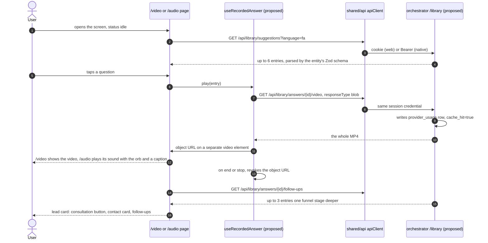
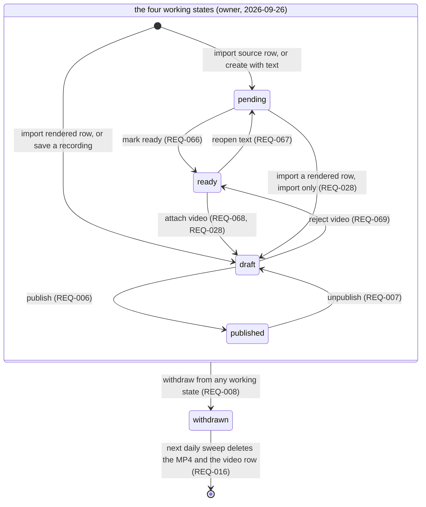
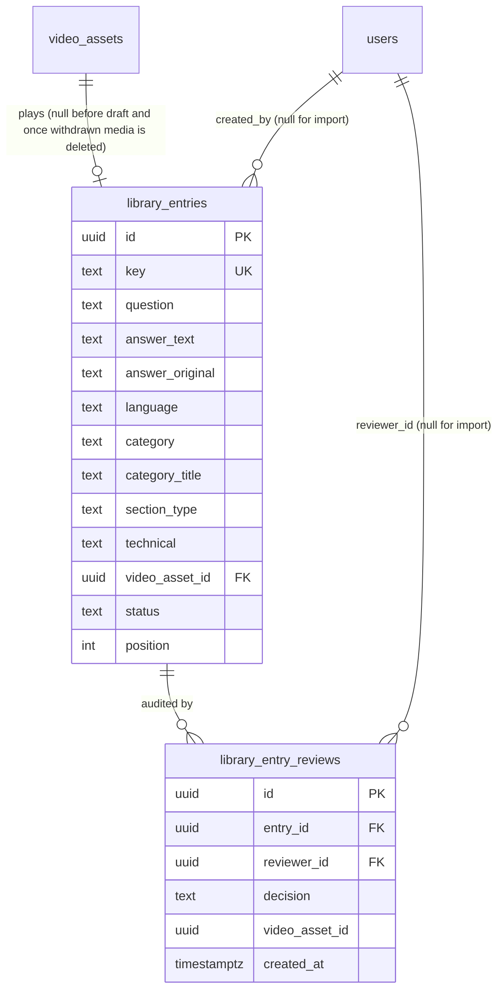

# Response caching for assistant answers

| Field   | Value                                          |
| ------- | ---------------------------------------------- |
| Created | 2026-09-19                                     |
| Updated | 2026-09-26                                     |
| Status  | Approved (owner, 2026-09-26)                   |
| Domain  | assistant                                      |
| Targets | mobile, web, admin (the widget is excluded, see section 2) |
| Author  | `respcache-t2-res` (Claude Opus 5), mission `20260919-respcache`, section 1; `spec-t1-res` (Claude Opus 5.5), mission `20260925-optionb`, teams `spec-t1` (sections 2 to 13) and `spec-t2` (entry lifecycle, two-source import, lead card) |
| Sources | `docs/features/response-caching/RESEARCH.md` (Resolved, Option B), `docs/DECISIONS/0014-conversation-data-retention.md` (Accepted), `docs/DECISIONS/0015-background-jobs.md` (Accepted), owner decisions of 2026-09-25 and 2026-09-26 |

Code is cited at `main@0747fc1`. `.../` means `apps/api/services/orchestrator/`. Frontend paths
start at `apps/frontend/`.

## 1. Purpose

Every answer the assistant gives is generated live, so a repeated question costs full price
every time. The assistant pipeline runs in the browser against LiveAvatar's cloud. Our backend
mints a session token and sees nothing else: no question text, no answer text, no answer media
(`apps/api/services/orchestrator/src/assistant/service.py:69`, `:221`). There is no answer to keep
and no way to serve one again. Caching is not missing from this system, but the one cache that
exists is a deterministic TTS audio cache consulted before the provider is called
(`apps/api/services/elevenlabs/service.py:59-60`), and it sits on the Phase 1 workbench path,
which is not what users talk to (RESEARCH.md §1).

This spec covers a curated library of pre-rendered answers. Staff author a fixed set of
questions in the `admin` target and approve the rendered video. Signed-in users reach those
answers through suggested questions on `mobile` and `web`, and anything typed or spoken freely
still starts a live session. The `widget` gets no library answers until a signed-in widget ADR is
accepted and built (ADR 0014 item 3). The library is reached by selection, not by matching
free-text questions, because matching cannot be made safe here on the evidence available: in
production the avatar speaks with a named practitioner's face, so a fluent answer to the wrong
question is attributed to a real person (RESEARCH.md §5.0, §6). The gain is lower provider
cost and a faster answer on the questions asked most. Its size can now be measured: the
assistant already writes one `provider_usage` row per live answer with `cache_hit=false`
(`.../src/assistant/service.py:216-260`), and a played library answer writes the same kind of row
with `cache_hit=true` (section 5, REQ-015), so `GET /usage` shows the ratio.

After a recorded answer, the screen offers the next step: a request for a consultation with the
live assistant, the official contact channels, and two or three follow-up questions one step
further on (owner, 2026-09-26). The library is also a way into a conversation, not only a cheaper
answer.

## 2. Scope

**In scope.** What this spec delivers.

- **A. The library in the backend.** One append-only migration with a `library_entries` table and
  a `library_entry_reviews` audit table. An entry moves through four working states, `pending`,
  `ready`, `draft` and `published` (owner, 2026-09-26), plus a final `withdrawn`. Admin endpoints
  to list, create, edit and move entries between states. Three signed-in user endpoints: the
  suggestion list, the video bytes of one entry, and the follow-up questions of one entry. A usage
  row with `cache_hit=true` for every played answer. Two steps added to the ADR 0015
  `retention_sweep` that delete media no entry uses any more.
- **B. The import, two sources.** A command-line import, run on the server, that reads the render
  sprint's results JSON and its MP4 files into `draft` entries, and the not-rendered answers of the
  source JSON into `pending` entries, on whichever install runs it. A small export command writes
  `ready` entries in the render script's input format, so a render run on the render server can
  produce their videos.
- **C. The admin screens.** An "Answer library" screen in the `admin` target (list, filters, a text
  editor with the rewrite rules for `pending` entries, review and state actions) and a "Record
  answer" screen that holds the recording workbench, moved from the `web` route `/avatar`, with
  polling of the `finalize` job, a list of finished recordings not yet in the library, and one
  message per recording failure. The `web` route `/avatar` is removed. A small backend change gives
  ElevenLabs' unpaid-plan answer its own error code.
- **D. Playback and the lead card on `mobile` and `web`.** On `/video` and `/audio`, while the
  conversation status is `idle`, the screen lists suggested questions under Start. A tap fetches
  the MP4 as a blob through the shared axios client and plays it. `/video` shows the video.
  `/audio` plays its sound with the orb and shows the answer text as a caption. Both show a
  "Recorded answer" label. When the answer ends, a lead card shows a «درخواست مشاوره» button, the
  contact channels and up to three follow-up questions.

**Out of scope.** Explicit exclusions.

- This phase does not give the `widget` any library playback or lead card, and the widget calls no
  library endpoint. That waits for the signed-in widget ADR (ADR 0014 item 3).
- This phase does not match free text or speech against the library. That is Option E, phase 3
  (RESEARCH.md §6).
- This phase does not store any user text: no drafts from users, no questions, no recordings of live
  answers. Drafts are Option E, phase 2. Recorded live answers are Option D, built after this spec
  (ADR 0014 item 7).
- **Next step, not in this change: saving chats and messages (text and voice) with an admin chat
  viewer.** The owner asked for it on 2026-09-25. It stores user conversations, which ADR 0014
  items 1 to 3 do not allow in this form, so it needs a new ADR first, then its own spec.
- This phase does not change the live assistant. What the assistant says after «درخواست مشاوره»
  (it asks the visitor to introduce themselves and qualifies the need) lives in the ElevenLabs agent
  prompt, outside this repository. That prompt is a dependency (section 11), not code here.
- This phase does not render answers in a background job. `render_video` waits on its own
  precondition (ADR 0015 item 3). A `ready` entry gets its video from the admin recording flow or a
  render run on the render server (REQ-070).
- This phase does not let staff reorder suggestions. The order is the order entries were created.
- This phase does not move media to object storage. Files stay on local disk (ADR 0014 item 6).
- This phase does not specify dependency (b), the ADR 0015 job runner with `GET /api/jobs/{jobId}`
  and a `finalize` that answers `202` with a job. This spec relies on it. Dependency (a),
  authoring-endpoint auth and the approval audit, is merged (#32, #33, #34) and is cited as code.
- This phase does not add a consent step. Nothing from a user is stored, so ADR 0014 item 1's
  consent step belongs to the Option D spec.

## 3. Actors and permissions

| Actor | Door | What they can do |
| ----- | ---- | ---------------- |
| Signed-in user on `mobile` or `web` | `get_current_user` (`.../src/auth/dependencies.py:50-54`): the `kd_session` cookie on web, `Authorization: Bearer` on native | read the suggestion list and the follow-ups, fetch the video of a published entry |
| Admin in the `admin` target | `require_admin` (`.../src/auth/dependencies.py:57-60`) on the router, the same pattern as `.../src/auth/admin.py:7` | everything in the library, and the workbench endpoints, which are admin only (`.../src/main.py:247`) |
| Operator with a shell on the server | none over HTTP: the import and the export run inside the orchestrator container | import the results and source JSON with the MP4 files; export `ready` entries |
| Anonymous widget visitor | the embed key plus an allowed `Origin` (`.../src/assistant/router.py:39-54`) | nothing in the library. The library endpoints use `get_current_user`, not `get_principal`, so the embed key gets `401` |

The library user endpoints deliberately do not use `get_principal`. ADR 0014 item 6 names
`get_principal` as the serving door, but item 3 says the widget plays no library entries until
the signed-in widget ADR. `get_current_user` enforces item 3 on the server. When the widget signs
users in, it becomes a signed-in user and passes the same check with no change here.

`RequireAuth`, `RequireProfile` and `RequireRole` on the frontend routes are UX only
(`apps/frontend/src/app/admin/router.tsx:10-14`). The backend checks every request.

## 4. User and system flow

### 4.1 Authoring: from a question to a published entry

The owner's four states (owner, 2026-09-26):

| State | Meaning | Who moves it on |
| ----- | ------- | --------------- |
| `pending` | question and answer text only, no video; the answer text may still be the original, not rewritten for speech | an admin edits the text, then marks it `ready` |
| `ready` | an admin approved the spoken text and asked for a video | the admin recording flow, or the import of a render run (REQ-070) |
| `draft` | a video exists and waits for admin review | an admin publishes it, or rejects the video (back to `ready`) |
| `published` | users see it | an admin unpublishes it (back to `draft`) or withdraws it |

`withdrawn` is not a fifth working state. It is where an entry goes when it leaves the library for
good (REQ-002).

Three ways in:

1. **Import of rendered answers.** The render sprint of 2026-09-25 produced 120 answers
   (`apps/api/setup/server/README.md:4-5`). An operator copies its results JSON and the MP4 files
   to the install that will serve the library and runs the import there (REQ-020). Each rendered
   row becomes a new `video_assets` row and a `draft` entry: the owner approved these texts, and
   the videos still need admin review (owner, 2026-09-26). The render server's `video_asset_id`
   values are not trusted on the target install (owner, 2026-09-25).
2. **Import of not-rendered answers.** Every source key without a render row, 272 today, and any
   later ones, come from the source JSON with the question, the original answer text, the category
   and the section type. The 272 are the 246 rows the source marks `technical` and 26 `casual` rows
   it marks `classify`, which the rewrite pass judged technical (REQ-021, "Verdicts"). Each becomes
   a `pending` entry. Its text is not yet rewritten for speech: an admin writes the spoken
   version in the entry editor, which shows the rewrite rules (REQ-073), and then marks it `ready`.
3. **Record in `admin`.** An admin opens Answer library, then Record answer, either from a `ready`
   entry (REQ-074) or empty. The screen is today's workbench
   (`apps/frontend/src/pages/avatar-session/AvatarSessionPage.tsx:13-40`). The chain is unchanged:
   TTS (`src/features/text-to-speech/useTtsGeneration.ts:18`), avatar session
   (`src/features/avatar-session/useAvatarSession.ts:77`), `generate-video`
   (`src/features/recording/useRecording.ts:29-42`), speak
   (`src/features/avatar-session/useAvatarSession.ts:114-124`), `finalize`
   (`src/features/recording/useRecording.ts:54-59`, which answers `202` plus a job once dependency
   (b) lands). When the job is `done`, the admin attaches the video to the `ready` entry, or saves
   it as a new `draft` entry.

Then **review**. In the Answer library list the admin opens a `draft` entry, watches the whole
video (fetched as a blob), reads the question and the answer text, and presses Publish. The
backend approves the video, publishes the entry and writes the audit rows, in one transaction.

### 4.2 Playback and the lead card

Every participant marked proposed is new. The page, `apiClient`
(`src/shared/api/client.ts:14`) and the session door exist today. The takeaway: the whole file is
downloaded through the same client and the same credential as every other request, before one
frame plays, and the conversation status stays `idle` from the first tap to the lead card.

The screen before and after, per target:

| Step | `/video` (mobile and web) | `/audio` (mobile and web) |
| ---- | ------------------------- | ------------------------- |
| status `idle` | Start, and under it the suggested questions | Start, and under it the suggested questions |
| downloading | the tapped question shows a spinner; a status line says the answer is loading; Stop is shown | same |
| playing | the recorded video covers the stage, with the "Recorded answer" label and the answer text as a caption; Stop; Start stays | the orb shows its speaking state, the answer text shows as a caption with the "Recorded answer" label; Stop; Start stays |
| ended or stopped | the lead card, in place of the suggestions and the Start button | same |
| «درخواست مشاوره» or Start pressed | playback stops if it runs, then the live session starts as today | same |
| live start failed | the existing error, and under it the contact card with "The live assistant is not available right now" (REQ-078) | same |
| status `ended` or `error` otherwise | no suggestions and no lead card (owner decision 3) | same |

## 5. Behaviour

Requirements carry ids. Each group is one pull request (section 11). Ids up to REQ-064 keep their
place; REQ-065 and later were added on 2026-09-26.

### Group A: the library in the backend

- **REQ-001.** A migration, the next free number after dependencies (a) and (b), adds the tables of
  section 7. It is additive only. Dependency (a) took `004_asset_reviews.sql`
  (`.../migrations/004_asset_reviews.sql:6-14`).
- **REQ-002.** An entry has a `status` of `pending`, `ready`, `draft`, `published` or `withdrawn`.
  The first four are the owner's working states (owner, 2026-09-26, section 4.1). `withdrawn` is the
  final state of an entry that left the library: the row stays, because its audit rows point at it
  (ADR 0014 item 5) and the sweep finds its media through it (REQ-016). No endpoint moves an entry
  out of `withdrawn`. The entry never uses `video_assets.status`: the question's review and the
  media's render are two lifecycles (ADR 0014, Context).
- **REQ-003.** The entry's `answer_text` is the approved spoken text. It is null only in `pending`
  (where the admin may not have written it yet) and in a `withdrawn` entry that left from
  `pending`. A video may join an entry only if the video's `text` equals the entry's `answer_text`
  after both are whitespace-normalized the way `TTSRequest.normalize_text` does
  (`.../src/schemas.py:40-46`). So the text users read in the caption is the text the avatar says.
- **REQ-004.** `POST /api/admin/library/entries` creates an entry in one of two ways. With text
  fields and no video it creates a `pending` entry. With `videoAssetId` it creates a `draft` entry
  from a finished recording (REQ-034, REQ-042); the video must exist, have status
  `VIDEO_GENERATED`, have a non-empty file at `video_path`, and not be used by another entry
  (`409 library_video_in_use`), and its `text` becomes the entry's `answer_text` (at most 480
  characters, else `422`). A missing `key` defaults to the video's `external_id`, or is refused
  without a video. A taken key is refused (`409 library_key_taken`). `position` is the current
  maximum plus one. `created_by` is the admin.
- **REQ-005.** `PATCH /api/admin/library/entries/{id}` edits an entry in place. Which fields it
  may change depends on the state:

  | State | Editable | Locked |
  | ----- | -------- | ------ |
  | `pending` | `question`, `answer_text`, `language`, `category`, `category_title`, `section_type`, `technical` | nothing |
  | `ready`, `draft` | `question`, `category`, `category_title`, `section_type`, `technical` | `answer_text`, `language` |
  | `published`, `withdrawn` | nothing | everything |

  `answer_text` and `language` stay locked outside `pending` because they tie to the audio: the
  avatar speaks the answer text in that language (REQ-003). The question and the category fields
  are not spoken (the render speaks only the answer, `apps/api/setup/server/render_answers.py:61`),
  so fixing a typo in them, or a wrong `section_type`, never costs a video. A `published` entry is
  not edited in place: the admin unpublishes it first (REQ-007, `published` to `draft`, which keeps
  the video approved), edits it, and publishes again, so every text users see went through Publish.
  A locked field, or any edit in `published` or `withdrawn`, answers `409 invalid_status_transition`
  with `currentStatus`. To change `answer_text` after `pending`, the admin reopens a `ready` entry
  (REQ-067); a `draft` entry needs a new video for new words, so it goes back through REQ-069.
- **REQ-006.** Publish is `draft` to `published` through the status route of REQ-065, in one
  transaction: it checks the video file exists; if the video is `VIDEO_GENERATED`, it approves it
  with the same update and audit insert that `Database.review_asset` runs
  (`.../src/database.py:249-274`), which writes an `asset_reviews` row; if the video is already
  `VIDEO_APPROVED`, it leaves it; any other video status answers `409 library_video_not_ready`.
  Then it sets the entry `published` with `published_at`, and writes a `library_entry_reviews` row
  (`published`).
- **REQ-007.** Unpublish is `published` to `draft`. It writes a review row (`unpublished`). The video
  keeps `VIDEO_APPROVED`, so a later publish needs no second video approval. Users stop seeing the
  entry at their next suggestion fetch.
- **REQ-008.** Withdraw moves an entry from any working state to `withdrawn` with `withdrawn_at`, and
  writes a review row (`withdrawn`). It is final.
- **REQ-009.** `GET /api/admin/library/entries` returns a page of entries, filterable by `status`,
  `language`, `category`, `section_type`, `technical` and a text search `q` over `key` and
  `question`, with the shape of section 6.
- **REQ-010.** The library does not depend on LiveAvatar (owner, 2026-09-25). Recorded answers are
  our own MP4 files. Sandbox mode (`LIVEAVATAR_SANDBOX`), the state of the LiveAvatar subscription
  and the assistant's avatar settings change nothing in REQ-011 to REQ-015 and REQ-077: the same
  entries are listed and played. Start keeps its current behaviour, so a live question still needs
  an active account. One consequence is accepted with it: on a sandbox install a recorded answer
  shows the practitioner and a live answer shows the public sandbox avatar
  (`.../src/assistant/service.py:311-315`).
- **REQ-011.** One query decides whether a user may see an entry. An entry is **servable** when it
  is `published`, its language equals the requested language, its video is `VIDEO_APPROVED`, and
  its video file exists. REQ-012, REQ-013 and REQ-077 all use it. A user sees only entries in the
  app's language (owner, 2026-09-25). The rendered answers are `fa`, so an `en` user sees no
  suggestions until `en` entries exist.
- **REQ-012.** `GET /api/library/suggestions?language=&limit=` returns the servable entries, at most
  `limit` (1 to 20, default 6), in this order: funnel stage first (stage 1 before 2 before 3, the
  stages of REQ-077), then `position`, then `id`. The pre-Start list is the entry point of the
  funnel, so it opens with stage 1 questions rather than with whichever rows an import wrote first.
  The stage order is this spec's choice; within a stage the order is still creation order, since
  staff cannot reorder in this phase (section 2).
- **REQ-013.** `GET /api/library/answers/{id}/video` returns the MP4 of a servable entry. Any entry
  that is not servable, or does not exist, answers `404 not_found` with the same body.
- **REQ-014.** The video endpoint is rate limited per user with the existing
  `Coordinator.rate_limit` (`.../src/coordination.py:48`), key `library:user:<id>`, a new setting
  `LIBRARY_PLAYBACK_RATE_LIMIT_PER_HOUR` with default 60. Over the limit it answers
  `429 library_rate_limited` with the wait, the same way `.../src/assistant/router.py:63-67` does.
- **REQ-015.** A `200` from the video endpoint writes one `provider_usage` row before the body is
  sent: `provider='liveavatar'`, `operation='assistant_answer'`, `provider_resource_id` null,
  `model` null, `characters` null, `estimated_duration_ms` the video's `duration_ms`,
  `cache_hit=true`, `occurred_at` the time of the request, and `metadata`
  `{library_entry_id, source: "library"}`. Nothing else. The row carries **no user id, no
  principal and no session id**. The reason is in section 9 ("The playback usage row"). A response
  other than `200` writes no row. The row counts a delivered file, not a watched one: a user who
  closes the screen mid-download is still counted.
- **REQ-016.** The ADR 0015 `retention_sweep` gains one step. For each `withdrawn` entry whose
  `video_asset_id` is not null, it deletes the MP4 file (a missing file is not an error), then in one
  transaction sets the entry's `video_asset_id` to null and deletes the `video_assets` row. The
  entry and its review rows stay, so the audit history survives (ADR 0014 item 5, owner decision).
  The sweep never deletes an `asset_reviews` row. That table is
  `asset_reviews(id, asset_kind, asset_id, reviewer_user_id, decision, previous_status,
  created_at)`, append-only, and `asset_id` has no foreign key to `video_assets`
  (`.../migrations/004_asset_reviews.sql:5-14`). So deleting a `video_assets` row leaves its audit
  rows in place: they keep the bare `asset_id` of a row that no longer exists.
- **REQ-017.** No library log line carries question text or answer text. Events log ids only:
  `library_entry_created`, `library_entry_edited` (with the names of the changed fields),
  `library_entry_status_changed` (with the old and the new status), `library_media_deleted`, each with the entry id and the admin id in `extra` (the house shape,
  `.../src/auth/router.py:51`).
- **REQ-065.** Every state change goes through one route,
  `PATCH /api/admin/library/entries/{id}/status`, with body `{ "status", "videoAssetId"? }`. One
  transition table in the backend, like `REVIEW_TRANSITIONS` for assets
  (`.../src/main.py:451-462`), lists each target state with the states it may start from:

  | To | From | Rule | Review row |
  | -- | ---- | ---- | ---------- |
  | `ready` | `pending` | REQ-066 | `ready` |
  | `pending` | `ready` | REQ-067 | `reopened` |
  | `draft` | `ready` | REQ-068, needs `videoAssetId` | `video_attached` |
  | `draft` | `pending` | REQ-028, the import only; the status route refuses it | `video_attached`, null reviewer |
  | `ready` | `draft` | REQ-069, rejects the video | `video_rejected` |
  | `published` | `draft` | REQ-006 | `published` |
  | `draft` | `published` | REQ-007 | `unpublished` |
  | `withdrawn` | `pending`, `ready`, `draft`, `published` | REQ-008 | `withdrawn` |

  The update is conditional on the current status (`WHERE id=$1 AND status = ANY($allowed)`) and
  runs in one transaction with its review row, the same pattern as `Database.review_asset`
  (`.../src/database.py:249-274`). A transition not in the table, or an entry that moved meanwhile,
  answers `409 invalid_status_transition` with `currentStatus`, the code assets already use
  (`.../src/main.py:486-498`). This table is the one place transitions are enforced, for the status
  route and for the import alike: both call the same backend function with the transition they
  want, and the import is the only caller allowed the `pending` to `draft` row. The admin screen
  only hides buttons the table would refuse.
- **REQ-066.** `pending` to `ready` needs `answer_text` of 1 to 480 characters and a `question`
  (else `422 validation_error`). It means the admin approved the spoken text and asks for a video
  (owner, 2026-09-26). The 350-character rule and the other rewrite rules are shown to the admin
  (REQ-073) but are not checked by the server: only the hard 480 limit is. Every length in this spec
  (the 350 and 480 limits, the editor's counter, the server check and the database `CHECK`) is
  counted after the whitespace normalization of REQ-003, on the string that is stored.
- **REQ-067.** `ready` to `pending` reopens the text for editing. Nothing else changes.
- **REQ-068.** `ready` to `draft` attaches a video. The video must have status `VIDEO_GENERATED`, a
  non-empty file, no other entry, and a `text` equal to the entry's `answer_text` (REQ-003), else
  `409 library_video_not_ready`, `409 library_video_in_use` or `409 library_text_mismatch`.
- **REQ-069.** `draft` to `ready` rejects the entry's video. In the same transaction it sets the
  video `REJECTED` with the update and audit insert of `Database.review_asset` (a video may go to
  `REJECTED` from `VIDEO_GENERATED` or `VIDEO_APPROVED`, `.../src/main.py:451-462`), clears the
  entry's `video_asset_id`, and writes a review row `video_rejected` that keeps the video's id. The
  text stays approved, so the entry waits for a new video.
- **REQ-070.** `render_video` is not built (ADR 0015 item 3). Today a `ready` entry becomes `draft`
  in one of two ways:
  - **The admin recording flow** (REQ-074): an admin records the entry's text in the `admin` target.
    It needs an active LiveAvatar account, a paid ElevenLabs plan (REQ-039) and a server whose
    LiveKit is public for the BYO transport (`apps/api/setup/server/README.md:17-30`).
  - **A render run on the render server** (`apps/api/setup/server/`, PR #37): the operator exports
    the `ready` entries (REQ-071), renders them with `render_answers.py` on a render server, and
    imports the results on the target install. The import attaches each rendered video to its
    `ready` entry by entry key (REQ-028).
  While LiveAvatar is inactive, neither way can make a video. `ready` entries stay `ready`, and the
  admin sees them under the status "Ready for video" with the hint `library.readyHint` (section 8).
  A recording attempt fails at session start with `library.record.errors.sessionFailed`. Nothing is
  lost: the text stays approved and the entry waits.
- **REQ-071.** A command, `python -m services.orchestrator.src.library_export`, runs inside the
  orchestrator container and writes the `ready` entries to a JSON list in the input format of
  `render_answers.py` (`apps/api/setup/server/render_answers.py:4`,
  `README.md:198-201`): `key`, `question`, `answer` (the entry's `answer_text`), plus `category`,
  `category_title`, `section_type`, `technical`, `language`, `answer_original`, and `batch` and
  `bridge_type` from the entry's `import_metadata` when present. The render script copies every
  input field except `answer` into its result row unchanged
  (`apps/api/setup/server/render_answers.py:65`), so its results JSON carries the fields REQ-021
  expects. Arguments: `--out <file>`, and `--key <key>` (repeatable) to export only some entries.
  It writes no row and logs keys only.
- **REQ-072.** The `retention_sweep` gains a second step. A video that REQ-069 rejected (a
  `video_rejected` review row names it) and that no entry uses now has its MP4 file and its
  `video_assets` row deleted, in the same way as REQ-016. Its `asset_reviews` rows stay.

### Group B: the import, two sources

- **REQ-020.** A command, `python -m services.orchestrator.src.library_import`, runs inside the
  orchestrator container of any install, with that install's settings and database. It reads one
  of two inputs per run:
  - `--results <file>` (repeatable, one file per render wave): rendered answers. Also required:
    `--media-dir <dir>` (the MP4 files, a path inside the container: the compose file mounts the
    host's `./media` at `/media`, `docker-compose.yml:108`, so a host folder
    `./media/import/<batch>` is `/media/import/<batch>`), and `--avatar-id` and `--voice-id` (the
    values the render used; they fill the `NOT NULL` columns of `video_assets`,
    `.../migrations/001_initial.sql:44-45`).
  - `--source <file>`: not-rendered answers. Also required: `--language fa|en` (the source rows
    have no language field). Optional: `--verdicts <file>` (repeatable), the rewrite pass's verdict
    files, which settle a `classify` row (REQ-021). The source import takes every row of the file;
    a key that already has an entry, which is every rendered key once the results import has run,
    is skipped (REQ-028). So after the results import, the source import creates exactly the
    not-rendered entries: 272 with the sprint's files.

  `--dry-run` works with both. There is no CSV input: both inputs are JSON (foreman decision,
  2026-09-26).
- **REQ-021.** The two JSON formats, UTF-8:
  - **Results**: one JSON object whose keys are entry keys and whose values are row objects, the
    shape `render_answers.py` writes (`apps/api/setup/server/render_answers.py:31-36`). It writes
    two kinds of row:
    - **A failed row** has only `key`, `question`, `answer` and a non-null `error`
      (`render_answers.py:102-107`). It stays in the file until a rerun succeeds
      (`render_answers.py:95-96`). Such a row needs only `key` (equal to its object key) and
      `error`. It is reported `not_rendered`, skipped, and not checked further. It never fails the
      file.
    - **A rendered row** has `error` null and all of `key` (equal to its object key), `batch`,
      `question`, `answer`, `category`, `category_title`, `section_type`, `technical`,
      `bridge_type`, `language`, `answer_original`, `video_asset_id`, `external_id`,
      `audio_asset_id`, `status`, `duration_ms` and `file` (`render_answers.py:64-74`, the extra
      fields copied from the export at `:65`). The field checks of REQ-022 apply only to these
      rows. A rendered row whose `status` is not `VIDEO_GENERATED` is also reported
      `not_rendered` and skipped.
  - **Verdicts**: the rewrite pass wrote one file per batch, `batch-1.json` to `batch-5.json`, 146
    rows in all (the 120 rendered answers and 26 judged technical), outside this repository. Each
    is a JSON list of objects; the import reads only `key` and `technical` (`technical` or
    `non-technical`, else `bad_technical`) and ignores the other fields. A source row whose
    `technical` is `classify` takes the verdict of its key. A verdict for a row that is not
    `classify` is ignored, and a `classify` row with no verdict keeps `classify`, so an admin can
    still filter for it. With the sprint's files, all 26 not-rendered `classify` rows become
    `technical`, and the source's own value is kept in `import_metadata.source_technical`.
  - **Source**: one JSON list of row objects with `key`, `question`, `answer_original`,
    `category`, `category_title`, `section`, `section_type` and `technical`, the fields of the
    render sprint's source sheet. `section` is kept in `import_metadata` only.

  A wrong top-level shape fails the file before a row is used (`bad_format`). So does a rendered
  row with a missing field or a wrong type, since `error` null promises the full field list.
- **REQ-022.** Each row is checked. `key` matches `^[A-Za-z0-9_-]{1,80}$`. `question` is 1 to 300
  characters after trimming. `answer` (results) is 1 to 480 characters. `answer_original` is 1 to
  5000 characters. `category` is a non-empty string or integer, stored as text. `category_title`
  is not empty. `section_type` is one of `knowledge`, `identity`, `sizing`, `meeting`,
  `commercial`, `casual`. `technical` is one of `technical`, `non-technical`, `classify`.
  `language` (results) is `fa` or `en`. `video_asset_id` (results) is a UUID. `duration_ms`
  (results) is a positive integer. These are the values the sprint's files hold (section 7).
- **REQ-023.** The import always creates new rows. The render server's `video_asset_id` values are
  not trusted on the target install (owner, 2026-09-25): the import never looks a row up by them
  and never reuses one, even when the render server and the target are the same install. The
  row's `video_asset_id` and `external_id` are kept only as provenance in the new video's
  `metadata.imported_from`. Entries are matched by entry key only (REQ-028).
- **REQ-024.** A results import has two phases, in this order. A source import has no files and
  runs phase 1 without the file checks, then writes its rows in one transaction.
  - **Phase 1, check (writes nothing).** A row whose `key` already has an entry is handled by
    REQ-028 first. For every row that will create or attach a video, the source file is
    `<media-dir>/<basename of file>`, which must equal `<external_id>.mp4`, the name Egress gave it
    (`.../src/main.py:378`, `.../src/livekit_gateway.py:84`, `render_answers.py:72`), else
    `bad_file`; a missing one fails with `file_missing`. The import probes the source file where it
    is, with `probe_avatar_mp4` (`.../src/media_probe.py:8`); a rejected file fails with
    `probe_failed`. The probed duration must be within 1000 ms of the row's `duration_ms`, or the
    row fails with `duration_mismatch`. The target name is `LIB_<external_id>.mp4`: a file of that
    name already in `VIDEO_CACHE_DIR` fails with `file_exists`, and a `video_assets` row with
    `external_id` = `LIB_<external_id>` fails with `external_id_taken` (the column is unique,
    `.../migrations/001_initial.sql:41`). Across all files of one run, a `key` that appears more
    than once fails each of those rows with `duplicate_key`, and an `external_id` that appears more
    than once fails each of them with `duplicate_external_id`. The target name carries the render's
    own `external_id` (for example `ANS_C18Q05_<time>`, `render_answers.py:53`), not only the key, so
    a new render of a key whose earlier video was rejected (REQ-069) and not yet swept gets a free
    name.
  - **Phase 2, write (only when every row passed phase 1, and never with `--dry-run`).** For each
    row the import copies the source file to `VIDEO_CACHE_DIR/LIB_<external_id>.mp4`.
    `VIDEO_CACHE_DIR` is `/media/video` in the compose file (`docker-compose.yml:104`; setting at `.../src/config.py:127`).
    The copy is not probed again: it must have the source's byte size, or the run fails. Then, in
    one database transaction, it inserts every `video_assets` row and writes every entry. Each
    video row has a new `id`, `external_id` = `LIB_<external_id>`, `video_path` = the absolute
    path of the copy (for example `/media/video/LIB_ANS_C18Q05_20260925143000.mp4`, the same form
    as `.../src/main.py:378`),
    `text` = the row's `answer` normalized as in REQ-003, the given `avatar_id` and `voice_id`,
    status `VIDEO_GENERATED`, `duration_ms` and `metadata.ffprobe` from the phase 1 probe, and
    `metadata.imported_from` `{sheet_video_asset_id, sheet_external_id, sheet_audio_asset_id}`.
    If a copy or the transaction fails, the import deletes every file it copied in this run,
    reports `write_failed`, and exits with status 1.
- **REQ-025.** The source files are only read. The import never moves or deletes them.
- **REQ-026.** A new results row creates a `draft` entry: the owner approved these texts, and the
  video still needs admin review (owner, 2026-09-26). The entry gets `key`, `question`,
  `answer_text` = `answer`, `answer_original`, `language`, `category`, `category_title`,
  `section_type`, `technical`, the new video, `created_by` null, and `import_metadata`
  `{batch, bridge_type}`. A new source row creates a `pending` entry with `answer_text` null,
  `answer_original`, the category fields (with `technical` settled by a verdict, REQ-021),
  `--language`, and `import_metadata` `{section, source_technical}`. The
  import never publishes and never marks an entry `ready`.
- **REQ-027.** The import is all or nothing. If any row fails phase 1, it never starts phase 2: it
  copies no file and writes no row, prints one line per failed row (file, key, reason code) and
  exits with status 1. `--dry-run` runs phase 1 only and prints the same report.
- **REQ-028.** How a row meets an entry that already has its key. This is how a render is attached
  to an existing entry (foreman decision, 2026-09-26):
  - **Results row, entry `ready`:** the import attaches the new video to that entry (`ready` to
    `draft`, review row `video_attached`, `reviewer_id` null for the import). The row's `answer`
    must equal the entry's `answer_text` (REQ-003), else the row fails with `answer_text_mismatch`.
    This is the return path of a render run (REQ-070, REQ-071).
  - **Results row, entry `pending`:** the import moves the entry `pending` to `draft` through the
    import-only row of the REQ-065 table, with review row `video_attached` and a null reviewer,
    because the rendered text is approved (owner, 2026-09-26). It is allowed only when the entry's
    `answer_text` is null or equal to the row's `answer` (REQ-003); then `answer_text` is set from
    the row, and so are `category`, `category_title`, `section_type` and `technical`, since the
    rendered row is the later, approved version of the same question. If an admin has already written a different spoken text in the editor, the row fails
    with `answer_text_mismatch`, so the admin's work is never replaced silently. So the order of a
    source import and a results import does not matter while nobody has edited the entry.
  - **Any row, entry in another state, and a source row whose key exists:** reported
    `already_imported` and skipped, with no file copied. A second run of the same files therefore
    changes nothing.

  To replace a published answer, staff withdraw the old entry and import or record the new one
  under a new key.
- **REQ-029.** The report and the logs name rows by file, key and reason code only, never by
  question or answer text.

### Group C: the admin screens

- **REQ-030.** The admin router (`src/app/admin/router.tsx:23-26`) gains `library` and
  `library/record`. The nav array (`src/app/admin/AdminLayout.tsx:30-33`) gains "Answer library".
- **REQ-031.** `src/pages/admin/library/AdminLibraryPage.tsx` copies the list pattern of
  `src/pages/admin/users/AdminUsersPage.tsx`: `SearchField`, filters for status (all, waiting for
  text approval, ready for video, waiting for video review, published, withdrawn), language,
  category, section type and technical, `Table`, `Pagination`, and the loading, empty and error
  states. Columns: question, key, category title, section type, status, duration.
- **REQ-032.** Opening an entry shows a panel that fits its state:
  - `pending`: the editor of REQ-073, and the actions Mark ready and Withdraw.
  - `ready`: the question and the category fields (editable, REQ-005), the answer text (read
    only), the hint `library.readyHint`, and the actions Record this answer (REQ-074), Reopen text
    and Withdraw.
  - `draft`: the video (fetched as a blob through `apiClient` from
    `GET /api/assets/video/{videoAssetId}`, admin only, `.../src/main.py:443`), the question and the
    category fields (editable, REQ-005), the answer text (read only), and the actions Publish,
    Reject video and Withdraw.
  - `published`: the same player, all fields read only with the note that Unpublish makes them
    editable, and the actions Unpublish and Withdraw.
  - `withdrawn`: the texts only, no action.
  Each action calls the status route (REQ-065).
- **REQ-033.** Withdraw asks for confirmation in a dialog that says users stop seeing the answer now
  and the video is deleted at the next daily cleanup, with no way back. Reject video asks for
  confirmation too: the video is deleted at the next daily cleanup, and a new recording costs paid
  minutes.
- **REQ-034.** `src/pages/admin/library/AdminRecordAnswerPage.tsx` composes the four workbench features
  as `AvatarSessionPage` does today (`src/pages/avatar-session/AvatarSessionPage.tsx:25-39`). Opened
  empty, it adds a Save to library form (question, key optional, language default `fa`, category,
  category title, section type, technical) that is enabled once the finalize job is `done` and the
  video is `VIDEO_GENERATED`. Saving calls REQ-004 with the video and opens the new `draft` entry.
- **REQ-035.** The Record answer screen asks for the avatar session with `max_session_duration: 300`.
  LiveAvatar production caps a session at 300 seconds (render sprint 2026-09-25,
  `apps/api/setup/server/README.md:228-230`), and one answer must fit in one session. The request
  schema allows up to 3600 (`.../src/schemas.py:70`), so the cap is set here, not by the schema.
- **REQ-036.** Record is disabled when the generated audio of the answer (`duration_ms` of the TTS
  result) is longer than 270 000 ms, with the message "too long for one recording". The 30 seconds
  of margin are for connecting and stopping Egress. That margin is a choice, not a measurement.
- **REQ-037.** The `web` route `/avatar` is removed (`src/app/web/router.tsx:29`), with its import
  (`:3`), the comment that describes it (`:16-21`), the Settings link to it
  (`src/pages/settings/SettingsIndexPage.tsx:82,113-119`) and its i18n keys
  (`settings.avatarConsole.*`). `src/pages/avatar-session/` is deleted. The workbench's Redux slices
  stay in the shared store (`src/app/store.ts:12-16`), which the admin target already uses
  (`src/app/providers.tsx:20`).
- **REQ-038.** The render chain needs the avatar's LiveKit token to allow subscribing: LiveAvatar
  rejects a BYO avatar token without `canSubscribe` (render sprint 2026-09-25,
  `apps/api/setup/server/README.md:231-234`). That fix is merged (#38): the avatar token now sets
  `can_subscribe=True` (`.../src/livekit_gateway.py:66-74`). This spec needs nothing more for it.
- **REQ-039.** Recording needs two paid provider accounts, and the Record answer screen says so in
  one line above the steps (`library.record.needsAccounts`): an active LiveAvatar account for the
  avatar session, and a paid ElevenLabs plan for the speech. The render sprint (2026-09-25) found
  that an unpaid ElevenLabs plan answers `payment_issue` (code 1008) on every speech call
  (`apps/api/setup/server/README.md:236-239`). Playback needs neither (REQ-010).
- **REQ-040.** The ElevenLabs client maps that answer to its own error code. When the speech
  WebSocket reports `payment_issue` or closes with code 1008, the client raises
  `ProviderError("elevenlabs_payment", ..., 502, False)` (not retryable) instead of the generic
  `elevenlabs_stream_error`, in both WebSocket paths that `/avatar/speak` can take
  (`_stream_dialogue` and `_stream_tts`, `apps/api/services/elevenlabs/client.py:123-170,172-211`).
  The HTTP TTS path keeps its mapping (`client.py:95-111`), because the render sprint saw the
  payment answer only on the WebSocket.
- **REQ-041.** `finalize` answers `202` with `{ "jobId" }` once dependency (b) lands (ADR 0015 item
  4, which leaves client polling to this spec). The Record answer screen polls it like this:
  - The `jobId` is kept in the existing recording slice (`src/features/recording/recordingSlice.ts`),
    next to the recording handle it belongs to. It is client state; the job's status is not.
  - The status is server state: a TanStack Query hook `useJob(jobId)` calls `GET /api/jobs/{jobId}`
    through `apiClient`, with `refetchInterval` 2000 ms while the status is `queued` or `running`.
  - Polling stops when the status is `done` or `failed`, and after 180 s from the `202` (a chosen
    value: the job's own file wait is 30 s by default and at most 60, ADR 0015 item 4, plus queue
    time and retries). A network error does not stop it; the next interval tries again.
  - What the admin sees, as a status line under the recording controls (`aria-live="polite"`):
    `queued`: `library.record.job.queued`; `running`: `library.record.job.running`; `done`:
    `library.record.job.done`, and Save to library or Attach to this answer becomes enabled;
    `failed`: the message for the job's `error.code` (section 8); stopped at 180 s:
    `library.record.job.slow` with a "Check again" button that restarts polling for another 180 s.
  - Leaving the screen stops polling (the query unmounts). The job runs on the server anyway.
    Returning within the same tab resumes it, because the `jobId` is still in the recording slice.
  - After a reload or in a new tab the slice is empty. The recording is not lost: REQ-042 lists it.
- **REQ-042.** `GET /api/admin/library/recordings?page=&pageSize=` lists finished recordings that no
  entry uses yet: `video_assets` rows with status `VIDEO_GENERATED`, a file on disk, and no
  `library_entries` row, newest first. The Record answer screen shows them under the heading
  `library.record.unsaved`, each with its answer text, duration and two actions: Save to library
  (the form of REQ-034) and Attach to a ready entry (a picker of `ready` entries whose
  `answer_text` equals the video's text, then REQ-068). This is how an admin keeps a recording
  after a reload, a closed tab or a poll that timed out.
- **REQ-073.** The editor of a `pending` entry shows the original answer (`answer_original`, read
  only), the question and the spoken answer (`answer_text`, editable), the category fields, and a
  box with the rewrite rules the admin follows (owner, 2026-09-26), keys `library.rules.*`:
  1. Spoken Persian, as the practitioner would say it aloud.
  2. Two to four sentences, then one bridge sentence that leads to the next step.
  3. At most 350 characters, or 480 when the answer has a phone number.
  4. No new facts: only what the original answer says.
  5. Phone numbers as grouped Persian words (digits were read out wrong in the render sprint,
     `apps/api/setup/server/README.md:240-241`).
  6. When a line has two numbers, give both.

  Under the answer field a live counter shows the length against 350 (and 480). Above 350 it turns
  to the warning tone with `library.rules.overSoft`; above 480 Mark ready is disabled with
  `library.rules.overHard`, which matches the server's limit (REQ-066). The box sits beside the
  field on a wide screen and above it on a phone, so the rules are in view while the admin writes.
- **REQ-074.** Record this answer, on a `ready` entry, opens the Record answer screen with the entry
  id. The composer is filled with the entry's `answer_text` and is read only, so the video's text
  equals the approved text (REQ-003). When the finalize job is `done`, the button Attach to this
  answer calls REQ-068 and opens the entry, now `draft`.

### Group D: playback and the lead card on `mobile` and `web`

- **REQ-050.** `src/entities/library-entry/` follows the `user` entity: `types.ts` (Zod schemas for
  the suggestion item and the admin entry), `api.ts`, `hooks.ts` with a `libraryEntryKeys` object.
  The widget never imports it.
- **REQ-051.** `useLibrarySuggestions(language)` is a TanStack Query hook, enabled only while the
  conversation status is `idle`. `language` is the screen's language
  (`src/features/assistant/useConversationScreen.ts:73-75`).
- **REQ-052.** `fetchLibraryVideo(id, signal)` in the entity's `api.ts` calls
  `apiClient.get(..., { responseType: 'blob', timeout: 60_000, signal })`, the same pattern as
  `fetchAudioPcm` (`src/shared/api/assets.ts:18-26`). No `<video src>` pointing at an API URL is
  used on any target (ADR 0014 item 6).
- **REQ-053.** A new feature folder `src/features/answer-library/` holds `SuggestedQuestions.tsx`,
  `RecordedAnswerPlayer.tsx`, `useRecordedAnswer.ts`, `LeadCard.tsx` and `contactChannels.ts`.
  Only `src/pages/conversation/` imports it.
- **REQ-054.** `useRecordedAnswer` owns playback in React state: `phase` (`idle`, `loading`,
  `playing`, `blocked`, `error`, `finished`), the active entry, the error kind, and the object URL.
  It creates the object URL from the blob and revokes it on end, on stop, on a new tap and on
  unmount. A new tap aborts the running download with its `AbortController`.
- **REQ-055.** Recorded playback uses its own `<video playsInline>` element inside
  `RecordedAnswerPlayer`. It never touches the live element of `ConversationStage`
  (`src/pages/conversation/ConversationStage.tsx:92-101`), so the `attachedSessionRef` guard
  (`src/features/assistant/useAssistantSession.ts:84,150-169`) is not involved.
- **REQ-056.** Both pages render `SuggestedQuestions` inside their existing pre-Start block
  (`VideoConversationPage.tsx:239-249`, `AudioConversationPage.tsx:308-318`), under the Start button,
  and only when `status === 'idle'` (owner decision 3). Under Start, the list's arrival never moves
  the Start button. While a recorded answer is loading or playing, the list is hidden and Stop is
  shown in its place. While the lead card shows, the list is hidden too (REQ-075).
- **REQ-057.** On `/video`, the player shows the video above the stage, full bleed like the stage
  (`ConversationStage.tsx:58-65`), with the "Recorded answer" label at the top and the answer text as
  a caption at the bottom (owner decision 2).
- **REQ-058.** On `/audio`, the player's element sits inside the page's existing `sr-only` wrapper
  (`AudioConversationPage.tsx:213-215`), so only its sound is heard (owner decision 4). The orb shows
  its speaking state: `orbState` (`src/features/assistant/orb/orb.ts:115-125`) gains a signal,
  `isRecordingPlaying`, that returns `agent` while the status is `idle`. The orb's level falls back
  to its synthetic envelope, because a file element has no `srcObject` to measure
  (`src/features/assistant/orb/useAvatarAudioLevel.ts:26`). The answer text shows as a caption under
  the orb with the "Recorded answer" label.
- **REQ-059.** The tap is the user gesture. If `play()` still rejects with `NotAllowedError` (the
  download took the gesture's time, common on iOS), the phase becomes `blocked` and a "Tap to play
  the answer" button appears, the same idea as the live screen's `assistant.video.enableAudio`
  overlay (`VideoConversationPage.tsx:195-202`). On `/video` it covers the player. On `/audio` the
  player is inside the `sr-only` wrapper and cannot be seen or tapped, so the button shows in place
  of the caption, under the orb.
- **REQ-060.** Pressing Start, or «درخواست مشاوره» on the lead card, while a recorded answer loads or
  plays stops it and revokes its URL first, then calls the live `start()` as today. Two voices never
  play at once.
- **REQ-061.** When playback ends or is stopped, the phase becomes `finished` and the page shows the
  lead card (REQ-075) with focus on its heading. The lead card's "Other questions" button returns
  to the suggestion list, with focus on the question that was played.
- **REQ-062.** A `404` on the video invalidates the suggestions query, so a withdrawn or unpublished
  entry leaves the list.
- **REQ-063.** Leaving the route stops playback (unmount). No navigation guard is added:
  `usePublishConversationLive` (`useConversationScreen.ts:86-92`) keeps guarding live sessions only.
- **REQ-064.** The widget's `AssistantPanel` and the `features/assistant` public index are unchanged,
  apart from the orb signal of REQ-058, which defaults to `false`.
- **REQ-075.** The lead card (owner, 2026-09-26) shows after a recorded answer ends, on `mobile` and
  `web`, never in the widget. It holds, in this order:
  1. A heading, `library.lead.title`, and a primary button «درخواست مشاوره»
     (`library.lead.consult`), with a one-line hint (`library.lead.consultHint`). The button calls the
     existing `start()` of the conversation controller, the same flow as Start. While the lead card
     shows, the page's Start button is hidden, so there is one primary action, not two.
  2. The contact card (REQ-076).
  3. Up to three follow-up questions (REQ-077) under `library.lead.followUpsTitle`. A tap plays that
     answer exactly like a suggestion. With no follow-up the heading and the list are not rendered.
  4. A secondary button "Other questions" (`library.lead.backToQuestions`).

  How this fits owner decision 3 (suggestions only while `status === 'idle'`): a recorded answer is
  not a live session, so the conversation status stays `idle` from the tap to the lead card
  (`src/features/assistant/types.ts:12-19`). The lead card and its follow-ups show only at `idle`.
  Pressing «درخواست مشاوره» moves the status to `requesting` and they hide, as the suggestions do.
  What the live assistant says next (it asks the visitor to introduce themselves and qualifies the
  need) is in the ElevenLabs agent prompt, outside this repository (section 11, dependency).
- **REQ-076.** The contact channels are configured in one place, `src/features/answer-library/contactChannels.ts`,
  a typed constant read by the contact card and by its tests, and nowhere else (owner, 2026-09-26):

  | Channel | Value | Link |
  | ------- | ----- | ---- |
  | Office | 02126230054, 02126230047 | `tel:+982126230054`, `tel:+982126230047` |
  | Sales | 02176222351, 02176222354 | `tel:+982176222351`, `tel:+982176222354` |
  | Email | info@kohansystemfarda.com | `mailto:info@kohansystemfarda.com` |
  | Website | kohansystemfarda.com | `https://kohansystemfarda.com`, opened in a new tab or the system browser |

  Phone numbers are shown grouped, in Persian digits in `fa` («۰۲۱ ۲۶۲۳ ۰۰۵۴») and Latin digits in
  `en` ("021 2623 0054"), always in a `dir="ltr"` span so the groups keep their order. The same
  numbers are spoken inside some recorded answers, so a change here also means those answers need a
  new render. The values are not per install today; if another install needs other channels, this
  file moves to configuration then.
- **REQ-077.** `GET /api/library/answers/{id}/follow-ups` returns up to three servable entries
  (REQ-011) for a servable entry `id`, else `404 not_found`. They have the same `category` and the
  same language as the played entry, are not the played entry, and sit one funnel stage deeper.
  The stage comes from `section_type`, with no new field. There are three stages (foreman
  decisions, 2026-09-26): `identity`, `knowledge` or `casual` is stage 1, `sizing` is stage 2,
  `meeting` or `commercial` is stage 3. After a stage 1 answer the follow-ups are stage 2 entries;
  after stage 2, stage 3 entries. Stage 3 has no deeper stage, so after a stage 3 answer the
  follow-ups are other stage 3 entries (foreman decision a, 2026-09-26). Order: `position`, then
  `id`. The response has the suggestion item shape (SEC-003).
  `technical` does not filter what users see. It is admin-only metadata, used by the admin filters
  (REQ-031) and the import (REQ-020). A `technical` answer reaches users only once it is
  `published`, like any entry, and then it is a suggestion and a follow-up like the rest (foreman
  decision, 2026-09-26).
- **REQ-078.** When the live start from the lead card fails (the status becomes `error`), or while
  LiveAvatar is inactive and the start is refused, the page shows the existing error
  (`VideoConversationPage.tsx:206-224`, `AudioConversationPage.tsx:277-296`) and, under it, the
  lead card in its fallback form: the message `library.lead.liveUnavailable` in place of the
  consultation button, and the contact card, which is the fallback channel (foreman decision,
  2026-09-26). The follow-ups are not shown, since the status is not `idle`. The app cannot know
  before a start that LiveAvatar is inactive, so before the first attempt the button is enabled.
  The page keeps, in React state, whether the start came from the lead card; a failure after a
  plain Start shows the existing error alone, as today.

### Security requirements

- **SEC-001.** Every `/api/admin/library/*` route sits on a router with
  `dependencies=[Depends(require_admin)]`.
- **SEC-002.** `/api/library/suggestions`, `/api/library/answers/{id}/video` and
  `/api/library/answers/{id}/follow-ups` use `get_current_user`. A request with only `X-Embed-Key`
  gets `401`.
- **SEC-003.** The suggestion item, used by the suggestions and the follow-ups, is an explicit
  allowlist: `id`, `question`, `answerText`, `durationMs`. No response to a non-admin carries
  `video_asset_id`, `external_id`, `avatar_id`, `video_path`, `key`, `category`, `section_type`,
  `technical`, `answer_original` or any review data.
- **SEC-004.** An entry that is not servable answers the same `404` as one that does not exist.
- **SEC-005.** No question or answer text appears in a log record or in a usage row (REQ-015,
  REQ-017, REQ-029). A test asserts it for a status change, playback and import.
- **SEC-006.** The removal of `/avatar` (REQ-037) ends the signed-out workbench route
  (`src/app/web/router.tsx:29` sits above `RequireAuth` at `:32`).
- **SEC-007.** The contact links are fixed values from REQ-076, never built from server data, so no
  response can change where a `tel:`, `mailto:` or web link points.

### State ownership

| State | Owner |
| ----- | ----- |
| suggestion list, follow-ups, admin entry list | TanStack Query (`libraryEntryKeys`) |
| playback phase, active entry, object URL | React state in `useRecordedAnswer` |
| lead card shown, whether the start came from the lead card | React state in the page |
| contact channels | a constant in `contactChannels.ts` (REQ-076) |
| review panel open, confirm dialog open, form fields | React state in the admin page |
| workbench session, composer, recording handle, finalize `jobId` | Redux, as today (`src/app/store.ts:12-16`) |
| entry status, reviews, usage rows | PostgreSQL |

The MP4 blob is not put in the Query cache, and one object URL at a time bounds the memory. The
render sprint measured about 0.4 MB per second of video (`apps/api/setup/server/README.md:242-243`),
and its 120 answers average about 35 s (69.6 minutes, `README.md:5`), so a typical answer is near
14 MB. That is an average from the sprint, not a measurement of each file.

### Entry lifecycle

The whole lifecycle is new. Every arrow between states is a row of the transition table in REQ-065
and writes one review row; the two entry arrows are REQ-004 and REQ-026. The `pending` to `draft`
arrow belongs to the import only. `withdrawn` is final, and the entry row stays after its media is
gone. Editing fields in place (REQ-005) changes no state and is left out of the picture.

## 6. API contract

Paths are the public ones. nginx forwards `/api/` to the orchestrator and strips the prefix
(`infra/nginx/default.conf:6-7`), so the routes are registered as `/library/...` and
`/admin/library/...`. Errors use the orchestrator's enveloped shape (`apps/api/README.md:30-35`).
JSON is camelCase through `CamelModel` (`.../src/schemas.py:10`).

### Signed-in user

**`GET /api/library/suggestions?language=fa&limit=6`**

- `language`: `fa` or `en`, required. `limit`: 1 to 20, default 6. This is a capped list, not a
  paginated collection: the screen shows a handful of buttons, and the cap bounds the query.
- `200`: `{ "items": [{ "id": "uuid", "question": "string", "answerText": "string", "durationMs": 42000 }] }`.
  An empty `items` is normal.
- `401 unauthorized` with no session or with the embed key only. `422 validation_error` for a bad
  parameter.

**`GET /api/library/answers/{id}/video`**

- `200`: `video/mp4` bytes. Writes the usage row of REQ-015.
- `401 unauthorized`. `404 not_found` for anything not servable. `429 library_rate_limited`, with
  `Retry-After`.

**`GET /api/library/answers/{id}/follow-ups`** (REQ-077)

- `200`: `{ "items": [...] }`, the suggestion item shape, at most 3 items. An empty `items` is
  normal.
- `401 unauthorized`. `404 not_found` when `id` is not servable.

### Admin (`require_admin`)

**`GET /api/admin/library/entries?status=&language=&category=&sectionType=&technical=&q=&page=1&pageSize=10`**

- `pageSize` 1 to 100, default 10, as `/api/admin/users` (`.../src/auth/admin.py:15`).
- `200`: `{ "items": AdminLibraryEntry[], "total", "page", "pageSize" }` (`docs/API.md:15`).
- `AdminLibraryEntry`: `id`, `key`, `question`, `answerText` (null in `pending` until written),
  `answerOriginal`, `language`, `category`, `categoryTitle`, `sectionType`, `technical`, `status`,
  `position`, `videoAssetId` (null in `pending` and `ready`, and once media is deleted),
  `videoStatus`, `durationMs`, `createdAt`, `publishedAt`, `withdrawnAt`.

**`POST /api/admin/library/entries`** (REQ-004): body, closed (an unknown key is `422`), either
`{ "question", "answerText"?, "answerOriginal"?, "language", "category", "categoryTitle",
"sectionType", "technical", "key" }` for a `pending` entry, or the same fields with
`"videoAssetId"` and without `answerText` for a `draft` entry. `201` with the entry. `404 not_found`
(video), `409 library_video_not_ready`, `409 library_video_in_use`, `409 library_key_taken`,
`422 validation_error`.

**`PATCH /api/admin/library/entries/{id}`** (REQ-005): body with any of `question`, `answerText`,
`language`, `category`, `categoryTitle`, `sectionType`, `technical`. `200` with the entry.
`404 not_found`, `409 invalid_status_transition` when the entry is not `pending`.

**`PATCH /api/admin/library/entries/{id}/status`** (REQ-065): body `{ "status", "videoAssetId"? }`.
`200` with the entry. `404 not_found`, `409 invalid_status_transition` (with `currentStatus`),
`409 library_video_not_ready`, `409 library_video_in_use`, `409 library_text_mismatch`,
`422 validation_error` (for example `ready` without an answer text, or `draft` without
`videoAssetId`).

**`GET /api/admin/library/recordings?page=1&pageSize=10`** (REQ-042): finished recordings no entry
uses yet. Paged like the entries list. `200`: `{ "items": [{ "videoAssetId", "answerText",
"durationMs", "createdAt" }], "total", "page", "pageSize" }`, newest first.

All admin routes: `401` without a session, `403` for a non-admin.

The Record answer screen also calls `GET /api/jobs/{jobId}` (REQ-041), which belongs to dependency
(b), and `GET /api/assets/video/{id}` (REQ-032), which exists and is admin only
(`.../src/main.py:443`).

That makes eight library routes: three for signed-in users and five for admins. State changes are
quick database writes, so they answer at once, not `202`. The long work of an answer (the render
and `finalize`) stays in the workbench chain and in dependency (b).

### What changes with the code

- `docs/API.md`: the eight routes in the "Endpoints used by the frontend" table
  (`docs/API.md:26-39`) and a section each, with the error codes above.
- `src/entities/library-entry/types.ts`: the Zod schemas, which parse every response.
- `src/data/mock/handlers.ts`: the eight routes. It has no `/api/assets` or library route today. The
  mock suggestions route answers two Persian entries, and the mock follow-ups route answers one of
  them. The mock video route answers `404 not_found`, because the in-browser mock carries no media
  file; the tests that play a video intercept the request with a fixture instead (section 12). The
  mock also answers `GET /api/assets/video/{videoAssetId}`, which the admin review player uses
  (REQ-032), with the same `404 not_found`; `tests/integration/adminLibraryPage.test.tsx` intercepts
  that request with the same fixture MP4.
- `apps/api/README.md`: the import and export commands and their arguments.

## 7. Data model and persistence

One new file in `.../migrations/`, numbered after the two dependency migrations (004 is dependency
(a), `.../migrations/004_asset_reviews.sql`; the runner takes the next). It is **additive**: two new
tables, no change to an existing one. Migrations are append-only and applied on startup
(`.../src/database.py:111-128`); there is no downgrade.

`video_assets` and `users` exist today (`.../migrations/001_initial.sql:39-53`,
`.../migrations/002_assistant.sql`); the two other tables are new.

**`library_entries`**

| Column | Type | Notes |
| ------ | ---- | ----- |
| `id` | `UUID PRIMARY KEY DEFAULT gen_random_uuid()` | |
| `key` | `TEXT UNIQUE NOT NULL` | `CHECK (key ~ '^[A-Za-z0-9_-]{1,80}$')`, the sheet's `key`, for example `C18Q05` |
| `question` | `TEXT NOT NULL` | staff text, `CHECK (char_length(question) BETWEEN 1 AND 300)` |
| `answer_text` | `TEXT` | the approved spoken text, `CHECK (char_length(answer_text) BETWEEN 1 AND 480)`; null only as REQ-003 allows |
| `answer_original` | `TEXT` | the original answer before the rewrite, up to 5000 characters; reference for the admin, never shown to users |
| `language` | `TEXT NOT NULL` | `CHECK (language IN ('fa','en'))`. A user sees only their app language (owner, 2026-09-25) |
| `category` | `TEXT NOT NULL` | the sheet's category number as text (`1` to `18` in the sprint's files) |
| `category_title` | `TEXT NOT NULL` | the category's title, shown in the admin list and filters |
| `section_type` | `TEXT NOT NULL` | `CHECK (section_type IN ('knowledge','identity','sizing','meeting','commercial','casual'))`; gives the funnel stage (REQ-077) |
| `technical` | `TEXT NOT NULL` | `CHECK (technical IN ('technical','non-technical','classify'))` |
| `import_metadata` | `JSONB NOT NULL DEFAULT '{}'` | `batch`, `bridge_type`, `section` from the import; never shown to users |
| `video_asset_id` | `UUID UNIQUE REFERENCES video_assets(id)` | see the checks below |
| `status` | `TEXT NOT NULL DEFAULT 'pending'` | `CHECK (status IN ('pending','ready','draft','published','withdrawn'))` |
| `position` | `INTEGER NOT NULL` | display order |
| `created_by` | `UUID REFERENCES users(id)` | null for the import |
| `created_at`, `updated_at` | `TIMESTAMPTZ NOT NULL DEFAULT now()` | |
| `published_at`, `withdrawn_at` | `TIMESTAMPTZ` | last transition of each kind |

Checks: `video_asset_id` is null in `pending` and `ready`, not null in `draft` and `published`, and
either in `withdrawn` (the sweep clears it). `answer_text` is not null in `ready`, `draft` and
`published`. Indexes: `(language, status, position)` for REQ-012, and
`(category, section_type, status)` for REQ-077.

`category`, `category_title`, `section_type` and `technical` come from the sheet (owner,
2026-09-26), because the follow-ups (REQ-077) and the admin filters (REQ-031) need them. The values
in the check lists are the ones the render sprint's source file holds: `section_type` has 158
`knowledge`, 88 `sizing`, 61 `commercial`, 50 `casual`, 27 `meeting` and 8 `identity` rows;
`technical` has 246 `technical`, 96 `non-technical` and 50 `classify` rows (392 questions, read
from the sprint's source JSON on 2026-09-26, outside this repository). The rewrite pass settled
the 50 `classify` rows: 24 `non-technical`, all rendered, and 26 `technical`, not rendered. So
the 120 rendered entries and the 272 pending ones hold `classify` only if a verdict file is left
out of the import.

**`library_entry_reviews`** (append-only, no update or delete path)

| Column | Type | Notes |
| ------ | ---- | ----- |
| `id` | `UUID PRIMARY KEY DEFAULT gen_random_uuid()` | |
| `entry_id` | `UUID NOT NULL REFERENCES library_entries(id)` | |
| `reviewer_id` | `UUID REFERENCES users(id)` | the admin; null when the import attached a video (REQ-028) |
| `decision` | `TEXT NOT NULL` | `CHECK (decision IN ('ready','reopened','video_attached','video_rejected','published','unpublished','withdrawn'))` |
| `video_asset_id` | `UUID` | the video involved in `video_attached` and `video_rejected`; no foreign key, so it survives the video's deletion, like `asset_reviews.asset_id` |
| `created_at` | `TIMESTAMPTZ NOT NULL DEFAULT now()` | |

No text column. ADR 0014 item 5 asks for "reviewer, decision, time, no user text". The video's own
approval audit is `asset_reviews`; this table audits the entry.

**`asset_reviews`** is dependency (a)'s table, merged, not this spec's:
`asset_reviews(id, asset_kind, asset_id, reviewer_user_id, decision, previous_status, created_at)`
(`.../migrations/004_asset_reviews.sql:6-14`). Its `asset_id` has no foreign key to `video_assets`
or `audio_assets`, and `reviewer_user_id` references `users(id)`. Its rows are append-only and
never deleted. When the sweep deletes a `video_assets` row (REQ-016, REQ-072), the
`asset_reviews` rows of that video stay and keep the bare id. The sweep never deletes from
`asset_reviews`.

**Lifecycle and retention.** An entry lives until it is withdrawn. Its media is deleted by the next
daily sweep (REQ-016, ADR 0014 item 1 table, ADR 0015 item 5), and so is a rejected video no entry
uses (REQ-072). The entry row and its review rows are kept as long as the library exists (ADR 0014
item 5, owner decision). Usage rows follow `provider_usage`, which has no deletion today. A library
usage row holds the entry id, the duration and the time, and no user id or session id (REQ-015).
So the hit ratio is read per entry (how often each answer was played), never per person.

**Media.** Files stay under `VIDEO_CACHE_DIR` (`.../src/config.py:127`), `/media/video` in the
orchestrator. Egress writes the same host folder through its own mount (`docker-compose.yml:74`,
`:104`). A recorded answer's file is `<external_id>.mp4` (`.../src/main.py:378`). An imported
answer's file is `LIB_<external_id>.mp4`, and its `video_path` points at it (REQ-024).

`docs/DATA_MODEL.md` gains both tables, the `video_assets` columns and statuses this feature
reads, and the library `assistant_answer` row (with `source: "library"`) in the provider usage
section (`docs/DATA_MODEL.md:130-157`).

## 8. Errors and edge cases

User-facing text lives in `common.json` under a new `library` key, and admin text in `admin.json`
under `library`. Every key has `en` and `fa`.

### User screens (`common.json`)

| Case | What happens | Key | `en` | `fa` |
| ---- | ------------ | --- | ---- | ---- |
| list heading | a visually hidden heading names the list | `library.suggestionsTitle` | Suggested questions | پرسش‌های پیشنهادی |
| label during playback | shown on the player | `library.recordedLabel` | Recorded answer | پاسخ ضبط‌شده |
| downloading | status line while the file downloads | `library.loading` | Loading the recorded answer | در حال بارگیری پاسخ ضبط‌شده |
| stop control | button | `library.stop` | Stop | توقف |
| autoplay refused | overlay button (REQ-059) | `library.tapToPlay` | Tap to play the answer | برای پخش پاسخ ضربه بزنید |
| caption region | accessible name of the caption | `library.captionLabel` | Answer text | متن پاسخ |
| list failed to load | compact error with Retry; Start still works | `library.suggestionsError` | Suggested questions could not load. | پرسش‌های پیشنهادی بارگیری نشد. |
| entry gone (`404`, withdrawn or unpublished meanwhile) | error line; list refetched (REQ-062) | `library.errors.notFound` | This answer is no longer available. | این پاسخ دیگر در دسترس نیست. |
| too many plays (`429`) | error line; retry after the wait | `library.errors.rateLimited` | You have played many answers. Try again in a few minutes. | پاسخ‌های زیادی پخش کرده‌اید. چند دقیقه دیگر دوباره امتحان کنید. |
| offline, or network failure | buttons disabled while offline; a failed download shows this | `library.errors.offline` | You are offline. Connect to play the answer. | اتصال اینترنت برقرار نیست. برای پخش پاسخ متصل شوید. |
| timeout, `5xx`, media error on play | error line with Retry | `library.errors.generic` | The recorded answer could not play. Try again, or start a live conversation. | پاسخ ضبط‌شده پخش نشد. دوباره امتحان کنید یا گفت‌وگوی زنده را شروع کنید. |
| lead card heading | REQ-075 | `library.lead.title` | What would you like to do next? | قدم بعدی شما چیست؟ |
| consultation button | REQ-075, starts the live assistant | `library.lead.consult` | Request a consultation | درخواست مشاوره |
| consultation hint | one line under the button | `library.lead.consultHint` | Talk to our live assistant. It asks a few questions about your needs. | با دستیار زنده ما گفت‌وگو کنید. چند سؤال درباره نیاز شما می‌پرسد. |
| live start failed or LiveAvatar inactive | in place of the button (REQ-078) | `library.lead.liveUnavailable` | The live assistant is not available right now. Please use the contact details below. | دستیار زنده در حال حاضر در دسترس نیست. لطفاً از راه‌های تماس زیر استفاده کنید. |
| contact card heading | REQ-076 | `library.lead.contactTitle` | Contact us | تماس با ما |
| office label | REQ-076 | `library.lead.office` | Office | دفتر |
| sales label | REQ-076 | `library.lead.sales` | Sales | فروش |
| email label | REQ-076 | `library.lead.email` | Email | ایمیل |
| website label | REQ-076 | `library.lead.website` | Website | وب‌سایت |
| phone link name | accessible name of each `tel:` link | `library.lead.callLabel` | Call {{label}}: {{number}} | تماس با {{label}}: {{number}} |
| follow-ups heading | REQ-077 | `library.lead.followUpsTitle` | Related questions | پرسش‌های مرتبط |
| back to the list | REQ-061 | `library.lead.backToQuestions` | Other questions | پرسش‌های دیگر |

Retry uses the existing `states.retry` key. Retrying is always safe: a play changes nothing except
one usage row. The user has typed nothing, so no input can be lost.

Other cases:

- **Double tap on the same question.** The second tap is ignored while that entry is `loading` or
  `playing`.
- **Tap on a second question during a download or playback.** The first is aborted and its URL
  revoked; the second starts (REQ-054).
- **Start during playback.** Playback stops first (REQ-060).
- **Session status changes to non-idle.** The list, the lead card and the follow-ups are hidden
  (REQ-056, REQ-075). Playback cannot run then, because Start stopped it.
- **Slow network.** The tapped button shows a spinner and the status line stays until the file has
  arrived. The whole file downloads before the first frame (ADR 0014, Consequences). There is no
  progress bar in this phase.
- **Library empty, or an `en` user with only `fa` entries.** The list endpoint
  answers `items: []` and nothing is rendered under Start. See section 10, "empty".
- **Follow-ups fail to load.** The lead card shows without them; the consultation button and the
  contact card do not depend on that request. No error is shown, because the follow-ups are an
  extra on a screen whose primary action still works.
- **No follow-up exists.** The follow-ups heading and list are not rendered (REQ-075).
- **A `tel:` link on a device with no phone app.** The system decides what happens; the number stays
  visible, so the user can copy it (open item 15 for the Capacitor app).

### Admin screens (`admin.json`)

| Case | Key | `en` | `fa` |
| ---- | --- | ---- | ---- |
| nav item | `nav.library` (next to `nav.dashboard` and `nav.users`) | Answer library | کتابخانه پاسخ‌ها |
| status `pending` | `library.status.pending` | Waiting for text approval | در انتظار تأیید متن |
| status `ready` | `library.status.ready` | Ready for video | آماده ساخت ویدیو |
| status `draft` | `library.status.draft` | Waiting for video review | در انتظار بررسی ویدیو |
| status `published` | `library.status.published` | Published | منتشرشده |
| status `withdrawn` | `library.status.withdrawn` | Withdrawn | حذف‌شده |
| `ready` hint (REQ-070) | `library.readyHint` | Record this answer here, or export it for a render run on the render server. Both need an active LiveAvatar account. | این پاسخ را همین‌جا ضبط کنید، یا آن را برای ساخت روی سرور ساخت ویدیو خروجی بگیرید. هر دو به حساب فعال LiveAvatar نیاز دارند. |
| empty list | `library.empty` | No answers yet. Record one, or import the answer files on the server. | هنوز پاسخی وجود ندارد. یک پاسخ ضبط کنید یا فایل‌های پاسخ را روی سرور وارد کنید. |
| withdraw confirmation | `library.withdrawConfirm` | Withdraw this answer? Users stop seeing it now. Its video is deleted at the next daily cleanup and cannot be restored. | این پاسخ حذف شود؟ کاربران از همین حالا آن را نمی‌بینند. ویدیوی آن در پاک‌سازی روزانه بعدی حذف می‌شود و قابل بازگرداندن نیست. |
| reject video confirmation | `library.rejectConfirm` | Reject this video? It is deleted at the next daily cleanup. The answer goes back to Ready for video, and a new recording costs paid minutes. | این ویدیو رد شود؟ در پاک‌سازی روزانه بعدی حذف می‌شود. پاسخ به «آماده ساخت ویدیو» برمی‌گردد و ضبط دوباره هزینه دارد. |
| `409 invalid_status_transition` | `library.errors.statusChanged` | This answer changed in the meantime. The page now shows its current state. | این پاسخ در این فاصله تغییر کرده است. صفحه اکنون وضعیت فعلی آن را نشان می‌دهد. |
| `409 library_video_not_ready` | `library.errors.videoNotReady` | The video is not ready. Wait until the recording has finished. | ویدیو آماده نیست. صبر کنید تا ضبط تمام شود. |
| `409 library_key_taken` | `library.errors.keyTaken` | This key is already used by another answer. | این کلید برای پاسخ دیگری استفاده شده است. |
| `409 library_video_in_use` | `library.errors.videoInUse` | This video already belongs to another answer. | این ویدیو به پاسخ دیگری تعلق دارد. |
| `409 library_text_mismatch` | `library.errors.textMismatch` | This video does not say the approved text of this answer. | این ویدیو متن تأییدشده این پاسخ را نمی‌گوید. |
| REQ-036 | `library.errors.tooLong` | This answer is too long for one recording. Keep its audio under 4 minutes 30 seconds. | این پاسخ برای یک ضبط طولانی است. صدای آن باید کمتر از ۴ دقیقه و ۳۰ ثانیه باشد. |
| rules box heading (REQ-073) | `library.rules.title` | How to write the spoken answer | راهنمای نوشتن پاسخ گفتاری |
| rule 1 | `library.rules.spoken` | Write in spoken Persian, as the practitioner would say it aloud. | به فارسی گفتاری بنویسید، همان‌طور که کارشناس آن را بلند می‌گوید. |
| rule 2 | `library.rules.sentences` | Two to four sentences, then one bridge sentence that leads to the next step. | دو تا چهار جمله، و در پایان یک جمله پل که به قدم بعدی می‌رسد. |
| rule 3 | `library.rules.length` | At most 350 characters, or 480 when the answer has a phone number. | حداکثر ۳۵۰ نویسه، یا ۴۸۰ نویسه اگر پاسخ شماره تلفن دارد. |
| rule 4 | `library.rules.noNewFacts` | No new facts. Use only what the original answer says. | هیچ واقعیت تازه‌ای اضافه نکنید. فقط از گفته‌های پاسخ اصلی استفاده کنید. |
| rule 5 | `library.rules.phoneWords` | Write phone numbers as Persian words, in groups. | شماره تلفن‌ها را با حروف فارسی و گروه‌گروه بنویسید. |
| rule 6 | `library.rules.bothNumbers` | When a line has two numbers, give both. | اگر یک خط دو شماره دارد، هر دو را بگویید. |
| counter | `library.rules.counter` | {{count}} characters | {{count}} نویسه |
| over 350 | `library.rules.overSoft` | Longer than 350 characters. This is allowed only when the answer has a phone number. | بیش از ۳۵۰ نویسه است. این فقط وقتی مجاز است که پاسخ شماره تلفن داشته باشد. |
| over 480 | `library.rules.overHard` | Longer than 480 characters. Shorten it before marking it ready. | بیش از ۴۸۰ نویسه است. پیش از تأیید آن را کوتاه کنید. |

A `409` after a concurrent change (two admins on one entry) shows `library.errors.statusChanged` and
refetches the entry. The admin's edited text stays in the field, so nothing typed is lost.

### Admin recording flow (`admin.json`, REQ-039 to REQ-042, REQ-074)

Recording needs an active LiveAvatar account and a paid ElevenLabs plan (REQ-039, render sprint
2026-09-25). The screen maps each backend error code to one message. The code itself is shown under
the message as a small left-to-right line, as the assistant screens do
(`VideoConversationPage.tsx:218-222`), so an admin can quote it.

| Step and code | Key | `en` | `fa` |
| ------------- | --- | ---- | ---- |
| screen notice | `library.record.needsAccounts` | Recording needs an active LiveAvatar account and a paid ElevenLabs plan. | ضبط به حساب فعال LiveAvatar و اشتراک پرداخت‌شده ElevenLabs نیاز دارد. |
| session start, any error of `POST /api/avatar/session` | `library.record.errors.sessionFailed` | The avatar session could not start. Check that the LiveAvatar account is active, then try again. | جلسه آواتار شروع نشد. بررسی کنید که حساب LiveAvatar فعال باشد و دوباره امتحان کنید. |
| speech, `elevenlabs_payment` (REQ-040) | `library.record.errors.speechPayment` | ElevenLabs refused the speech because the plan is not paid. Pay the ElevenLabs plan, then try again. | ElevenLabs صدا را نساخت چون هزینه اشتراک پرداخت نشده است. اشتراک ElevenLabs را پرداخت کنید و دوباره امتحان کنید. |
| speech, `elevenlabs_quota` | `library.record.errors.speechBusy` | ElevenLabs is busy or its quota is used up. Wait a minute, then try again. | ElevenLabs مشغول است یا سهمیه آن تمام شده است. یک دقیقه صبر کنید و دوباره امتحان کنید. |
| speech, any other error of TTS or speak (`elevenlabs_auth`, `elevenlabs_error`, `elevenlabs_stream_error`, `elevenlabs_timeout`, ...) | `library.record.errors.speechFailed` | The avatar could not speak the answer. Check that the ElevenLabs plan is paid and active, then try again. | آواتار نتوانست پاسخ را بگوید. بررسی کنید که اشتراک ElevenLabs پرداخت‌شده و فعال باشد و دوباره امتحان کنید. |
| recording start, `409 recording_unavailable` (`.../src/main.py:368-376`) | `library.record.errors.recordingUnavailable` | Recording is not available on this server. It needs the BYO transport and a public LiveKit address. | ضبط روی این سرور در دسترس نیست. به حالت BYO و یک نشانی عمومی LiveKit نیاز دارد. |
| recording start, `409 duplicate_generation` (`.../src/main.py:381-387`) | `library.record.errors.recordingDuplicate` | This recording has already started. Stop it, or start a new avatar session. | این ضبط قبلاً شروع شده است. آن را متوقف کنید یا جلسه آواتار تازه‌ای شروع کنید. |
| recording start, any other error | `library.record.errors.recordingFailed` | The recording could not start. Try again. | ضبط شروع نشد. دوباره امتحان کنید. |
| finalize job `failed`, `egress_failure` (the file did not appear in the wait, ADR 0015 item 4) | `library.record.errors.finalizeFileMissing` | The video file did not appear in time. Record the answer again. | فایل ویدیو به‌موقع آماده نشد. پاسخ را دوباره ضبط کنید. |
| finalize job `failed`, `egress_invalid_mp4` (`.../src/media_probe.py:23-26,35-38`) | `library.record.errors.finalizeInvalid` | The video file is damaged or has no sound. Record the answer again. | فایل ویدیو خراب است یا صدا ندارد. پاسخ را دوباره ضبط کنید. |
| finalize job `failed`, `worker_lost` (ADR 0015 item 3) | `library.record.errors.finalizeLost` | The server restarted while it processed the recording. Record the answer again. | سرور هنگام پردازش ضبط دوباره راه‌اندازی شد. پاسخ را دوباره ضبط کنید. |
| finalize request refused, or job `failed` with any other code | `library.record.errors.finalizeFailed` | Processing the recording failed. Record the answer again. | پردازش ضبط ناموفق بود. پاسخ را دوباره ضبط کنید. |
| job `queued` | `library.record.job.queued` | Waiting to process the recording | در انتظار پردازش ضبط |
| job `running` | `library.record.job.running` | Processing the recording | در حال پردازش ضبط |
| job `done` | `library.record.job.done` | The recording is ready. Save it to the library. | ضبط آماده است. آن را در کتابخانه ذخیره کنید. |
| polling stopped at 180 s (not an error) | `library.record.job.slow` | The recording is still being processed. Check again in a minute. | ضبط هنوز در حال پردازش است. یک دقیقه دیگر دوباره بررسی کنید. |
| button after `slow` | `library.record.job.checkAgain` | Check again | بررسی دوباره |
| REQ-042 heading | `library.record.unsaved` | Finished recordings not in the library | ضبط‌های آماده‌ای که در کتابخانه نیستند |
| REQ-074 button | `library.record.attach` | Attach to this answer | افزودن به این پاسخ |

Retry safety. A session start or a speech call that failed can be retried. A new recording spends
paid LiveAvatar minutes and ElevenLabs characters again, so the messages that end in "Record the
answer again" are the only ones that ask for that. The answer text stays in the composer (its
Redux slice, `src/app/store.ts:15`), or in the entry for REQ-074, so nothing typed is lost. A
recording whose job is still running is never lost either: REQ-042 lists it once the job is `done`.

### Import and export (operator, English only)

The commands print reason codes, not translated text: `bad_format`, `bad_key`, `bad_question`,
`bad_answer`, `bad_answer_original`, `bad_category`, `bad_section_type`, `bad_technical`,
`bad_language`, `bad_video_asset_id`, `bad_duration`, `bad_file`, `file_missing`, `file_exists`,
`external_id_taken`, `duplicate_key`, `duplicate_external_id`, `probe_failed`,
`duration_mismatch`, `answer_text_mismatch`, `language_mismatch` (a results row whose `language`
differs from the `ready` or `pending` entry it would attach to), `write_failed` (phase 2), and three
that are not failures: `already_imported`, `not_rendered` and `attached` (REQ-028). A failure writes
nothing (REQ-027), so a fixed file can simply be run again. The export prints `not_ready` for a
`--key` that names no `ready` entry, and then writes no file.

## 9. Security and privacy

- **Who is authorized, and where.** Admin routes: `require_admin` on the router (SEC-001).
  User routes: `get_current_user` (SEC-002). The import and the export have no HTTP surface; they
  need a shell on the server. The frontend guards are UX only.
- **No new user data.** Nothing a user says or types reaches the library. Questions and answers are
  staff text. The lead card starts the existing live session and stores nothing. ADR 0014 items 1
  to 3 are not touched, and `docs/SECURITY.md:26-27` (item 17, "Today the backend stores none")
  stays true.
- **Logging.** Ids only (REQ-017, REQ-029, SEC-005).
- **The playback usage row.** It holds the library entry id, `cache_hit=true`, the duration and
  the time, and no user id, principal or session id (REQ-015, foreman decision 2026-09-25). The
  reason: every entry is a health question. A row that joins a user id to an entry id records
  which person chose which health question. That is more than the metadata ADR 0014 allows
  ("a count, a duration, `cache_hit`",
  `docs/DECISIONS/0014-conversation-data-retention.md:58-59`), and more than
  `docs/SECURITY.md:16` lists (user, model, token counts, latency, for a gateway call, not for a
  choice of topic). The live `assistant_answer` rows carry a principal
  (`.../src/assistant/service.py:252`), but they say nothing about the topic. So the hit ratio is
  read per entry, not per person. The rate limit of REQ-014 does key on the user id, but only as a
  Redis counter that expires with its one-hour window (`.../src/coordination.py:48`) and holds no
  entry id. The follow-ups request writes no row.
- **Tokens.** No new token. The video goes through `apiClient`, which adds the same cookie or Bearer
  as every request (`src/shared/api/interceptors.ts:11-17`, `src/shared/api/client.ts:19`). The
  object URL is a `blob:` URL local to the page and carries no credential. No media URL is put in
  the DOM: ADR 0014 item 6 rejects a public URL, a signed URL and a `<video src>`
  (`docs/DECISIONS/0014-conversation-data-retention.md:211-214`).
- **What a public response exposes.** The allowlist of SEC-003. Unpublished and withdrawn
  entries are indistinguishable from missing ones (SEC-004). The original answer text, the
  category fields and the import metadata stay admin only.
- **Contact links.** Fixed values in the app (REQ-076, SEC-007). They are the company's public
  channels, so showing them exposes nothing new.
- **Abuse.** The video route is rate limited per user (REQ-014), so one account cannot inflate the
  hit count or pull the files in a loop. The suggestion and follow-up routes return at most 20 and
  3 items and touch no provider.
- **The practitioner's face.** An entry reaches users only after an admin watched it and published
  it with an audit row (REQ-006). An imported `draft` entry is not shown until that happens, even
  though its text is approved. That keeps the decisive argument of RESEARCH.md §6: nothing is shown
  that an admin did not approve for this face.
- **Surface removed.** `/avatar` on `web` is gone (SEC-006). The workbench is reachable only in
  `admin`, which has its own origin (item 12, `docs/SECURITY.md:15`), and its routes need the admin
  role (`.../src/main.py:247`).
- **Render token.** REQ-038 gives the avatar's LiveKit token `canSubscribe` in the render room. The
  only other participant is the admin's browser, which cannot publish (`.../src/livekit_gateway.py:75-80`),
  so the avatar can subscribe to nothing but itself.

## 10. UX states

"User" means `/video` and `/audio` on `mobile` and `web`. "Admin" means the Answer library and
Record answer screens.

| State | Behaviour |
| ----- | --------- |
| default | User: status `idle`, Start as today, and under it up to six suggested questions as full-width glass buttons. After a recorded answer: the lead card (REQ-075). Admin: the Answer library list, newest first, with filters. |
| loading | User, list: a compact `LoadingState` with a label under Start; Start stays usable. User, answer: the tapped button shows `isPending`, the `library.loading` line is announced politely, Stop is shown. User, follow-ups: the lead card shows at once; the follow-ups appear when they arrive, below the contact card, so nothing above them moves. Admin: `LoadingState` in the table body, as `AdminUsersPage`. Record answer: the job status line of REQ-041 (`library.record.job.queued`, `.running`). |
| success | User: the answer plays with the "Recorded answer" label and its caption (REQ-057, REQ-058); at the end the lead card shows with focus on its heading. Admin: the list shows; an action updates the row and shows a HeroUI toast. |
| empty | User: nothing is rendered under Start, on purpose. An empty library is normal for an `en` user (only `fa` answers exist) or before the first publish, and an "empty" message about a feature the user never saw would be noise. No follow-up: the lead card shows without that part. Admin: `EmptyState` with `library.empty`. |
| error (with retry) | User, list: a compact `ErrorState` with `library.suggestionsError` and `onRetry`; Start still works. User, answer: the error line of section 8 in place of the player, with Retry, and the list returns. User, live start from the lead card: the existing `ErrorState` with Retry, and the contact card with `library.lead.liveUnavailable` under it (REQ-078). Admin: `ErrorState` with `onRetry` for the list; action errors as section 8. Record answer: one message per failure, from the recording table in section 8, with the error code under it. |
| disabled | User: suggestion and follow-up buttons are disabled while offline; the contact links stay usable. Admin: actions not allowed by the status are not rendered; Mark ready is disabled above 480 characters; Save to library and Attach are disabled until the finalize job is `done`; Record is disabled for audio over 270 000 ms with `library.errors.tooLong`. |
| unauthorized (401) | User: the routes sit behind `RequireAuth` (`src/app/mobile/router.tsx:35`, `src/app/web/router.tsx:32`); a `401` from the library follows the existing session handling to `/login`. Admin: `RequireAuth` (`src/app/admin/router.tsx:21`). |
| forbidden (403) | User: cannot happen, the user routes need no role. Admin: a non-admin is sent to `/forbidden` by `RequireRole` (`src/app/admin/router.tsx:22`); a `403` from the API shows the same page. |
| offline | `OfflineBanner` in each layout (`src/app/mobile/MobileLayout.tsx:61`, `src/app/web/WebLayout.tsx:51`, `src/app/admin/AdminLayout.tsx:133`). User: suggestion and follow-up buttons disabled; a download that fails offline shows `library.errors.offline`; the contact card still shows, since calling needs no data connection. |
| partial data | User: an entry whose file vanished is not servable and is not listed (REQ-011); a list that loads while the video later fails shows the answer error; follow-ups that fail to load leave the rest of the lead card working. Admin: an entry with deleted media shows no player; a `pending` entry with no spoken text yet shows only the original. |
| long content / overflow | Questions: up to 300 characters, clamped to two lines on the button with the full text as its accessible name. Captions: up to 480 characters, in a scrollable region with a maximum height of about a third of the screen. The lead card scrolls inside its column on a short screen, the consultation button first. The admin editor shows the original (up to 5000 characters) in a scrollable read-only region. |
| narrow viewport (phone) | Buttons span the column width inside the existing gutters (`safe-inline-gutter`); the caption region stays above the bottom controls (`CONTROL_COLUMN_BOTTOM`). The contact card lists one channel per row, each link a full-width 44 px target. Admin: the table follows `AdminUsersPage` on small screens; the rules box sits above the answer field. |
| RTL / Persian | Logical classes only (`ps-*`, `pe-*`, `text-start`). Persian questions render right to left in `fa`. Phone numbers, the email and the website sit in `dir="ltr"` spans inside the right-to-left card. Persian text is longer than English; the two-line clamp and the scroll region absorb it. Durations use `formatNumber` with the language, as `VideoConversationPage.tsx:143-146` does. |
| accessibility (keyboard, focus, labels, 44px targets) | Each suggestion and follow-up is a HeroUI `Button` with `min-h-11` (44 px) and the question as its name; the list has the hidden heading `library.suggestionsTitle`. Stop, Tap to play, «درخواست مشاوره», "Other questions" and every contact link are 44 px targets. Each `tel:` link is named with `library.lead.callLabel`. The lead card is a region named by its heading, and focus moves to that heading when it appears (REQ-061). The caption is a labelled region (`library.captionLabel`). On `/video` the caption is the text alternative for the recorded speech. The loading line is a polite live region. `prefers-reduced-motion` needs nothing new: the player and the lead card have no animation, and the orb keeps its existing reduced-motion branch. The withdraw and reject dialogs trap focus and return it to their button on cancel. The admin rules box is linked to the answer field with `aria-describedby`, and the counter is a polite live region. |

## 11. Compatibility and rollout

**Targets.**

- `mobile` and `web`: new suggestions, playback and the lead card on `/video` and `/audio`. The
  live session is unchanged. `mobile` needs a new app build to get it.
- `admin`: two new screens and a nav item.
- `web`: loses `/avatar`. Its only link was on Settings for admins, which moves to `admin`. Whoever
  bookmarked `/avatar` gets the not-found page.
- `widget`: no change, and no library call (REQ-064, SEC-002).

**Who depends on today's behaviour.** The render sprint of 2026-09-25 is over
(`apps/api/setup/server/README.md:4-5`), so nothing depends on `/avatar` for renders any more;
render runs use `render_answers.py`. `tests/e2e/web.contrast.spec.ts:261-265` opens `/avatar` and
moves to an admin spec.

**Dependencies outside this spec.**

- The ElevenLabs agent prompt must ask the visitor to introduce themselves and qualify the need
  after «درخواست مشاوره» (owner, 2026-09-26). It is configured at the provider, not in this
  repository.
- Dependency (b), the ADR 0015 runner, for `finalize` as a job (REQ-041).

**Order.** The backend ships before the clients. Each line is one pull request, one root cause.

1. Dependency (b), the ADR 0015 runner. Dependency (a) is merged (#32, #33, #34), and so is the
   `canSubscribe` fix of REQ-038 (#38).
2. Group A, backend: migration, admin and user routes, the transition table, usage row,
   `docs/API.md`, `docs/DATA_MODEL.md`, the mock, the entity schemas.
3. Group A, sweep steps (REQ-016, REQ-072). Needs (b).
4. Group B, the import and the export (REQ-020 to REQ-029, REQ-071). Needs group A's tables.
5. Group C, the admin library screen with the editor and rules (REQ-030 to REQ-033, REQ-073).
   Needs group A.
6. The ElevenLabs payment error code (REQ-040), backend only. Needs nothing.
7. Group C, the Record answer screen, the job polling, the unsaved-recordings list, recording from a
   `ready` entry and the removal of `/avatar` (REQ-034 to REQ-037, REQ-039, REQ-041, REQ-042,
   REQ-074). Needs (b), since `finalize` then answers `202`.
8. Group D, playback on `mobile` and `web` (REQ-050 to REQ-064). Needs group A.
9. Group D, the lead card, the contact card and the follow-ups (REQ-075 to REQ-078). Needs the
   previous line.

**Running the imports.** Once groups A and B are deployed, the operator runs the results import for
the 120 rendered answers first, then the source import with the five verdict files for the other
272, each with `--dry-run` first. The other order gives the same entries, but the 120 rendered
keys then pass through `pending` on the way to `draft` (REQ-028). An admin then reviews and
publishes the `draft` entries, and rewrites and marks `ready` the `pending` ones. The live
subscription is not needed for any of this, or for playback: playback reads our own files
(HANDOFF, Step 0).

**Owner decisions on rollout (owner, 2026-09-25).**

- **(a) Library home: import anywhere.** The import reads the files and creates new rows on
  whichever install runs the app (REQ-020, REQ-023, REQ-024). The render server's
  `video_asset_id` values are not trusted on the target install. The render droplet is temporary,
  so every MP4 needs a backup off it before it is destroyed (`apps/api/setup/server/README.md:245-261`).
- **(b) Language.** Each entry stores its language. A user sees only entries in their app language
  (REQ-011). The rendered answers are `fa`, so an `en` user sees no suggestions until `en` answers
  exist. The live voice agent has the same shape: one language per install, `fa` by default
  (`.../src/config.py:70`).
- **(c) Sandbox and subscription.** The library always shows (REQ-010). Recorded answers are our own
  MP4 files and need no LiveAvatar, so they work in sandbox mode and after the subscription ends.
  Live questions still need an active account, and Start keeps its current behaviour.

## 12. Acceptance criteria

- [ ] **SC-001** (REQ-001, REQ-002). The migration applies on an empty database and on a copy of
  one with dependency migrations applied; it creates both tables and changes no existing column.
- [ ] **SC-002** (REQ-006). Publishing a `draft` entry whose video is `VIDEO_GENERATED` sets the video
  `VIDEO_APPROVED`, the entry `published`, and writes one `asset_reviews` row and one
  `library_entry_reviews` row. With a video in status `DRAFT` it answers
  `409 library_video_not_ready` and changes nothing.
- [ ] **SC-003** (REQ-010, REQ-011, REQ-012). With six `fa` entries (published, pending, ready,
  draft, published with a missing file, withdrawn) and one published `en` entry,
  `GET /api/library/suggestions?language=fa` returns only the first; `language=en` returns only the
  `en` entry; the result is the same with `LIVEAVATAR_SANDBOX` true and false.
- [ ] **SC-004** (REQ-013, SEC-004). The video route returns `200 video/mp4` for a servable entry and
  the same `404` body for each of the others and for a random id.
- [ ] **SC-005** (REQ-015). Each `200` from the video route adds exactly one `provider_usage` row with
  `cache_hit=true`, `operation='assistant_answer'`, `provider_resource_id` null, and `metadata`
  equal to exactly `{library_entry_id, source: "library"}` (no user id, no principal, no session
  id); a `404` and a `429` add none; `GET /usage` counts it under `cache_hits`.
- [ ] **SC-006** (REQ-014). The 61st video request of one user within an hour answers
  `429 library_rate_limited` with `Retry-After`.
- [ ] **SC-007** (SEC-001, SEC-002). Every admin library route answers `401` without a session and
  `403` for a `user`; the three user routes answer `401` with only a valid `X-Embed-Key` and allowed
  `Origin`.
- [ ] **SC-008** (SEC-003). The suggestion and follow-up responses parse with a strict schema of
  exactly `id`, `question`, `answerText`, `durationMs`.
- [ ] **SC-009** (REQ-016). After a sweep, a withdrawn entry has `video_asset_id` null, its
  `video_assets` row and MP4 are gone, its `library_entry_reviews` rows and the video's
  `asset_reviews` rows remain; a published entry is untouched.
- [ ] **SC-010** (REQ-020 to REQ-028). A results import with one bad row writes nothing and exits 1
  with that row's code; after fixing it, the import creates one `draft` entry and one new
  `video_assets` row per rendered row, whose `id` differs from the row's `video_asset_id`; a row
  with an `error` and only the four fields the render script writes for a failure is reported
  `not_rendered` and does not fail the file; a second run reports `already_imported` for every row
  and changes nothing; a file whose duration differs by more than 1000 ms fails with
  `duration_mismatch`.
- [ ] **SC-011** (REQ-017, REQ-029, SEC-005). Captured log records of a create, a status change, a
  playback, an import and an export contain no question or answer text.
- [ ] **SC-012** (REQ-056, owner decision 3). On `/video` and `/audio`, the suggestions show at
  `idle`, and are absent at `requesting`, `connecting`, `connected`, `ending`, `ended` and `error`.
- [ ] **SC-013** (REQ-052, REQ-057). On `/video`, a tap fetches the video with `responseType: 'blob'`,
  shows the player with the "Recorded answer" label and the caption, and no element on the page has
  a `src` starting with the API base.
- [ ] **SC-014** (REQ-058, owner decision 4). On `/audio`, a tap plays the answer with the orb's
  `data-sphere-state="agent"`, the caption visible, and no visible video element.
- [ ] **SC-015** (REQ-060). Pressing Start or «درخواست مشاوره» during playback pauses the player and
  revokes its object URL before `POST /api/assistant/session` is sent.
- [ ] **SC-016** (REQ-054, REQ-061). Stop, end of playback and unmount each revoke the object URL;
  after end or Stop the lead card shows with focus on its heading; "Other questions" returns focus to
  the played question.
- [ ] **SC-017** (REQ-062). A `404` on the video shows `library.errors.notFound` and refetches the
  suggestions.
- [ ] **SC-018** (REQ-064). The widget makes no request to `/api/library/*` in its smoke test.
- [ ] **SC-019** (REQ-037, SEC-006). `/avatar` on `web` renders the not-found page, and Settings has
  no link to it.
- [ ] **SC-020** (REQ-031 to REQ-034). In `admin`, a list with entries in each status shows the right
  actions per status; Withdraw and Reject video need the dialog's confirmation; Save to library
  creates a `draft` entry from a finished recording.
- [ ] **SC-021** (REQ-035, REQ-036). The Record answer screen sends `max_session_duration: 300`, and
  Record is disabled for a TTS result with `duration_ms` 270 001.
- [ ] **SC-022** (section 8). Every new `library.*` and `nav.library` key exists in both `en` and
  `fa` (a new unit test, since the repo has no parity check today), and the admin and user screens
  pass the RTL layout check in `fa`.
- [ ] **SC-023** (REQ-041). After a `202` from `finalize`, the screen requests `GET /api/jobs/{jobId}`
  every 2000 ms while the job is `queued` or `running`, stops at `done` (Save to library enabled)
  and at `failed` (the mapped message of section 8), and stops at 180 s with
  `library.record.job.slow`; leaving the screen stops the requests and returning resumes them.
- [ ] **SC-024** (REQ-042). A `VIDEO_GENERATED` video with a file and no entry is listed by
  `GET /api/admin/library/recordings`; once an entry uses it, it is not.
- [ ] **SC-025** (REQ-040). A speech WebSocket that closes with code 1008 raises
  `elevenlabs_payment`, not retryable, on both WebSocket paths; the admin screen shows
  `library.record.errors.speechPayment`.
- [ ] **SC-026** (REQ-016, REQ-072). After the sweep deletes a withdrawn entry's video row, or a
  rejected video no entry uses, the video's `asset_reviews` rows still exist with the same
  `asset_id`.
- [ ] **SC-027** (REQ-065). Every row of the transition table succeeds from each listed state and
  writes one review row with its decision; every other pair answers `409 invalid_status_transition`
  with `currentStatus` and writes nothing; two concurrent requests on one entry leave exactly one
  change.
- [ ] **SC-028** (REQ-066, REQ-005). `ready` without `answer_text`, or with 481 characters counted
  after normalization, answers `422`; `PATCH` of `question` or `section_type` succeeds on a `ready`
  and on a `draft` entry and leaves its status and video unchanged; `PATCH` of `answer_text` or
  `language` on a `ready` or `draft` entry, and any `PATCH` on a `published` entry, answers
  `409 invalid_status_transition`.
- [ ] **SC-029** (REQ-068, REQ-069). Attaching a video whose text differs from `answer_text` answers
  `409 library_text_mismatch`; rejecting a `draft` video sets the video `REJECTED` with an
  `asset_reviews` row, clears `video_asset_id`, and leaves the entry `ready`.
- [ ] **SC-030** (REQ-021, REQ-026). After a results import, a source import of a file with
  rendered and not-rendered keys creates `pending` entries for the not-rendered keys only, with
  `answer_text` null and `answer_original` kept, and reports the rendered keys `already_imported`;
  with a verdict file, a `classify` row is stored as its verdict and without one it stays
  `classify`; any CSV or other top-level shape fails with `bad_format`.
- [ ] **SC-031** (REQ-028). A results row whose key has a `ready` entry with the same text attaches
  its video (`ready` to `draft`, a `video_attached` review row with a null reviewer); with a
  different text it fails `answer_text_mismatch`; a results row whose key has a `pending` entry with
  a null `answer_text` moves it to `draft` with the row's text and a `video_attached` review row
  with a null reviewer, and with a different, admin-written `answer_text` it fails
  `answer_text_mismatch` and changes nothing; the status route refuses `pending` to `draft`; the
  results and source imports give the same entries in either order.
- [ ] **SC-032** (REQ-071). The export writes every `ready` entry, and only those, as
  `[{key, question, answer, ...}]`, and a results file that `render_answers.py` would write from it
  imports cleanly.
- [ ] **SC-033** (REQ-073). The `pending` editor shows the six rules and the counter; above 350
  characters it shows `library.rules.overSoft`; above 480 Mark ready is disabled.
- [ ] **SC-034** (REQ-075, REQ-076). After a recorded answer, the lead card shows «درخواست مشاوره»,
  four `tel:` links with the REQ-076 targets, a `mailto:` link and a website link, and the page's
  Start button is hidden; pressing «درخواست مشاوره» calls `POST /api/assistant/session`; the card and
  its follow-ups are absent once the status is not `idle`.
- [ ] **SC-035** (REQ-077). For a stage 1 entry the follow-ups are published stage 2 entries of the
  same category and language, at most three, not the entry itself; for a `casual` entry they are
  stage 2 entries too; for a stage 3 entry they are other stage 3 entries; an entry of another
  category or language is never returned; `technical` never changes the result. The suggestions
  list returns stage 1 entries before stage 2 and 3 (REQ-012).
- [ ] **SC-036** (REQ-078). When the start from the lead card fails, the page shows the existing
  error, `library.lead.liveUnavailable` and the contact card; after a failed plain Start it shows the
  existing error only.
- [ ] **SC-037** (SEC-007). The contact links' `href` values equal the constants of
  `contactChannels.ts` whatever the API returns.

### Tests

- `apps/api/services/orchestrator/tests/test_library_api.py` (new): SC-002 to SC-008, SC-011 for the
  API, SC-024, SC-027 to SC-029, SC-035.
- `apps/api/services/orchestrator/tests/test_library_import.py` (new): SC-010, SC-011 for the import
  and export, SC-030 to SC-032.
- The runner's sweep tests from dependency (b), extended: SC-009, SC-026.
- `apps/frontend/tests/unit/entities/library-entry/types.test.ts` (new): SC-008 on the client side.
- `apps/frontend/tests/unit/features/answer-library/useRecordedAnswer.test.ts` (new): SC-015, SC-016.
- `apps/frontend/tests/unit/features/answer-library/contactChannels.test.ts` (new): SC-037.
- `apps/frontend/tests/unit/features/assistant/orb.test.ts` (extended): the `isRecordingPlaying` signal.
- `apps/frontend/tests/unit/data/mock/` (extended): the eight mock routes.
- `apps/frontend/tests/integration/conversationRoutes.test.tsx` (extended): SC-012, SC-017.
- `apps/frontend/tests/integration/recordedAnswerPlayback.test.tsx` (new): SC-013, SC-014, SC-034,
  SC-036, with a fixture MP4 under `apps/frontend/tests/fixtures/`.
- `apps/frontend/tests/integration/adminLibraryPage.test.tsx` (new, modelled on
  `adminUsersPage.test.tsx`): SC-020, SC-033.
- `apps/frontend/tests/integration/settingsPages.test.tsx` (extended): SC-019.
- `apps/frontend/src/features/recording/useRecording.test.tsx` (extended): SC-021, SC-023.
- `apps/frontend/tests/unit/i18n/libraryKeys.test.ts` (new): SC-022.
- `apps/api/services/elevenlabs/tests/test_client.py` (extended): SC-025.
- `apps/frontend/tests/e2e/mobile.conversation.spec.ts` (extended): tap, play, label, caption, Stop,
  lead card, «درخواست مشاوره», Start during playback, `fa`.
- `apps/frontend/tests/e2e/admin.library.spec.ts` (new): rewrite, mark ready, review and publish;
  the dark-theme check moved from `web.contrast.spec.ts:261-265`.
- `apps/frontend/tests/e2e/widget.smoke.spec.ts` (extended): SC-018.

## 13. Related artifacts

| Artifact | Where | State |
| -------- | ----- | ----- |
| Research | `docs/features/response-caching/RESEARCH.md` | `Resolved`, Option B chosen (§6) |
| ADR | `docs/DECISIONS/0014-conversation-data-retention.md` | `Accepted` 2026-09-25 |
| ADR | `docs/DECISIONS/0015-background-jobs.md` | `Accepted` 2026-09-25 |
| Dependency (a) | authoring-endpoint auth and approval audit, `004_asset_reviews.sql` | merged: [#32](https://github.com/Kohandezh/kohandezh-live-avatar/pull/32), [#33](https://github.com/Kohandezh/kohandezh-live-avatar/pull/33), [#34](https://github.com/Kohandezh/kohandezh-live-avatar/pull/34) |
| Dependency (b) | ADR 0015 job runner, `GET /api/jobs/{jobId}` | not merged at `0747fc1` |
| Render server | `apps/api/setup/server/` | merged: [#37](https://github.com/Kohandezh/kohandezh-live-avatar/pull/37) |
| `canSubscribe` fix | REQ-038, `.../src/livekit_gateway.py:66-74` | merged: [#38](https://github.com/Kohandezh/kohandezh-live-avatar/pull/38) |
| This spec | first version | merged: [#31](https://github.com/Kohandezh/kohandezh-live-avatar/pull/31) |
| Pull request | [#18](https://github.com/Kohandezh/kohandezh-live-avatar/pull/18) | carried the research |
| Pull request | [#30](https://github.com/Kohandezh/kohandezh-live-avatar/pull/30) | merged, recorded the owner's ADR decisions |
| Linear issue | none yet | |

**The gate passes.** The spike is `Resolved` and names Option B (RESEARCH.md §6). The ADR it asked
for exists and is `Accepted` (ADR 0014), and the job question has its own accepted ADR (ADR 0015).
This spec follows them and reopens none of their decisions. Where it adds a rule the ADRs leave
open, it says so: the serving door is `get_current_user` rather than `get_principal` (section 3).

**Owner decisions used.** 2026-09-25: recording moves into `admin` and `/avatar` leaves `web`
(REQ-034, REQ-037); a played answer shows "Recorded answer" (REQ-057, REQ-058); suggestions show
only at `idle` (REQ-056); `/audio` plays the sound with the orb and a caption (REQ-058); the import
creates new rows on any install and trusts no render-server id (REQ-023); entries carry a language
and a user sees only their own (REQ-011); the library shows in sandbox mode and after the
subscription ends (REQ-010). 2026-09-26: the spec is approved; the four-state lifecycle (REQ-002,
REQ-065); two import sources, `draft` for rendered and `pending` for not-rendered answers (REQ-026);
the rewrite rules (REQ-073); the lead card with the consultation button, the contact channels and
the follow-ups (REQ-075 to REQ-077); the category fields on each entry (section 7). Foreman
decisions of 2026-09-26: the funnel stage from `section_type` (REQ-077), the contact card as the
fallback when the live start fails (REQ-078), JSON inputs only (REQ-020, REQ-021), attaching a
render to a `ready` entry by key (REQ-028).

**Next step, not in this change.** Saving chats and messages (text and voice) with an admin chat
viewer (owner, 2026-09-25). It stores user conversations, which ADR 0014 does not allow in this
form, so a new ADR comes first, then its own spec.

**Open items.** This is the one list of everything this spec leaves open. None blocks writing the
code; each is named where it applies.

1. **Persona change.** The spike asks what happens to stored answers when the avatar, the voice or
   the persona changes at the provider (`docs/features/response-caching/RESEARCH.md:1500-1506`).
   Under REQ-010 the library does not compare avatars, so an answer recorded with an old face or
   voice keeps playing until staff withdraw it. Each video keeps its `avatar_id` and `voice_id`
   (`.../migrations/001_initial.sql:44-45`), so such entries can be found. No automatic check is
   built in this phase. Whether one is needed is the owner's call, later.
2. **Two voices (owner to decide).** The recorded answers use a stock ElevenLabs voice, Daniel
   (`apps/api/setup/server/README.md:88,109-110`), while the live assistant speaks with the owner's
   cloned voice when the ElevenLabs plan allows it. A visitor who plays a recorded answer and then
   presses «درخواست مشاوره» can hear two voices. This is spike U10, now confirmed rather than
   possible.
3. **MP4 size.** Known only as the sprint's average, about 0.4 MB per second (section 5, State
   ownership), not per file.
4. **Chosen values, not measured.** The 270 s audio limit (REQ-036), the 1000 ms import tolerance
   (REQ-024), the 2000 ms poll interval and the 180 s poll cap (REQ-041), 60 plays per user per
   hour (REQ-014), six suggestions by default (REQ-012), and three follow-ups at most (REQ-077).
5. **The admin recording flow needs a public LiveKit.** An install with no public `wss://` LiveKit
   can only get videos through a render run (REQ-070).
6. **The dev mock plays nothing.** Its video route answers `404` (section 6); tests use a fixture.
7. **Dependency (b)** is not merged at `0747fc1`.
8. **No feature switch.** There is no setting that turns the library off. The way back is to
   unpublish every entry (REQ-007); the suggestions list is then empty and the screens look as they
   do today.
9. **No expiry.** Answers do not expire and have no review date. A published answer stays until
    staff unpublish or withdraw it, even if the facts behind it change (spike open question,
    `docs/features/response-caching/RESEARCH.md:1511-1513`).
10. **The live agent does not know what the user heard.** A recorded answer plays with no session,
    so if the user then presses «درخواست مشاوره», the live agent has no record of the recorded
    question or answer.
11. **One session at a time.** ADR 0015 item 3 leaves it to this spec whether an admin recording
    and a live user session can run at the same time if the LiveAvatar account allows only one
    session (`docs/DECISIONS/0015-background-jobs.md:125`). This spec does not schedule recordings
    around live users. It is unverified whether the account has that limit.
12. **Reading the hit ratio.** The ratio is read through `GET /usage`, which dependency (a) put
    behind `require_admin` (`.../src/main.py:247,501`). It is listed here only because it has no
    screen: an admin reads it from the API.
13. **The agent prompt.** The live assistant's behaviour after «درخواست مشاوره» lives in the
    ElevenLabs agent prompt, outside this repository (section 11). Nothing here tests it.
14. **The rewrite rules are not checked by the server** beyond the 480-character limit (REQ-066).
    Spoken register, sentence count, no new facts and phone-number wording depend on the admin.
15. **`tel:` links in the Capacitor app are unverified.** Whether a `tel:` or `mailto:` link opens
    the phone or mail app from the Android and iOS WebView has not been checked; check it on a
    device (foreman decision, 2026-09-26).
16. **Follow-ups are sparse at first.** The 120 rendered answers have no `knowledge` or `sizing`
    entry (sprint files, read on 2026-09-26). Their stage 1 entries are the 8 `identity` and 24
    `casual` ones. So a stage 1 answer has no stage 2 follow-up until sizing answers are published.
17. **Contact channels are not per install.** They sit in one app file (REQ-076). Another customer
    would need them moved to configuration.
